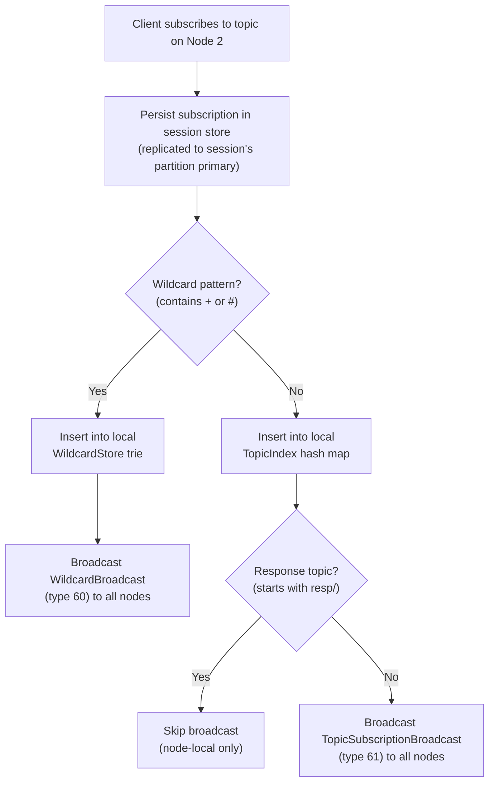
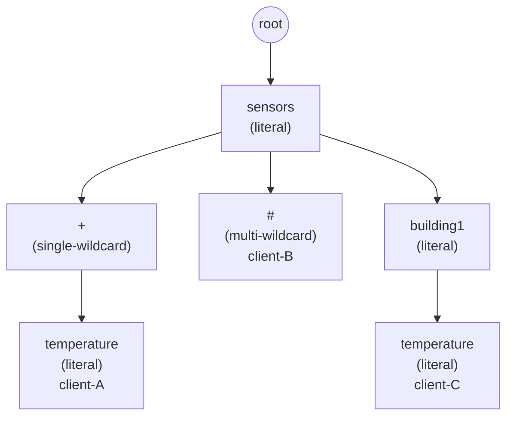
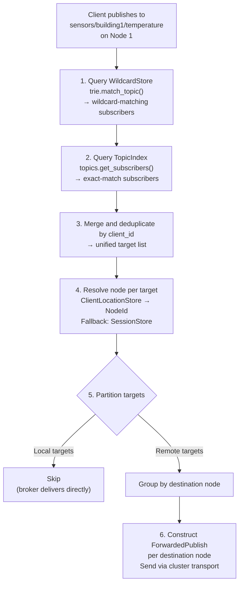

# Chapter 8: Cross-Node Pub/Sub Routing

Chapter 7 established a transport layer that delivers messages between nodes with uniform performance regardless of topology. This chapter puts that transport to work on the defining challenge of unifying a message broker with a distributed database: routing published messages to subscribers that may be connected to any node in the cluster, without cross-node queries on every publish.

The problem is deceptively simple to state. A client on Node 1 publishes to `sensors/temp`. A client on Node 3 subscribes to `sensors/temp`. The message must arrive at Node 3. In a single-node broker this is a hash map lookup. In a cluster, it becomes a distributed systems problem: Node 1 must know that Node 3 has a subscriber, and it must know this without asking Node 3 on every publish.

## 8.1 The Routing Problem

In a single-node MQTT broker, publish routing is straightforward. The broker maintains a map from topic strings to subscriber lists. When a message arrives on a topic, the broker looks up the subscribers and delivers the message to each one. The entire operation is a local memory access — no I/O, no coordination.

Distributing this across a cluster introduces three questions that don't exist in the single-node case:

**Who subscribes?** Node 1 needs to know that a client on Node 3 subscribed to `sensors/temp`. If topic subscriptions are partitioned — stored only on the node that owns a given partition — then Node 1 might not have the subscription data it needs. It would need to query other nodes on every publish to find out who subscribes, turning a local memory access into a network round-trip.

**Where is the subscriber?** Even if Node 1 knows that client `sensor-reader` subscribes to `sensors/temp`, it doesn't know which node `sensor-reader` is connected to. Sessions are partitioned with replication factor 2, so in a 3-node cluster any given node holds session data for roughly two-thirds of clients. Node 1 might not have the session for a client connected to Node 3.

**How to avoid loops?** When Node 1 forwards a message to Node 3, Node 3 must deliver it locally to its subscribers without re-forwarding it back to Node 1 or to Node 2. The forwarding mechanism must be self-terminating.

The first two questions have the same answer: replicate the metadata to all nodes. The third is solved by a combination of client ID filtering and a forwarding-specific internal client.

## 8.2 Three Broadcast Stores

Chapter 4 introduced the distinction between partitioned entities and broadcast entities. Partitioned entities (sessions, database records) live on the node that owns their partition and its replica. Broadcast entities must exist on every node because they are consulted on every publish.

Three stores make cross-node pub/sub possible:

| Store               | Entity         | Maps                    | Purpose                        |
| ------------------- | -------------- | ----------------------- | ------------------------------ |
| TopicIndex          | `_topic_index` | topic → [subscribers]   | Exact topic subscriptions      |
| WildcardStore       | `_wildcards`   | pattern → [subscribers] | Wildcard pattern subscriptions |
| ClientLocationStore | `_client_loc`  | client_id → node_id     | Where each client is connected |

All three follow the same replication principle: **apply locally first, then broadcast to all nodes**. This ordering is deliberate. The subscribing node must be able to route messages to its own subscribers immediately, without waiting for the broadcast to complete a round-trip through the cluster.

### TopicIndex

The TopicIndex is an in-memory hash map from topic strings to subscriber lists. Each entry contains:

| Field       | Description                                       |
| ----------- | ------------------------------------------------- |
| topic       | The MQTT topic string                             |
| sequence    | Monotonically increasing counter per topic        |
| subscribers | List of (client_id, client_partition, qos) tuples |

When a client subscribes to an exact topic (no wildcards), two things happen: the local TopicIndex is updated, and a `TopicSubscriptionBroadcast` message (type 61) is sent to all other nodes via the cluster transport. Each receiving node applies the subscription to its own local TopicIndex.

The subscriber list is deduplicated by client ID. The same client subscribing to the same topic twice produces one entry, not two. The sequence counter increments on every publish to the topic, providing a monotonic ordering for messages on that topic.

### WildcardStore

Wildcard subscriptions — patterns containing `+` (single-level) or `#` (multi-level) — cannot be stored in the same hash map as exact topics. A hash map supports equality lookups, but wildcard matching requires evaluating every pattern against the published topic. The WildcardStore wraps a trie (prefix tree) that makes this evaluation efficient.

Section 8.4 covers the trie in detail. For now, the broadcast mechanism mirrors the TopicIndex: the local trie is updated, then a `WildcardBroadcast` message (type 60) is sent to all nodes.

One difference: wildcard subscriptions are also persisted locally across 256 partition-scoped keys in the embedded database. On restart, the trie is rebuilt from these persisted entries. Exact topic subscriptions in the TopicIndex are not persisted — they are reconstructed from session data during startup.

### ClientLocationStore

The ClientLocationStore maps each connected client's ID to the node it is connected to. When a client connects, an entry is inserted; when it disconnects, the entry is removed. Both operations are broadcast to all nodes via `write_or_forward`, which recognizes `_client_loc` as a broadcast entity and fans the write to every alive node.

The in-memory representation is minimal: a hash map from client ID strings to node IDs. The wire format that travels between nodes carries additional fields — a version byte and a millisecond timestamp — but the store strips these to the essential mapping.

Internal clients (those whose IDs start with `mqdb-`) are excluded from the location store. These are the broker's own internal MQTT clients — the request handler, the response publisher, the event publisher — and every node has its own identical set. Broadcasting their locations would add noise without information: no node ever needs to forward a message to another node's request handler.

### Three Propagation Mechanisms

The three stores use different propagation mechanisms despite all being broadcast entities:

| Store               | Propagation                                                        | Wire Type                              |
| ------------------- | ------------------------------------------------------------------ | -------------------------------------- |
| TopicIndex          | Dedicated cluster broadcast message                                | Type 61 (`TopicSubscriptionBroadcast`) |
| WildcardStore       | Dedicated cluster broadcast message + 256 local persistence writes | Type 60 (`WildcardBroadcast`)          |
| ClientLocationStore | Single `ReplicationWrite` via `write_or_forward`                   | Type 20 (`WriteRequest`)               |

The TopicIndex uses the lightest mechanism: a single broadcast message, no local persistence, no Raft log entries. This keeps the Raft log compact while ensuring every node has complete subscriber maps.

The WildcardStore adds local persistence because the trie must survive restarts. The 256 local writes (one per partition) allow the trie to be rebuilt from the embedded database without requiring a full snapshot from another node.

The ClientLocationStore routes through `write_or_forward`, the same path used for partitioned entities. But because `_client_loc` is recognized as a broadcast entity, `write_or_forward` sends the write to all alive nodes instead of just the partition primary and its replicas.

## 8.3 The Subscribe Flow

When a client subscribes to a topic on any node, the event handler classifies the subscription and takes different paths for exact topics and wildcard patterns.

Response topics deserve special attention. MQTT 5.0 request-response patterns use a response topic that the requesting client subscribes to for receiving replies. These topics typically start with `resp/` and are ephemeral — they exist only for the duration of a single request-response exchange. Broadcasting them to all nodes would be wasteful: the publisher and subscriber of a request-response exchange are always on the same node (the broker publishes the response locally). The event handler detects response topics and suppresses the cluster broadcast, keeping them node-local.

On the receiving end, when a node receives a `TopicSubscriptionBroadcast` or `WildcardBroadcast` from another node, it applies the subscription to its local store. For the TopicIndex, `apply_replicated` deserializes the incoming entry and replaces the local entry entirely — a full-state replacement, not a merge. If the incoming entry has zero subscribers (the last subscriber unsubscribed), the local entry is removed.

## 8.4 Wildcard Routing

MQTT wildcards introduce a fundamentally different matching problem from exact topic lookups. The subscription `sensors/+/temperature` must match the published topic `sensors/building1/temperature` but not `sensors/building1/humidity` or `sensors/building1/floor2/temperature`. The subscription `sensors/#` must match all of these.

A hash map cannot answer the question "which patterns match this topic?" efficiently. The WildcardStore uses a trie where each level corresponds to one segment of an MQTT topic (split by `/`).

### Trie Structure

Each node in the trie has three types of edges:

- **Literal edges**: a hash map from exact segment strings (like `sensors`, `building1`) to child nodes
- **Single-wildcard edge**: at most one, representing the `+` wildcard
- **Multi-wildcard edge**: at most one, representing the `#` wildcard

Subscribers are stored only at terminal nodes — the node corresponding to the last segment of their subscription pattern.

Consider a building monitoring system with three clients:

| Client   | Subscription                    | Meaning                                 |
| -------- | ------------------------------- | --------------------------------------- |
| client-A | `sensors/+/temperature`         | Temperature from any building           |
| client-B | `sensors/#`                     | All sensor data from all buildings      |
| client-C | `sensors/building1/temperature` | Temperature from building1 specifically |

These three subscriptions produce the following trie:

### Matching Algorithm

A sensor publishes a reading to `sensors/building1/temperature`. Which of the three clients should receive it? The matching algorithm walks the trie level by level, splitting into parallel branches at every wildcard edge.

**Level 0 — root.** The published topic has segments `["sensors", "building1", "temperature"]`. The algorithm takes the first segment, `"sensors"`, and checks three things at the root node: is there a `#` edge (no), is there a `+` edge (no), is there a literal `"sensors"` edge (yes). It follows the literal edge to the `"sensors"` node.

**Level 1 — `"sensors"`.** The next segment is `"building1"`. Again, three checks:

- `#` edge? Yes — `#` matches everything from this point onward, so client-B is collected immediately. This branch terminates.
- `+` edge? Yes — `+` matches any single segment, so `"building1"` qualifies. The algorithm follows the `+` edge with the remaining segments `["temperature"]`.
- Literal `"building1"` edge? Yes. The algorithm follows it with the remaining segments `["temperature"]`.

The search has now split into two active branches: one at the `+` node, one at the `"building1"` node.

**Level 2a — `+` → `"temperature"`.** The remaining segment is `"temperature"`. The `+` node has a literal `"temperature"` child. Follow it. This is the last segment, so check for subscribers: client-A is collected.

**Level 2b — `"building1"` → `"temperature"`.** Same remaining segment, `"temperature"`. The `"building1"` node has a literal `"temperature"` child. Follow it. Last segment, check for subscribers: client-C is collected.

**Result:** all three clients match. Client-A matched through the `+` wildcard, client-B matched through the `#` wildcard at the `"sensors"` level, and client-C matched through the exact literal path. The algorithm explored all matching branches without scanning non-matching subscriptions. Its cost is proportional to the number of matching patterns, not the total number of patterns in the trie.

### System Topic Protection

The MQTT specification states that topics beginning with `$` must not be matched by wildcard subscriptions. A subscription to `#` should not receive messages published to `$SYS/uptime` or `$DB/users/events/created`. The trie enforces this: if the published topic starts with `$`, the matching function returns an empty result immediately. Clients must subscribe to system topics with exact patterns handled outside the wildcard trie.

### Subscriber Identity

Each subscriber in the trie carries four fields: client ID, client partition (the partition that owns the client's session, derived from the CRC32 hash of the client ID), QoS, and subscription type (MQTT or database event watch). The client partition links back to the partition-based session storage, enabling the `clear_for_partition` operation that removes all wildcard subscriptions belonging to sessions in a specific partition — used during partition ownership changes.

## 8.5 The Publish Routing Flow

When a client publishes a message, the event handler orchestrates a multi-step routing flow that combines the three broadcast stores into a forwarding decision:

Step 3 deduplicates by client ID because a client can appear in both result sets — once from an exact subscription and once from a wildcard subscription to the same topic. When both match, the router keeps the higher subscription QoS. The effective delivery QoS is determined later as the minimum of the publish QoS and the subscription QoS.

Step 4 uses a two-tier lookup. The ClientLocationStore is the primary source — a direct hash map lookup. If no entry exists (the location broadcast hasn't propagated yet, or the client connected before the location store existed), the fallback checks the session store for a session marked as connected. This fallback covers the startup race condition where a client connects before the location broadcast has been received by all nodes.

Step 5 skips local targets because the MQTT broker already delivered the message to locally connected subscribers as part of its normal publish processing. Only subscribers on remote nodes need forwarding.

Step 6 batches targets by destination node. All subscribers on the same remote node are grouped into a single `ForwardedPublish` message. A cluster with 10 subscribers on Node 3 sends one message to Node 3, not 10. This minimizes cross-node traffic.

The routing path acquires only a read lock on the node controller. Publish routing doesn't mutate any shared state (the sequence counter in the TopicIndex notwithstanding — it is protected by the TopicIndex's own internal lock). This means publishes on different topics can be routed concurrently without contention.

## 8.6 The Forwarded Publish Protocol

The `ForwardedPublish` is the wire message that carries a published message from the origin node to destination nodes. It is assigned message type 30 in the cluster protocol.

| Field        | Type     | Size     | Description                                       |
| ------------ | -------- | -------- | ------------------------------------------------- |
| version      | u8       | 1        | Protocol version (currently 2)                    |
| origin_node  | u16      | 2        | Node that received the original publish           |
| timestamp_ms | u64      | 8        | Millisecond UNIX timestamp at construction        |
| topic_len    | u16      | 2        | Length of topic string                            |
| topic        | bytes    | variable | Published topic                                   |
| qos          | u8       | 1        | Publish QoS level                                 |
| retain       | u8       | 1        | Retain flag (0 or 1)                              |
| payload_len  | u32      | 4        | Length of payload                                 |
| payload      | bytes    | variable | Message payload                                   |
| target_count | u8       | 1        | Number of target clients (max 255)                |
| targets      | repeated | variable | Per-target: [client_id_len:1][client_id:N][qos:1] |

The per-target QoS may differ from the publish QoS. MQTT specifies the effective delivery QoS as the minimum of the publish QoS and the subscription QoS. A QoS 2 publish to a QoS 1 subscriber delivers at QoS 1. The effective QoS is computed per-target and included in the forwarded message so the destination node can deliver at the correct level without re-resolving subscriptions.

### Loop Prevention

When a destination node receives a `ForwardedPublish`, it delivers the message to the specified local clients by publishing it through a dedicated internal MQTT client whose ID follows the pattern `mqdb-forward-{node_id}`. The event handler filters out publishes from clients with the `mqdb-forward-` prefix — if the origin of a publish is a forwarding client, the message is not routed again. This prevents infinite forwarding loops where Node 1 forwards to Node 3, Node 3 would forward back to Node 1, and so on.

### Deduplication

In certain cluster topologies, the same `ForwardedPublish` can arrive at a node more than once. The message processor applies a fingerprint-based deduplication filter before forwarding messages to the main event loop.

The fingerprint hashes four fields: origin node, timestamp, topic, and payload. The hash is checked against a bounded set of 1,000 entries with FIFO eviction — when the set is full, the oldest fingerprint is removed before the new one is inserted. Duplicate messages are silently dropped.

The fields excluded from the fingerprint — QoS, retain flag, and the target list — are delivery metadata, not message identity. Two forwards of the same message to different targets (different target lists) should still be deduplicated because they represent the same publish event.

The `timestamp_ms` field was added in version 2 of the protocol, and the story of why it was needed is told in Section 8.8.

## 8.7 What Went Wrong: The Missing ClientLocationStore

In a 3-node cluster, messages published on Node 1 reached subscribers on Node 2 but not Node 3.

The original design stored subscribers in the TopicIndex with their client partition — the partition derived from the CRC32 hash of the client ID. The routing code used this partition to look up the client's session and find which node the client was connected to. Sessions are partitioned entities with replication factor 2, meaning each node holds session data for about two-thirds of the partitions.

In a 3-node cluster, Node 1 holds session replicas for some partitions but not all. When a client connected to Node 3 subscribed to a topic, Node 1's TopicIndex learned about the subscription (via broadcast), but when Node 1 tried to resolve where that client was connected, it looked up the session by partition. If Node 1 didn't hold the replica for that client's session partition, the lookup failed. No session found, no node to forward to, message silently dropped.

The root cause was a conflation of two concerns. The TopicIndex answered "who subscribes?" correctly — the broadcast ensured all nodes knew about all subscriptions. But "where is the subscriber connected?" was answered by looking up session data, which is partitioned and therefore incomplete on any given node.

The fix was to separate these concerns. The ClientLocationStore was introduced as a new broadcast entity (`_client_loc`) that tracks `client_id → connected_node` mappings on every node. When a client connects, the connect event broadcasts the mapping to all nodes. When the publish router needs to resolve a subscriber's location, it checks the ClientLocationStore first — a simple hash map lookup against data that exists on every node.

The session store fallback was retained for the startup race condition: a client might connect before the first ClientLocationStore broadcast reaches all nodes. In steady state, the ClientLocationStore handles all lookups.

The architectural lesson is that broadcast entities must cover the complete chain of information needed for a local routing decision. Having subscriber identity (TopicIndex) without subscriber location (ClientLocationStore) left a gap that only manifested in 3-node clusters, where session partitioning creates the coverage holes that a 2-node cluster (with RF=2 covering all partitions) masks.

## 8.8 What Went Wrong: Time-Blind Deduplication

Two separate bugs shared the same root cause: deduplication keys that lacked a temporal component.

### The ForwardedPublish Bug

Cross-node pub/sub worked on the first run of a test but failed on subsequent runs with the same client IDs.

The original deduplication fingerprint hashed three fields: origin node, topic, and payload. When a test published "hello" to `sensors/temp` from Node 1, the fingerprint was cached. When the same test ran again — same topic, same payload, same origin — the fingerprint was identical. If the 1,000-entry cache hadn't evicted the first run's entries, the second run's messages were silently dropped as duplicates.

The fix was adding `timestamp_ms` to the `ForwardedPublish` struct. Each publish captures `SystemTime::now()` at construction, producing a unique fingerprint even for identical content. The wire protocol version was bumped from 1 to 2.

### The ClientLocationEntry Bug

Cross-node pub/sub with multiple topics failed on the second run of a test.

The `ClientLocationEntry` originally used only the client ID as its identity. When the same client disconnected and reconnected, the new location entry was byte-identical to the old one (same client ID, same node). The replication pipeline's deduplication treated the reconnection as a duplicate of the original connection and silently rejected it. The stale location data meant the publish router could target the wrong node or no node at all.

The fix: adding `timestamp_ms` to the `ClientLocationEntry`. Each connection event produces an entry with a unique timestamp, preventing the replication pipeline from treating reconnections as duplicates. The entry version was bumped to 2.

Bumping wire protocol versions for a single-field addition during development may seem excessive. The version machinery — parsers that handle both v1 and v2 formats, version fields in every serialized message — existed precisely to be exercised. A wire format that has never changed is a wire format whose upgrade path has never been tested.

### The Shared Lesson

Both bugs illustrate the same principle: any deduplication mechanism in a distributed system must account for legitimate repeated operations over time. Content-only fingerprints assume that identical content implies identical intent. In a system where clients reconnect and publishers republish, this assumption is wrong. A monotonic counter or a timestamp is the minimum temporal signal needed to distinguish "same message, retransmitted" from "new message, identical content."

The fix in both cases was minimal — adding one 8-byte field to the wire format. The debugging was not. The symptom ("works on first run, fails on second") was reproducible but the causal chain from dedup cache to silent message drops was invisible to normal logging. No error was reported; messages simply didn't arrive.

## 8.9 What Went Wrong: The Missing Broadcast

Subscribing to exact topics (non-wildcard) on Node 2 produced no messages when publishers published on Node 1. Wildcard subscriptions worked.

The original implementation had a `WildcardBroadcast` message (type 60) that propagated wildcard subscriptions to all nodes. When a client subscribed to `sensors/+/temp` on Node 2, every node learned about it via the broadcast, and publishes on Node 1 to `sensors/building1/temp` were correctly forwarded.

But exact topic subscriptions — `sensors/temp`, `home/lights`, any topic without `+` or `#` — were only stored in the local node's TopicIndex. No broadcast was sent. When a client on Node 2 subscribed to `sensors/temp`, only Node 2 knew about it. Node 1's TopicIndex had no entry for that subscription, so publishes to `sensors/temp` on Node 1 found no subscribers and were never forwarded.

The asymmetry was hidden during development because wildcard-based tests passed. Only tests that used exact topic subscriptions across nodes exposed the gap. This was pure lapse of attention type bug.

The fix was a new message type: `TopicSubscriptionBroadcast` (type 61), mirroring the `WildcardBroadcast` for exact topics. The subscribe and unsubscribe paths in the event handler were updated to broadcast exact topic subscriptions to all nodes, using the same pattern: apply locally first, then send to every alive node.

The cost of this broadcast is low. An exact topic subscription generates one broadcast message to each alive node. A wildcard subscription generates the same single broadcast message plus 256 local persistence writes for restart recovery. In both cases, cluster propagation uses a single message rather than 256 individual replication writes through Raft, keeping the Raft log compact.

| Subscription Type | Broadcast Message                      | Local Persistence           | Cluster Messages |
| ----------------- | -------------------------------------- | --------------------------- | ---------------- |
| Exact topic       | `TopicSubscriptionBroadcast` (type 61) | None                        | 1 per alive node |
| Wildcard pattern  | `WildcardBroadcast` (type 60)          | 256 partition-scoped writes | 1 per alive node |

The architectural lesson: when a category of data is classified as a broadcast entity, every variant of that data must be broadcast. Having wildcard subscriptions broadcast but exact subscriptions local created an inconsistency that violated the broadcast contract. The TopicIndex is either a broadcast entity or it is not — there is no middle ground where some subscriptions propagate and others do not.

## 8.10 Lessons

Three lessons emerge from the cross-node pub/sub routing design.

**Broadcast trades storage for latency.** Every node holds a complete copy of every subscription and every client location. In a cluster with 10,000 connected clients and 50,000 subscriptions, each node stores all 50,000 subscription entries and all 10,000 location mappings. The memory cost is real but bounded. The benefit is that publish routing — the hot path, executing on every published message — is a purely local operation.

**Deduplication needs time.** The twin bugs demonstrate that content-based deduplication silently drops legitimate repeated operations. Any dedup key in a system where events repeat over time must include a temporal component. This applies broadly: idempotency keys, cache fingerprints, replication dedup — whenever the same logical content can legitimately appear twice, time should be part of the identity.

**Broadcast is all or nothing.** Showed that partial broadcast — wildcards yes, exact topics no — creates invisible routing failures. The subscribe event handler had two code paths (wildcard and exact), and only one included the broadcast step. The fix was mechanical (add the broadcast to the exact path), but finding the bug required tracing through the routing flow and discovering that exact subscriptions were invisible cross-node. The principle generalizes: when a data category is designated as broadcast, every mutation path for that category must broadcast. Skipping one creates a gap that only manifests under specific workload patterns — exactly the kind of bug that survives testing but fails in production.

## What Comes Next

The cluster can now route individual published messages to subscribers on any node. Chapter 9 tackles a harder problem: queries that span multiple partitions. When a client asks to list all records in an entity, the data is scattered across 256 partitions owned by different nodes. The scatter-gather pattern, partition pruning, distributed pagination, and the unexpectedly difficult problem of retained message wildcards are the subjects of Chapter 9.
