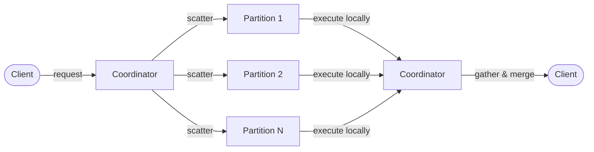

# Chapter 9: Query Coordination

Chapter 5 showed how single-record operations reach the correct partition primary: compute the hash, forward if not local, get the response back. Chapter 8 solved cross-node pub/sub: broadcast stores track who subscribes where, and forwarded publishes deliver messages to remote subscribers. But answering a question that spans multiple partitions is harder than either. When a client asks to list all records in an entity, the data is scattered across 256 partitions owned by different nodes. No single node has the complete dataset.

This chapter covers the machinery that turns a single client query into a distributed operation: how the coordinator fans out requests, how partition owners respond, how results are merged and deduplicated, how pagination works across independent partition states, and how the unexpectedly difficult problem of wildcard retained messages led to three layers of deduplication.

## 9.1 The Scatter-Gather Pattern

A distributed list query follows a five-step pattern:



**Step 1: Receive.** The coordinator node (whichever node the client is connected to) receives the list request via MQTT request-response.

**Step 2: Scatter.** The coordinator generates a `QueryRequest` for each target partition and sends it to the partition's primary node. Each request carries a unique `query_id` (shared across all partitions in the same query), a timeout, the entity type, an optional filter expression, a result limit, and an optional pagination cursor.

**Step 3: Execute.** Each partition primary executes the query against its local store. The store applies the filter, respects the limit, and returns results along with a `has_more` flag and a cursor for resumption.

**Step 4: Gather.** The coordinator collects `QueryResponse` messages as they arrive. Each response carries the query ID, the partition ID, a status code (Ok, Timeout, Error, or NotPrimary), the serialized results, the `has_more` flag, and the partition's cursor.

**Step 5: Merge.** When all expected partitions have responded — or the timeout expires — the coordinator merges the results. Deduplication removes records that appeared from multiple partitions. Filters are re-applied (for correctness after dedup). Results are sorted, projected, and returned to the client.

The coordinator tracks pending queries in a `HashMap<u64, PendingQuery>`, keyed by query ID. Each `PendingQuery` records the set of expected partitions and stores responses as they arrive. Completion is detected by comparing the set of received responses against the set of expected partitions — when they match, the query is done.

Timeout detection runs periodically. If the elapsed time since query start exceeds the configured timeout, the coordinator builds a partial result from whatever responses have arrived and marks it with a `partial` flag. The client receives data from the partitions that responded, along with a list of missing partitions. Partial results are better than no results — a slow or dead node should not block every list query in the cluster.

### Two Query Paths

The system maintains two separate scatter-gather implementations for different query types.

**Binary path.** The `QueryCoordinator` handles queries for internal MQTT entities (sessions, retained messages, subscriptions). Requests and responses use the binary cluster protocol — `QueryRequest` (message type 50) and `QueryResponse` (message type 51) — and results arrive as raw bytes decoded by the coordinator.

**JSON path.** Database list queries use `PendingScatterRequest`, a separate accumulator that collects `serde_json::Value` items. The coordinator sends `JsonDbRequest` messages to remote nodes, and responses arrive as JSON arrays. This path handles the full merge pipeline: dedup, filter, sort, project.

The split exists because the two query types have different serialization formats, different merge requirements, and evolved at different times. The binary path predates the JSON database layer and handles entity types with fixed schemas. The JSON path handles user-defined entities with dynamic schemas, arbitrary filters, and multi-field sorting. Unifying them would require a common serialization layer that handles both — possible, but not justified given that each path is straightforward on its own.

## 9.2 Partition Pruning

Not every query needs to scatter across all 256 partitions. When the query targets a specific record by ID, the partition function determines exactly which partition holds it:

```
partition = CRC32(entity + "/" + id) % 256
```

A read-by-ID operation never scatters. The coordinator computes the target partition, checks whether this node is the primary, and either executes locally or forwards to the primary. One partition, one network hop at most.

List queries can also be pruned when the filter includes an ID constraint. The `prune_partitions()` method examines the filter string for `id=VALUE` patterns:

| Query                               | Target                          | Partitions Queried |
| ----------------------------------- | ------------------------------- | ------------------ |
| `read entity/abc-123`               | `CRC32("entity/abc-123") % 256` | 1                  |
| `list entity --filter 'id=abc-123'` | Same hash                       | 1                  |
| `list entity --filter 'age>30'`     | No ID present                   | 256                |
| `list entity` (no filter)           | No pruning possible             | 256                |

The pruning is conservative. If the filter contains `id=VALUE`, the coordinator extracts the value, hashes it, and queries a single partition. For any other filter — range queries, field comparisons, pattern matches — the coordinator queries all 256 partitions because it cannot determine which partitions hold matching records without scanning them.

This makes reads and ID-targeted lists O(1) in the number of partitions, while unfiltered or field-filtered lists remain O(N) where N is the partition count. In a 3-node cluster with 256 partitions, a pruned query sends one request; an unpruned query sends up to 256 requests to three nodes. The difference is substantial, but the unpruned case is unavoidable without secondary index partitioning — a feature that MQDB does not implement.

## 9.3 Merge and Sort

When responses arrive from multiple partitions, the coordinator must combine them into a single ordered result set. The merge phase has four steps, applied in strict order.

**Deduplication.** A `HashSet<String>` tracks seen entity IDs. Each result is checked against the set; the first occurrence is kept, duplicates are dropped. Duplicates can appear because the scatter query targets partition primaries, but in a cluster with replication factor 2, a node might be primary for some partitions and replica for others. If both a primary and a replica respond for the same partition (possible during rebalancing or when the query targets "all alive nodes" rather than "all primaries"), the same record could appear twice. The HashSet ensures at-most-once delivery per entity ID.

**Filtering.** Filters are re-applied at the coordinator after deduplication. This is redundant in the current implementation — every node applies the same filters to its local results before responding. The re-application is a defensive measure: it guarantees correctness regardless of what remote nodes return. If a future code path returns unfiltered results, or if ownership filters on the coordinator differ from those on a remote node, the coordinator's filter pass catches the discrepancy.

**Sorting.** Results are sorted at the coordinator, not at each partition. Partition-level sorting is pointless because the coordinator must re-sort anyway — two independently sorted lists do not produce a globally sorted list when concatenated. The sort supports multiple fields with ascending or descending direction for each. The comparator iterates the sort specification, comparing field values in order until a non-equal result is found. JSON values are compared by type: numbers as f64, strings lexicographically, booleans by value. Missing fields sort before present ones.

**Truncation.** After sorting, the result is truncated to the maximum list size. This cap prevents a list query from returning the entire dataset — a safeguard against clients that omit pagination.

The order matters: dedup before filter (to remove exact duplicates first), filter before sort (to reduce the dataset), sort before truncate (to keep the correct top-N results). Projection is applied after this entire pipeline, as described in the next section.

## 9.4 Field Projection

Projection returns a subset of fields from each result. A client requesting `--projection name,email` receives only those fields (plus `id`, which is always included) instead of the full record.

The projection specification travels in the request payload:

```json
{ "projection": ["name", "email"] }
```

Schema validation rejects unknown projection fields before the query executes. If the entity has a declared schema and the client requests a field that does not exist in it, the query fails with a descriptive error. The `id` field is always permitted regardless of schema.

In the merge pipeline, projection is the final step — applied after deduplication, filtering, sorting, and truncation. This ordering is deliberate. Filters may reference fields that are not in the projection list: a query that filters by `age > 30` but projects only `name` needs the `age` field present during filtering. Similarly, sorting by `created_at` while projecting only `name` requires the sort field to exist until sorting completes. Applying projection earlier would discard the fields that filters and sorts depend on.

In scatter-gather queries, projection happens at the coordinator, not at remote nodes. Remote nodes return full records. The coordinator applies projection after merging, filtering, and sorting. This means more data travels over the network than strictly necessary, but it avoids the complexity of remote nodes needing to know which fields to preserve for filter and sort evaluation. The tradeoff is acceptable because list queries are not the hot path — pub/sub message routing is — and the additional network overhead is bounded by the result limit.

The projection function itself is straightforward: iterate the requested field names, copy matching fields from the record's `data` object into a new object, always include `id`. Fields not in the projection list are omitted. The result is a smaller JSON object.

## 9.5 Pagination

Pagination across 256 independent partitions requires each partition to maintain its own position. A global offset ("skip the first 100 records") would require counting records across all partitions, which is itself a distributed query. Instead, MQDB uses keyset pagination: each partition tracks the last key it returned, and the next page starts from records after that key.

The cursor has two levels:

**PartitionCursor** — tracks position within a single partition:

| Field       | Type  | Purpose                                |
| ----------- | ----- | -------------------------------------- |
| `partition` | u16   | Which partition this cursor belongs to |
| `sequence`  | u64   | Logical sequence position              |
| `last_key`  | bytes | The key of the last record returned    |

**ScatterCursor** — aggregates cursors from all queried partitions:

| Field     | Type | Purpose                                                   |
| --------- | ---- | --------------------------------------------------------- |
| `cursors` | Vec  | One `PartitionCursor` per partition that returned results |

Both are encoded as binary (big-endian, length-prefixed) rather than JSON or base64. The encoding is compact: a `PartitionCursor` is 12 bytes plus the key length; a `ScatterCursor` is 2 bytes (count) plus the sum of its partition cursors.

The pagination flow works as follows:

1. Client sends a list request (no cursor).
2. Coordinator scatters to all target partitions. Each partition returns results up to the limit, a `has_more` flag, and a cursor if more data exists.
3. Coordinator merges results and builds a `ScatterCursor` from all partition cursors.
4. Client receives results plus the opaque cursor.
5. Client sends the next request with the cursor attached.
6. Coordinator extracts each partition's cursor from the `ScatterCursor` and includes it in that partition's `QueryRequest`.
7. Each partition resumes from where it left off: filtering records where `key > last_key`.
8. Process repeats until no partition reports `has_more`.

The `has_more` flag is aggregated conservatively: if any partition has more data, the overall result reports `has_more = true`. This means the client may occasionally make a request that returns zero results from some partitions (those partitions were already exhausted) while still receiving data from others. The pagination terminates when all partitions are exhausted.

Each partition's pagination is truly independent. Partition 0 might exhaust its results after two pages while partition 47 has five pages of data. The `ScatterCursor` handles this naturally — exhausted partitions have no cursor entry, so no `QueryRequest` is generated for them in subsequent rounds. Only partitions with remaining data receive follow-up queries.

## 9.6 Retained Message Queries

The MQTT 5.0 specification says that when a client subscribes, the server SHOULD deliver retained messages matching the subscription's topic filter, including wildcard patterns. For exact topic subscriptions, this is a point lookup: hash the topic to its partition, query the primary, deliver the message. One partition, one request, same as a read-by-ID.

Wildcard subscriptions are the hard case. A subscription to `sensors/+/temperature` must find all retained messages whose topics match that pattern — `sensors/room1/temperature`, `sensors/room2/temperature`, and so on. These topics hash to different partitions scattered across the cluster. No single partition or node holds all matching messages.

Most distributed MQTT implementations — including AWS IoT Core — skip wildcard retained delivery entirely. The distributed query is difficult to get right, and the MQTT spec says "SHOULD" rather than "MUST." MQDB implements it anyway, because retained messages are a core part of the state synchronization model. A subscriber connecting with a wildcard pattern expects to receive the current state of all matching topics, not just future publishes.

The naive approach is to scatter a query to all 256 partitions, collect the responses, filter by wildcard match, and deliver. This works correctly for data like database records, where each record exists on exactly one partition primary. But retained messages have replication: with replication factor 2, each partition's data exists on both a primary and a replica node. Querying "all alive nodes" instead of "all partition primaries" would return duplicate messages. And even querying partition primaries, the naive fan-out generates an excessive number of requests.

In a 3-node cluster with 256 partitions and RF=2, the naive per-partition approach produced 170x message duplication in testing. The same retained message arrived repeatedly from primary/replica overlap, from nodes that owned the same data under different partition roles, and from replication writes arriving concurrently with query responses.

## 9.7 Three Layers of Retained Dedup

Solving the 170x duplication required deduplication at three distinct layers, each addressing a different source of duplicates.

**Layer 1: Per-node query deduplication.** Instead of sending one query per partition (256 queries), the coordinator deduplicates by target node. A `HashSet<NodeId>` tracks which nodes have already been queried. For each partition, the coordinator looks up the primary node. If that node has already been queried, the partition is skipped. If the node is the local node, the partition is skipped (local data is queried separately, not via the network).

The effect: in a 3-node cluster, 256 partition queries collapse to at most 2 remote requests — one to each of the other two nodes. Each remote node returns all retained messages from all partitions it owns. This is the largest dedup win, eliminating the vast majority of redundant queries.

**Layer 2: Same-topic deduplication.** After collecting responses from remote nodes, the coordinator filters out topics that already exist in the local retained store. Since retained messages are replicated (RF=2), the local node often holds a replica copy of the same message that a remote node returned as a primary copy. Filtering against the local store eliminates these duplicates before delivery.

The check is a simple existence test: for each retained message in the remote response, does the local retained store already have a message for this topic? If yes, skip it — the subscriber will receive (or has already received) the local copy.

**Layer 3: TTL-based write filtering.** A time-based cache prevents re-delivery during the window between a query response arriving and a replication write for the same retained message being processed. The cache maps topic strings to timestamps. When a retained message is delivered to the broker, the topic and current time are recorded. For the next 5 seconds, any attempt to deliver the same topic (whether from a replication write or a late query response) is suppressed.

Why 5 seconds? The window must be long enough to cover the worst-case delay between a query response arriving and the corresponding replication write being processed. In practice, replication writes arrive within milliseconds. The 5-second TTL provides a wide safety margin while being short enough that a genuinely updated retained message (new publish after the query) will be delivered once the window expires.

Without all three layers working together, the subscriber would receive the same retained message multiple times. Layer 1 reduces network traffic. Layer 2 eliminates primary/replica overlap. Layer 3 handles the race between query responses and replication writes.

The three layers have a compositional structure worth noting:

| Layer | Source of Duplicates                                 | Mechanism                                      | When                      |
| ----- | ---------------------------------------------------- | ---------------------------------------------- | ------------------------- |
| 1     | Same data on multiple partitions owned by same node  | `HashSet<NodeId>` skips already-queried nodes  | Before sending queries    |
| 2     | Same message on primary (remote) and replica (local) | Filter against local retained store            | After receiving responses |
| 3     | Replication write arriving concurrently with query   | TTL cache suppresses re-delivery for 5 seconds | During delivery           |

## 9.8 What Went Wrong: The Naive Fan-Out

The original wildcard retained query implementation scattered one request per partition. In a 3-node cluster with 256 partitions, this generated up to 256 individual query requests — most of which targeted the same two remote nodes. The responses contained massive overlap because the same retained messages existed on both primaries and replicas.

The symptom was not incorrect behavior — the subscriber eventually received all matching retained messages — but the volume of duplicate deliveries and unnecessary network traffic made the feature unusable in practice. A wildcard subscription to `#` (all topics) with 100 retained messages in the cluster would deliver close to 17,000 messages before deduplication, overwhelming both the network and the subscriber's message buffer.

The fix was the three-layer dedup described above, with the per-node query deduplication (Layer 1) providing the most dramatic improvement. Collapsing 256 partition queries to 2 node queries reduced both network traffic and response processing by two orders of magnitude. The remaining two layers cleaned up the edge cases that per-node dedup alone could not address.

The lesson is specific to replicated systems: any query pattern that works correctly for unique-per-partition data (like database records) can break badly when applied to replicated data (like retained messages). The replication factor multiplies every overlap, and the multiplication compounds with partition count. Testing with a small number of partitions or a single node would not have revealed the 170x amplification — it required a multi-node cluster with realistic partition distribution.

## Lessons

**Prune first, scatter second.** The partition pruning optimization is the most impactful query optimization in the system. A single-ID query that touches one partition instead of 256 represents a 256x reduction in network traffic and latency. The pruning logic is trivial — extract an ID from the filter, hash it — but its effect is outsized. Before building sophisticated query planners, check whether the common case can be short-circuited.

**Project last, not first.** The temptation to apply projection early — at each partition rather than at the coordinator — would reduce network traffic. But it creates a coupling between projection and the filter/sort pipeline: the coordinator must know which fields the filters and sorts reference, and the remote nodes must preserve those fields while projecting away others. Applying projection last keeps the pipeline stages independent. Each stage operates on complete records and does not need to know what the other stages require.

## What Comes Next

The cluster can now route messages, replicate data, and answer distributed queries. But what happens when a node disappears? Chapter 10 covers failure detection: the heartbeat protocol that monitors node health, the state machine that transitions nodes from alive to suspected to dead, and the partition failover mechanism that reassigns ownership when a node is confirmed dead.
