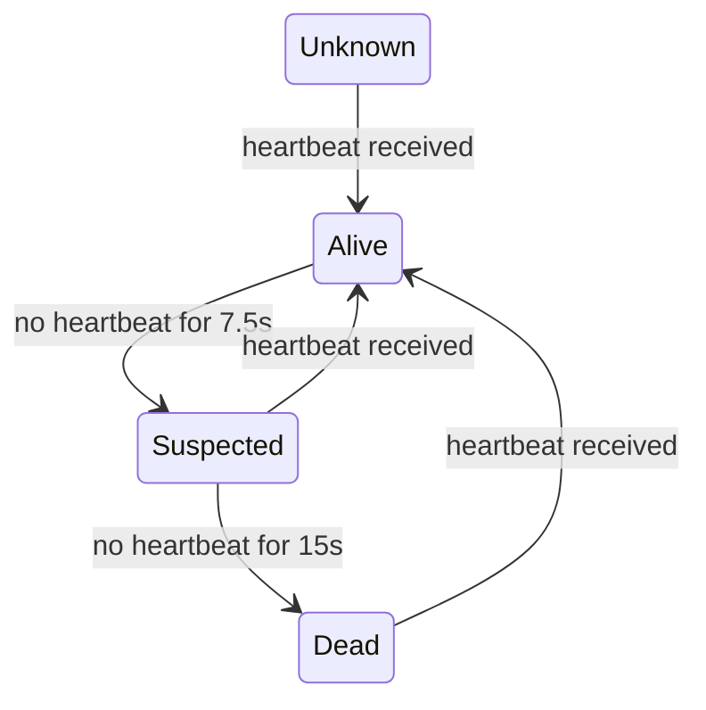
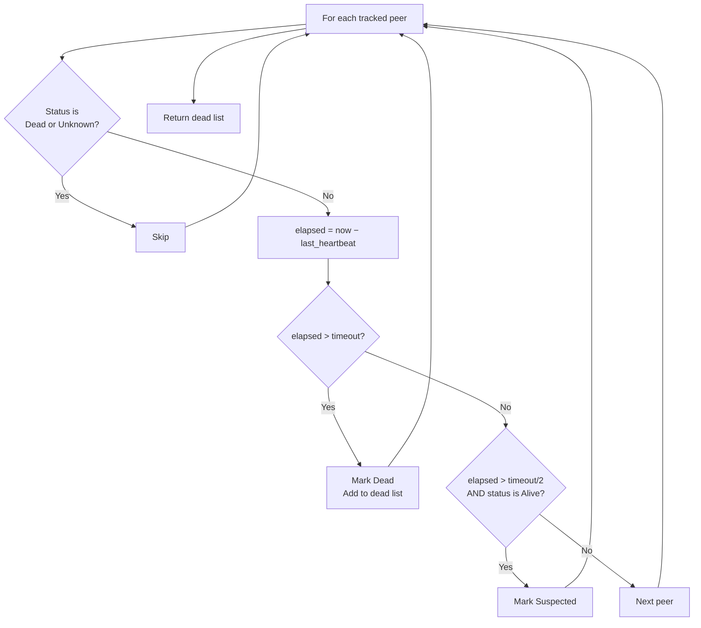
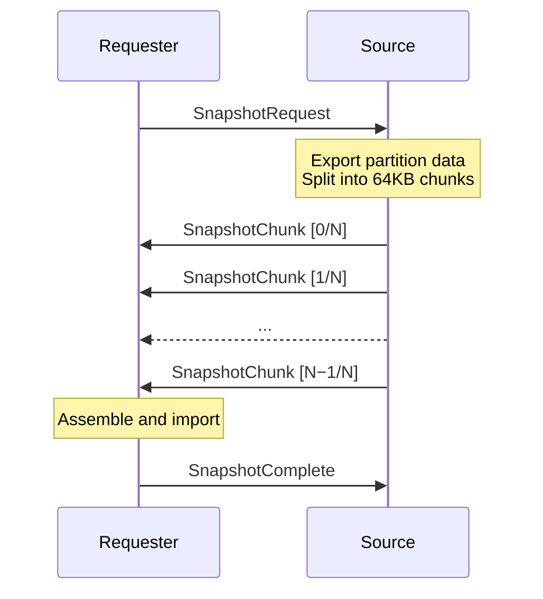
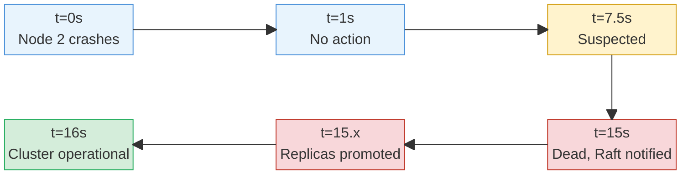
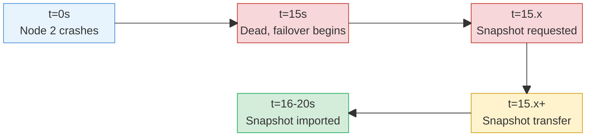

# Chapter 10: Failure Detection and Recovery

Everything described so far — partitioning, replication, routing, queries — assumes that nodes are running. This chapter deals with the moment they stop. A node crashes, a network cable is pulled, a process runs out of memory. The cluster must detect the absence, decide when to stop waiting, and reassign the missing node's work to someone still alive. Getting this wrong in either direction is expensive: declare a node dead too early and the cluster wastes effort recovering partitions that will come back online in seconds. Declare it dead too late and clients experience prolonged unavailability for every partition the missing node owned.

## 10.1 The Heartbeat Protocol

Failure detection in MQDB rests on a single mechanism: periodic heartbeat messages. Every node sends a heartbeat to all its peers at a fixed interval. Every node tracks when it last received a heartbeat from each peer. If enough time passes without a heartbeat, the peer is considered dead.

The heartbeat message is 75 bytes:

| Bytes | Field          | Type    |
| ----- | -------------- | ------- |
| 1     | version        | u8      |
| 2     | node_id        | u16     |
| 8     | timestamp_ms   | u64     |
| 32    | primary_bitmap | [u64;4] |
| 32    | replica_bitmap | [u64;4] |

The version field (currently 2) allows future protocol changes. The node_id identifies the sender. The timestamp records when the heartbeat was created. The two bitmaps — 256 bits each, packed into four 64-bit words — encode which partitions the sender currently owns as primary and which it holds as replica.

Reading a bit from the bitmap is a two-step operation: divide the partition number by 64 to get the word index, take the remainder to get the bit position within that word. Setting a bit uses the same decomposition with a bitwise OR. This is O(1) per partition, and encoding all 256 partitions requires no iteration over partition structures — just four words read directly from memory.

The heartbeat interval defaults to 1 second. Choosing a heartbeat interval involves a three-way tension between detection latency, network overhead, and false positive rate. A 100ms interval would detect failures in under a second but would generate ten times the background traffic. A 10-second interval would be nearly invisible on the network but would leave the cluster blind to failures for tens of seconds. One second is a compromise: failures are detected within 15 seconds (the timeout), the network overhead is 75 bytes per peer per second, and the protocol tolerates up to 14 consecutive lost heartbeats before declaring a node dead.

## 10.2 The Node State Machine

Each node tracks the status of every peer through a four-state machine:



A node enters **Unknown** when it is first registered as a peer. No heartbeat has been received yet, so the node's liveness is indeterminate. The node transitions to **Alive** when the first heartbeat arrives — or any subsequent heartbeat after a period of silence. The `last_heartbeat` timestamp is updated, the `missed_count` is reset to zero, and the node is added to the set of nodes that can receive forwarded messages and replication writes.

After 7.5 seconds without a heartbeat (half the timeout), the node moves to **Suspected**. This state exists as a warning signal. The node might be experiencing a temporary network partition, a garbage collection pause, or a brief CPU stall. No recovery action is taken.

After 15 seconds without a heartbeat, the node is declared **Dead**. This triggers active recovery: the Raft leader is notified, partitions are reassigned, sessions are cleaned up. The dead node is removed from the cluster membership list.

A node that receives a heartbeat while in the Suspected or Dead state transitions back to Alive. The protocol does not hold grudges. If a node was falsely declared dead and its partitions were reassigned, the reassignment stands — the returning node will receive new partition assignments through the normal rebalancing process (Chapter 11).

The timeout check runs every tick of the event loop. It iterates over all known peers, computes the elapsed time since the last heartbeat, and returns a list of nodes that have crossed the death threshold:



The skip conditions are critical. Dead nodes are skipped because their death has already been processed — re-reporting them would trigger redundant failover logic. Unknown nodes are skipped for a reason that required a bug to discover, covered in Section 10.3.

## 10.3 Why Bitmaps in Heartbeats

The simplest heartbeat would be an empty "I'm alive" ping. The primary and replica bitmaps add 64 bytes to each message — nearly doubling its size. What do they buy?

When a node receives a heartbeat, it extracts the sender's partition claims and compares them against its own partition map. If the sender claims to be primary for a partition that has no primary in the local map, the receiver fills in that gap:

```
for each of 256 partitions:
    if sender claims primary AND local map has no primary:
        set sender as primary in local map
```

This serves a specific purpose: a joining node can learn which partitions are assigned where before the Raft log has fully replicated. When Node 3 joins a cluster where Nodes 1 and 2 have already partitioned the data, Node 3 needs to know who owns each partition to forward writes and serve reads correctly. The Raft log will eventually deliver this information through committed partition updates. But "eventually" can take several seconds — election, log replication, application — and during that window, every client request to Node 3 for a partition it cannot locate will fail.

Heartbeat bitmaps close this window. Within one heartbeat interval (1 second) of connecting to a peer, the joining node has a working partition map. It may not be perfectly current — reassignments that happened between the heartbeat creation and reception are missed — but it is sufficient for routing. The Raft log corrects any discrepancies once it catches up.

The bitmaps also provide a consistency check. If the sender claims to be primary for a partition that the receiver's map assigns to a different node, the receiver logs a discrepancy. It does not overwrite the existing assignment — the Raft-committed partition map is authoritative — but the log entry helps operators diagnose split-brain or stale-map conditions.

## 10.4 The False Death Problem

The initial implementation registered new peers with `last_heartbeat = 0`. The `check_timeouts` function computed the elapsed time as `now - 0 = now`, which for any reasonable `now` value exceeded the 15-second timeout. The result: Node 2 would register Node 1 as a peer, immediately run a timeout check, and declare Node 1 dead — before a single heartbeat had the chance to arrive.

The symptom was a cluster that oscillated between death detection and revival on startup. Node 2 would start, register Node 1, declare it dead, begin failover processing, receive Node 1's first heartbeat, revive it, trigger rebalancing, detect Node 1 as dead again (because the rebalancing logic had not yet completed and the heartbeat timer reset), and loop. The cluster would eventually stabilize after enough heartbeats, but the startup phase was unpredictable and generated bursts of unnecessary Raft proposals.

The fix was the `Unknown` status and the skip condition in `check_timeouts`. A newly registered node enters `Unknown` with `last_heartbeat = 0`. The timeout check explicitly skips nodes in the `Unknown` state. The node transitions to `Alive` only when a real heartbeat arrives, at which point `last_heartbeat` is set to the actual reception time. From that point forward, timeout checks work correctly — they compare against a real timestamp, not an initialization sentinel.

This bug illustrates a general principle: any timestamp initialized to zero is a latent bug in any system that computes durations by subtraction. The subtraction `now - 0` produces a duration equal to the system's uptime (or epoch time, depending on the clock source), which will exceed virtually any timeout threshold. The fix is never to compute a duration from a sentinel — either skip the computation or use an `Option<u64>` that makes the absence of a timestamp explicit. MQDB chose the skip approach because the state machine already provided a natural place for it.

A related issue affected the other direction: a node sending heartbeats before it had partition assignments. The heartbeat would contain an empty primary bitmap, telling peers that this node owns nothing. Since the heartbeat was valid (correctly formatted, real timestamp), the peer would mark the sender as Alive. But the empty bitmap provided no routing information, and the peer might skip the sender in partition assignment decisions because it appeared to be a node with no work.

The fix was a guard in `should_send`: heartbeats are suppressed only when the node has neither partition assignments nor registered peers. A node with partitions but no peers has nobody to send to. A node with peers but no partitions still sends heartbeats — the bitmaps will be empty, but the "I'm alive" signal is valuable for the peer's timeout tracking. Only a node with nothing (no partitions, no peers) stays silent — during the brief window before the cluster has formed, there is nobody to talk to and nothing to report.

## 10.5 Partition Failover

When `check_timeouts` returns one or more dead nodes, the event loop processes each death notification through a chain of actions:

1. **Notify Raft.** The node controller sends a `NodeDead` event to the Raft coordinator. On the Raft leader, this triggers partition reassignment. On followers, the event is queued for processing in case the follower becomes leader before the current leader handles it.

2. **Queue session cleanup.** The dead node's ID is pushed to a session-update queue. The session manager will later disconnect all sessions that were connected to the dead node and trigger Last Will & Testament delivery for those sessions.

3. **Log partition status.** The node controller iterates all 256 partitions. For each partition where the dead node was primary and the local node is a replica, it logs that a failover is expected. For each partition where the dead node was a replica and the local node is primary, it logs that the replication factor has decreased. These are informational — the actual reassignment happens through Raft.

The Raft leader's `handle_node_death` function does the real work. It first removes the dead node from the cluster membership list. Then it iterates all 256 partitions, checking the dead node's role in each:

**Dead node was primary.** The leader calls `select_new_primary`, which first checks the partition's replica list for an alive node. If a replica is alive, it becomes the new primary — this is the fast path, because the replica already has the data. If no replica is alive, any alive node in the cluster is chosen as a fallback — this is the slow path, because the new primary will need a snapshot transfer to obtain the data it does not yet have. The leader then proposes a Raft command that sets the new primary, removes the dead node from the replica list, and increments the partition's epoch.

**Dead node was replica.** The leader proposes a simpler update: keep the existing primary, remove the dead node from the replica list, increment the epoch. No primary change is needed. The epoch bump serves the same purpose as in the primary case: it versions the partition assignment so that any node still operating under the old assignment — for instance, a primary that was about to send replication writes to the now-dead replica — observes the new epoch and updates its replica list accordingly.

Each reassignment is a separate Raft proposal. For a node that owned many partitions — say, 85 primaries and 85 replicas in a balanced 3-node cluster — this means up to 170 Raft proposals. The Raft log batches these efficiently (the batch flush fix from Chapter 6 is essential here), but they are still individual proposals that must be committed and applied by all nodes.

The epoch increment on every reassignment deserves emphasis. Consider a scenario where Node 2 is primary for partition 50, dies, and Node 1 is promoted to primary. If Node 2 had in-flight replication writes to Node 3 (the replica) at the moment of death, those writes carry the old epoch. When Node 3 receives the partition update from Raft with the new epoch, it begins rejecting writes with the old epoch. This prevents stale data from a dead node's in-flight messages from corrupting the new primary's state.

The leader also tracks which dead nodes it has processed to prevent duplicate work. If multiple timeout checks fire before the Raft proposals are committed (possible if the event loop is busy), the `processed_dead_nodes` set ensures the reassignment logic runs only once per dead node.

## 10.6 Snapshot Transfer

When a node becomes the new primary for a partition it does not yet have data for — the fallback case where no existing replica was available — it needs the partition's entire dataset. This is the snapshot transfer protocol.

The transfer follows a three-message handshake:



**SnapshotRequest** is 5 bytes: a version byte, the partition ID (2 bytes), and the requester's node ID (2 bytes). The source node receives the request, exports the partition's data from its store, records the current sequence number, and begins sending chunks.

**SnapshotChunk** carries a 23-byte header followed by up to 64KB of data:

| Bytes | Field                | Type  |
| ----- | -------------------- | ----- |
| 1     | version              | u8    |
| 2     | partition            | u16   |
| 4     | chunk_index          | u32   |
| 4     | total_chunks         | u32   |
| 8     | sequence_at_snapshot | u64   |
| 4     | data_length          | u32   |
| var   | data                 | bytes |

The `chunk_index` and `total_chunks` fields allow out-of-order reassembly. The `sequence_at_snapshot` field records the partition's sequence number at the time of export — after importing the snapshot, the receiver sets its replica sequence to this value, so subsequent replication writes pick up exactly where the snapshot left off.

**SnapshotComplete** is 12 bytes: version, partition, a status byte (Ok, Failed, or NoData), and the final sequence number. The requester sends this after importing the snapshot (or after a failure) to tell the source the transfer is done. If the status is Ok and the source has an active migration for this partition, the migration advances from the Preparing phase to the Overlapping phase, where both old and new primaries can serve reads while the new primary catches up on writes that arrived during the transfer.

On the receiving side, a `SnapshotBuilder` accumulates chunks. It pre-allocates a vector of `Option<Vec<u8>>` with one slot per expected chunk. Chunks can arrive in any order — the builder slots them by index and tracks how many have been received. Once all chunks are present, `assemble` concatenates them in order and returns the complete dataset. The receiver imports the data into its store, sets the replica's sequence counter, and transitions the replica state from awaiting-snapshot to active.

The request is deduplicated: a `HashSet<PartitionId>` tracks which partitions have outstanding snapshot requests. If a snapshot is already in flight for a partition, subsequent requests are ignored. This prevents the requester from flooding the source with redundant snapshot requests if the event loop fires multiple times before the first chunk arrives.

## 10.7 The Recovery Timeline

Putting the pieces together, the timeline from node failure to full recovery looks like this. In both diagrams, blue marks normal operation, yellow a transitional or in-progress state, red a critical failure, and green a recovered cluster. The fast path (replica promotion):



The fast path takes approximately 15–16 seconds from failure to recovery. The dominant component is the timeout itself — detection takes 15 seconds, and the Raft proposal and commit cycle adds less than a second.

For the slow path (no replica available, snapshot needed):



The slow path adds the snapshot transfer time to the detection delay. For small partitions (a few megabytes), this is negligible. For large partitions, the 64KB chunk size keeps memory pressure bounded — neither the sender nor receiver needs to hold the entire partition in memory at once, though the sender does serialize the entire partition before chunking.

The 15-second detection delay is the main cost. Reducing it requires either a shorter timeout (increasing false positive risk) or an active probing mechanism (adding protocol complexity). MQDB chose the passive approach — heartbeat absence detection with conservative timeouts — because false positives (declaring a healthy node dead) are more disruptive than a 15-second detection delay. A false positive triggers unnecessary partition reassignment, epoch increments, snapshot transfers, session disconnections, and Last Will & Testament deliveries. Undoing this work when the node comes back is not free — the cluster must rebalance again, sessions must reconnect, and any LWT messages have already been sent.

## What Went Wrong: The Initialization Race

Section 10.3 described two heartbeat bugs: the instant-death bug (where `last_heartbeat = 0` caused every new peer to be declared dead immediately) and the empty-bitmap bug (where a node sending heartbeats before partition initialization advertised that it owned nothing). Both share a root cause: the system treated an uninitialized state as a valid state. Both assumptions led to incorrect behavior during startup — the one phase of a node's lifecycle where initialization is by definition incomplete.

The general lesson is that distributed systems have more states than their steady-state design accounts for. A heartbeat protocol designed for a running cluster assumes that every tracked node has sent at least one heartbeat. That assumption is false during the first seconds of a node's existence. A status machine designed for alive-or-dead transitions needs a third state — unknown — for the interval before liveness can be determined.

## Lessons

**The timeout is the feature.** Fifteen seconds feels slow. The temptation is to shorten it — surely 5 seconds would be fast enough, surely 3 would be better. But every second removed from the timeout is a second added to the false positive window. A network blip that lasts 6 seconds is harmless at a 15-second timeout and catastrophic at a 5-second one. The timeout duration is not a performance parameter to be optimized. It is a policy decision about how much disruption the cluster can tolerate from a false positive versus how much unavailability it can tolerate from a slow detection.

**Bitmaps are cheap redundancy.** The 64 bytes of partition bitmaps in each heartbeat are not strictly necessary — the Raft log is the authoritative source. But they close the gap between "node is connected" and "node knows the partition map," which can be several seconds during startup. This kind of redundancy — repeating information through a secondary channel to reduce latency — is common in distributed systems. The overhead is small (64 bytes per heartbeat), the benefit is concrete (routing works seconds earlier), and the correctness properties are unchanged (Raft remains authoritative).

**Sentinel values are bugs waiting to happen.** Using zero as "no timestamp yet" is indistinguishable from "timestamp zero" in any arithmetic. The `Unknown` state made the absence of a heartbeat explicit in the type system rather than encoding it as a magic number. The general principle: if a value might not exist yet, represent the absence explicitly rather than choosing a numeric sentinel that might accidentally participate in computations.

## What Comes Next

Failure detection reassigns the dead node's partitions to survivors, but it does not address the reverse: what happens when a new node joins or a recovered node returns? Chapter 11 covers rebalancing — the algorithm that redistributes partitions across a changing set of nodes, the race conditions that arise when multiple rebalancing proposals compete, and the edge case of single-node bootstrap where there are no peers to rebalance with.
