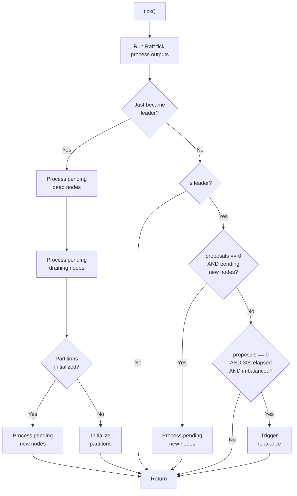
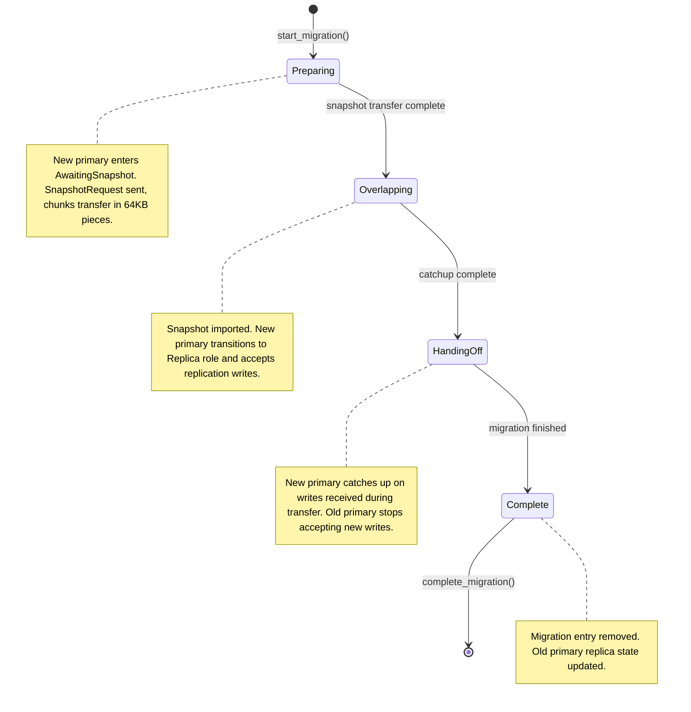

# Chapter 11: Rebalancing

Chapter 10 ended with a cluster that can detect dead nodes and reassign their partitions to survivors. The dead node's primaries are promoted from replicas, its replicas are removed, and the cluster continues operating with reduced redundancy. But this only handles subtraction — removing a node from the partition map. The reverse problem is harder: when a new node joins, or a recovered node returns, how does the cluster redistribute partitions so that every node carries a fair share of the work?

This is the rebalancing problem. It appears in four distinct scenarios, each with different constraints and failure modes. The algorithms that solve it are straightforward. The coordination that prevents them from corrupting each other is not.

## 11.1 The Rebalancing Problem

Four scenarios require partition redistribution:

**Fresh cluster bootstrap.** The first node starts, wins its own Raft election (single-node majority), and finds all 256 partitions unassigned. It must assign every partition a primary and, once a second node exists, a replica. This is the only scenario where assignments are created from nothing.

**Node joins.** A new node connects to an existing cluster. It has zero partitions. The existing nodes are overloaded — they carry partitions that should be shared with the newcomer. The cluster must move some partitions from the existing nodes to the new one without interrupting reads and writes to the partitions being moved.

**Node dies.** Covered in Chapter 10, but listed here for completeness. The dead node's primaries need promotion from replicas, and its replicas need replacement on surviving nodes. This is handled by a dedicated removal algorithm rather than the general rebalancer.

**Graceful drain.** A node announces that it intends to shut down. Unlike a crash, this is cooperative — the draining node can continue serving its partitions while the cluster moves them elsewhere, and it can delay shutdown until the migration is complete.

All four scenarios share a set of constraints. Primary and replica for the same partition must reside on different nodes — co-locating them defeats the purpose of replication. The replication factor must be maintained whenever enough nodes exist. Data movement should be minimized — rewriting all 256 partitions when only 30 need to move wastes bandwidth and creates unnecessary disruption. And all assignment changes must be serialized through Raft, because the partition map is replicated state that every node must agree on.

The ideal distribution is straightforward to compute:

| Nodes | Primaries per node | Replicas per node |
| ----- | ------------------ | ----------------- |
| 1     | 256                | 0                 |
| 2     | 128                | 128               |
| 3     | 85 or 86           | 85 or 86          |
| 4     | 64                 | 64                |
| 5     | 51 or 52           | 51 or 52          |

With 256 partitions and N nodes, each node should hold approximately 256/N primaries and 256/N replicas. The remainder (256 mod N) partitions are distributed one extra each to the first few nodes, making the difference between any two nodes at most one partition.

## 11.2 Three Algorithms

The rebalancer contains three functions, each designed for a different scenario. All three take the current partition map as input and produce a list of `PartitionReassignment` values — each specifying a partition, its old primary, its new primary, the old replica list, the new replica list, and a new epoch.

### Balanced Assignment

`compute_balanced_assignments` handles fresh cluster bootstrap. It takes a sorted list of nodes, creates a new empty partition map, and fills it with a round-robin assignment:

```
for partition 0..255:
    primary = nodes[partition % node_count]
    replica = nodes[(partition + 1) % node_count]
```

Partition 0 goes to Node 1, partition 1 to Node 2, partition 2 to Node 3, partition 3 back to Node 1, and so on. Each partition's replica is the next node in the ring. The result is a perfectly balanced distribution — every node gets exactly 256/N or 256/N + 1 primaries, and the same for replicas.

This algorithm is only used during bootstrap. It rewrites all 256 partitions, which is acceptable when no existing assignments need to be preserved. Using it on a running cluster would move every partition, destroying data locality and triggering 256 snapshot transfers.

The replication factor is capped at the number of available nodes. A single-node cluster sets RF to 1 (primary only, no replicas). A two-node cluster sets RF to 2. A five-node cluster with `replication_factor: 3` produces two replicas per partition, each on a different node from the primary. The round-robin selection for replicas uses consecutive offsets from the primary's position: replica 1 is at `(primary_idx + 1) % node_count`, replica 2 at `(primary_idx + 2) % node_count`, and so on.

### Incremental Assignment

`compute_incremental_assignments` handles node joins. It takes the current partition map and the full list of nodes (including the new one), then runs three phases:

**Phase 1: Redistribute primaries.** The algorithm computes the ideal primary count per node (256 / node_count) and scans all 256 partitions. For each partition whose current primary has more than ideal + 1 primaries, it searches the partition's existing replicas for one with fewer than ideal primaries. If a suitable replica is found, it becomes the new primary and the old primary takes its place as a replica (if the replica list has room). Partitions where no existing replica qualifies are skipped — the algorithm never promotes a node that lacks data for the partition. The algorithm tracks counts as it goes, so each move updates the accounting for subsequent decisions.

**Phase 2: Add missing replicas.** After moving primaries, some partitions may lack replicas — either because the cluster previously had too few nodes for the desired replication factor, or because the primary moves in Phase 1 changed the replica configuration. This phase scans all partitions that were not touched in Phase 1, finds those with fewer replicas than desired (RF - 1), and assigns new replicas from available nodes.

**Phase 3: Redistribute replicas.** Even after Phases 1 and 2, replica distribution can be uneven. Some nodes may hold far more replicas than others — particularly a new node that joined with no partitions. This phase identifies underweight nodes (replica count below half the ideal) and overloaded nodes (replica count above ideal), then moves replicas from overloaded to underweight by swapping the overloaded node out of a partition's replica list and substituting the underweight node.

A concrete example: consider a 2-node cluster where Nodes 1 and 2 each hold 128 primaries and 128 replicas. Node 3 joins. The rebalancer runs twice — once immediately, and once after a 30-second periodic balance check — to achieve a balanced distribution.

**First rebalance cycle.** The ideal primary count per node is 256/3 = 85. Phase 1 scans all 256 partitions looking for moves. For each partition, it searches the existing replicas for a promotion candidate. A partition with primary Node 1 has replica Node 2, but Node 2 already holds 128 primaries — well above the ideal of 85, so it does not qualify. Node 3 is not a replica for any partition, so it is never considered. Phase 1 produces zero moves.

Phase 2 checks for missing replicas. Every partition already has RF=2 (one primary, one replica, both on Nodes 1 and 2). No gaps.

Phase 3 checks replica distribution. Node 3 has 0 replicas. The ideal is 85. Nodes 1 and 2 each hold 128 replicas, far above ideal. Phase 3 swaps Node 3 into the replica list for approximately 85 partitions, replacing whichever of Nodes 1 or 2 was the overloaded replica.

The first cycle produces ~85 reassignments, all replica changes. No primaries move. Node 3 becomes a replica for ~85 partitions and requests snapshot transfers from each partition's primary to obtain the data.

**Second rebalance cycle.** Thirty seconds later, the Raft leader's periodic balance check fires (described in Section 11.3). Node 1 has 128 primaries, Node 2 has 128, Node 3 has 0 — the difference exceeds 1, so `primaries_imbalanced()` returns true and triggers another rebalance.

Phase 1 scans the partitions again. Now Node 3 is a replica for ~85 partitions. For each of those, the algorithm finds Node 3 as a candidate: it has 0 primaries, below the ideal of 85. The current primary (Node 1 or 2) has 128, above the maximum of 86. The partition moves: Node 3 becomes primary, and the old primary fills the replica slot that Node 3 vacated. Approximately 85 primaries move to Node 3 — and because Node 3 already received snapshot data as a replica, it has the partition data before it starts serving as primary.

Phase 2 finds no missing replicas. Phase 3 adjusts replica distribution for any remaining imbalance.

The total across both cycles: ~85 (cycle 1, replicas) + ~85 (cycle 2, primaries) = ~170 partition changes, the same count as a single-cycle rebalance would produce, but split across two rounds with a 30-second gap between them. The two-cycle approach ensures that data always precedes promotion — a node becomes a replica, receives its snapshot, and only then gets promoted to primary.

### Removal Assignment

`compute_removal_assignments` handles node death and graceful drain. It takes the current partition map, the list of remaining nodes (excluding the removed one), and the removed node's ID.

For each of the 256 partitions, the algorithm checks the removed node's role:

**Removed node was primary.** If the partition has a living replica, promote it to primary. If no replica is alive, assign the least-loaded remaining node as the new primary. In either case, remove the dead node from the replica list. If the replica count is now below the desired RF, fill from remaining nodes using a round-robin selection starting from the new primary's position in the node list.

**Removed node was replica.** Keep the existing primary. Remove the dead node from the replica list. Fill any gap from remaining nodes.

**Removed node had no role.** Skip — no change needed.

The output is a list of reassignments that, when applied, leaves the removed node with zero partition ownership. Every partition that the removed node touched is accounted for. The epoch on each reassigned partition is incremented, so any in-flight writes from the removed node (carrying the old epoch) are rejected.

## 11.3 Leader-Only Coordination

Computing partition reassignments is a pure function — it takes a map and produces a list of changes. The hard part is coordinating when and how those changes are proposed to Raft. Only the Raft leader can propose commands. Events that trigger rebalancing (node joins, node deaths, drain notifications) can arrive at any node. Multiple events can arrive concurrently. And the rebalancer's output depends on the current partition map, which changes as proposals are committed.

### Three Queues

The `RaftCoordinator` maintains three pending sets:

- `pending_new_nodes` — nodes that have joined but not yet received partitions
- `pending_dead_nodes` — nodes that have been declared dead but not yet processed
- `pending_draining_nodes` — nodes that have announced they are draining

Each has a corresponding `processed_*` set that prevents double-processing. When a `NodeAlive` event arrives for a node with no partitions, the node is added to `pending_new_nodes`. When a `NodeDead` event arrives, the node is added to `pending_dead_nodes`. When a `DrainNotification` arrives, the node goes to `pending_draining_nodes`.

On a follower, these sets just accumulate. The follower cannot propose Raft commands, so it queues the events in case it becomes leader before the current leader processes them. On the leader, events are processed immediately — unless a rebalance is already in progress.

### The Tick Loop

`RaftCoordinator::tick()` runs on every Raft tick. It drives the Raft state machine, processes any outputs (sending messages, applying committed commands), and then checks whether rebalancing work needs to happen.



Three transitions drive the loop:

**`just_became_leader`**: When a node transitions from follower to leader, it processes all pending work in priority order — dead nodes first (most urgent, since partitions are unavailable), then draining nodes, then new nodes. If partitions have never been initialized (fresh cluster), it calls the bootstrap path instead of processing new nodes.

**Steady state**: When the leader has no pending proposals (`pending_partition_proposals == 0`) and there are pending new nodes, it processes them. The condition on `pending_partition_proposals` is the backpressure gate — the leader will not start a new rebalance round while a previous round's proposals are still being committed.

**Periodic balance check**: When the leader has no pending proposals, no pending new nodes, and at least 30 seconds have elapsed since the last balance check, it evaluates `primaries_imbalanced()`. This function compares the maximum and minimum primary counts across all nodes — if the difference exceeds 1, the distribution is unbalanced and a new rebalance round is triggered. This catches the case where a first rebalance cycle added replicas to a new node but could not promote any to primary (because the new node had no replicas when Phase 1 ran). The 30-second delay gives snapshot transfers time to complete, so that when the second cycle's Phase 1 runs, the new replicas have their data and are ready for promotion.

### The Backpressure Gate

The `pending_partition_proposals` counter is the mechanism that prevents the race condition described in Section 11.5. When `trigger_rebalance_internal()` runs, it computes reassignments from the current partition map, proposes each one as a Raft command, and sets `pending_partition_proposals` to the number of proposed reassignments.

Each time a `UpdatePartition` command is committed and applied through Raft, the counter is decremented:

```
pending_partition_proposals = pending_partition_proposals.saturating_sub(1)
```

The `tick()` loop checks this counter before processing new nodes. If it is non-zero, pending new nodes stay in the queue. Once it reaches zero, all proposals from the previous round have been committed and the partition map reflects their changes. Only then is it safe to compute a new round of reassignments.

This is a form of barrier synchronization. The computation that produces proposals (the rebalancer algorithm) reads from the partition map. The proposals, once committed, modify the partition map. If two computations overlap — reading the same pre-modification map — they produce conflicting proposals. The counter serializes the read-modify-write cycle: each round runs to completion before the next begins.

### Epoch Bumps

Every `PartitionReassignment` increments the partition's epoch. The epoch serves as a logical clock for ownership changes. When a partition moves from Node 1 to Node 2, the epoch goes from (say) 3 to 4. Node 2 starts accepting writes at epoch 4. Any write arriving at a replica with epoch 3 is rejected as stale.

The quorum tracker uses epochs to fail fast. When a replica responds with `StaleEpoch`, the tracker sets a `stale_epoch_seen` flag. In `current_result()`, the tracker first checks whether enough acks have arrived to satisfy quorum — if so, it returns `Success`. Only if quorum has not been reached does the stale epoch flag cause an immediate `Failed` result, short-circuiting the wait for additional responses or a timeout. The priority order (quorum check before stale epoch check) means a write that already achieved quorum is not retroactively failed by a late stale-epoch response from a different replica.

The replica's `handle_write` function enforces epoch ordering. A write arriving with an epoch lower than the replica's current epoch receives a `StaleEpoch` response. A write with a higher epoch causes the replica to accept the new epoch, reset its sequence counter to zero, and clear any buffered out-of-order writes — the new epoch represents a new primary, and the old sequence space is irrelevant. A write with a matching epoch is processed normally through the sequence-gap detection and reordering logic described in Chapter 5.

This creates a clear invariant: at any point in time, a replica accepts writes from exactly one epoch. A rebalancing operation that moves a partition's primary bumps the epoch, which atomically invalidates all in-flight writes from the old primary. There is no window where writes from both the old and new primary could interleave on the same replica — the epoch transition is monotonic and applied on the first write at the new epoch.

## 11.4 Partition Migration

Computing a new assignment and committing it through Raft changes the partition map — but the data is still on the old node. Moving a partition's data from one node to another requires the snapshot transfer protocol described in Chapter 10, wrapped in a coordination layer that the `MigrationManager` provides.

The migration follows a four-phase state machine:



Invalid transitions are rejected — skipping from Preparing to HandingOff, or going backward from Overlapping to Preparing, returns `InvalidPhaseTransition`.

**Preparing.** The migration starts. The new primary's replica state for this partition is set to `AwaitingSnapshot` — a fourth replica role alongside None, Primary, and Replica. A replica in `AwaitingSnapshot` rejects all replication writes with a `NotReplica` response. This is intentional: applying writes to a partition with no base data would corrupt the state.

The new primary sends a `SnapshotRequest` to the old primary, asking for the partition's complete dataset. The request is 5 bytes: a version byte, the partition ID, and the requester's node ID. If the request doesn't get through (network issue, old primary busy), the periodic tick retries it: the node controller scans for replicas in `AwaitingSnapshot` state and re-sends snapshot requests for any that don't already have an outstanding request or an in-progress transfer. A deduplication set (`requested_snapshots`) prevents flooding the source with redundant requests.

The old primary receives the request and immediately begins the transfer. It exports its partition data, records the current sequence number, and creates a `SnapshotSender` that splits the data into 64KB chunks. Each chunk carries a 23-byte header: version (1 byte), partition ID (2 bytes), chunk index (4 bytes), total chunks (4 bytes), sequence at snapshot (8 bytes), and data length (4 bytes), followed by the chunk data. The chunk size is fixed at 64KB (`DEFAULT_CHUNK_SIZE`), which bounds memory pressure on both sides — neither the sender nor receiver needs to hold the entire partition in memory simultaneously, though the sender does serialize the partition data before chunking.

The `SnapshotBuilder` on the receiving side pre-allocates a vector of `Option<Vec<u8>>` slots — one per expected chunk. Chunks can arrive in any order; the builder slots them by index and tracks how many have arrived. When all chunks are present, `assemble()` concatenates them in order and returns the complete dataset. Out-of-order arrival is handled naturally by the indexed slot design — chunk 5 can arrive before chunk 2, and both will be placed correctly.

When all chunks arrive and the snapshot is successfully imported, the receiving node checks the current partition map to determine its intended role. If the partition map assigns this node as primary, it transitions from `AwaitingSnapshot` to `Primary`; otherwise, it transitions to `Replica`. In both cases, the sequence is set to the snapshot's sequence number. The node sends a `SnapshotComplete` message back to the source, which — if a migration is active — advances the migration to the Overlapping phase.

**Overlapping.** The snapshot has been imported. The new primary is now in `Replica` role and accepts replication writes. The old primary continues serving as it always has. Both nodes can accept writes for this partition during this phase — the old primary as the authoritative source, and the new primary catching up on any writes that arrived during the Preparing phase's snapshot transfer.

The new primary's sequence starts at `sequence_at_snapshot` — the sequence number recorded at the moment the old primary began the export. This ensures that subsequent replication writes pick up exactly where the snapshot left off. If the old primary processed writes 1 through 500 before exporting, and writes 501 through 520 arrived during the transfer, the new primary's sequence starts at 500 and the replication pipeline delivers 501 through 520 in order.

**HandingOff.** The new primary has caught up on all writes that occurred during the transfer. The `catchup_sequence` field in the migration state tracks how far the catchup has progressed. The old primary stops accepting new writes for this partition and begins redirecting clients to the new primary.

**Complete.** Catchup is done. The new primary is fully current. The `MigrationManager` removes the entry for this partition. The old primary's replica state for this partition is updated to reflect its new role (typically becoming a replica of the partition it used to own as primary).

The `MigrationState` struct tracks all the metadata for an in-progress migration:

| Field             | Purpose                                                      |
| ----------------- | ------------------------------------------------------------ |
| partition         | Which partition is being migrated                            |
| phase             | Current phase (Preparing, Overlapping, HandingOff, Complete) |
| old_primary       | Node sending the data                                        |
| new_primary       | Node receiving the data                                      |
| epoch             | The epoch of the new assignment                              |
| started_at        | Timestamp when migration started                             |
| snapshot_complete | Whether the full snapshot has been received                  |
| catchup_sequence  | Sequence number of last caught-up write                      |

The migration manager is per-node. Each node tracks only the migrations it is involved in — either as sender (`is_sending`) or receiver (`is_receiving`). A node can have multiple active migrations simultaneously — one per partition being moved to or from this node.

The `MigrationCheckpoint` provides persistence for in-progress migrations. It serializes the partition number, the migrated sequence number, whether the snapshot is complete, and a timestamp into a compact binary format (using big-endian byte encoding). If a node crashes and restarts mid-migration, it can reconstruct its migration state from checkpoints rather than starting the entire transfer over. The checkpoint is written after each phase transition, so the recovery point is the last completed phase — not the last individual chunk received.

### Graceful Shutdown

The `can_shutdown_safely()` function gates shutdown on three conditions: the node must be in draining mode (`self.draining`), it must have no pending writes (`self.pending.is_empty()`), and it must have no outgoing snapshots (`self.outgoing_snapshots.is_empty()`). A draining node that still has data in transit — either writes waiting for quorum acknowledgment or snapshot chunks being sent to a migration target — will delay its shutdown until those operations complete.

The drain sequence begins when a node calls `set_draining(true)`. This broadcasts a `DrainNotification` to all peers. The Raft leader receives the notification and calls `trigger_drain_rebalance`, which runs the removal algorithm to redistribute the draining node's partitions across the remaining nodes. As migrations complete and pending writes drain, `can_shutdown_safely()` eventually returns true.

## 11.5 What Went Wrong

### The Rebalance Race Condition

When Node 3 joined a 2-node cluster, it sometimes received zero partitions. The sequence was:

1. Node 3 sends its first heartbeat. Nodes 1 and 2 detect the new peer.
2. The Raft leader (say Node 1) calls `trigger_rebalance_internal()`. The current partition map shows 128/128 primaries for Nodes 1 and 2. The incremental algorithm produces ~85 reassignment proposals.
3. Node 1 proposes all 85 reassignments to Raft.
4. While those proposals are being committed, Node 4 joins the cluster. Node 1 detects the new peer and calls `trigger_rebalance_internal()` again.
5. The partition map has not changed — none of the 85 proposals from Step 3 have been applied yet. The algorithm computes reassignments from the same 128/128 distribution, now targeting 4 nodes. It produces ~64 proposals for Node 4 and ~20 adjustments for existing nodes.
6. Both sets of proposals interleave through the Raft log. Some of the Step 5 proposals conflict with Step 3 proposals — they target the same partitions with different destinations. When applied in log order, the later proposal overwrites the earlier one. The result is that some partitions intended for Node 3 end up assigned to Node 4, and some intended for Node 4 end up back on Nodes 1 or 2. Node 3 ends up with fewer partitions than expected, sometimes zero.

The root cause is a read-modify-write race. The rebalancer reads the partition map, computes modifications, and writes them back through Raft. But Raft commit is asynchronous — the proposals enter the log but are not applied until committed. During the commit window, the map is stale. Any computation that reads the stale map produces outputs that conflict with the pending proposals.

The fix was the `pending_partition_proposals` counter. After proposing N reassignments, the leader sets the counter to N. Each applied `UpdatePartition` decrements it. The `tick()` loop gates new rebalancing on `pending_partition_proposals == 0`. When Node 4 joins while Node 3's reassignments are in flight, `handle_node_alive` detects the non-zero counter and queues Node 4 in `pending_new_nodes` instead of triggering an immediate rebalance. Once all of Node 3's proposals are committed and the counter reaches zero, `tick()` processes Node 4 from the queue — now reading a partition map that reflects Node 3's assignments and computing correct incremental moves for Node 4.

The counter uses `saturating_sub(1)` for the decrement, which prevents underflow if an `UpdatePartition` is applied from a source other than the current rebalance round (for example, an external update from a peer's Raft log). The saturation ensures the counter reaches zero without going negative, which would block future rebalancing forever.

### The Single-Node Bootstrap Problem

A single-node cluster failed to initialize partitions. The trigger path for rebalancing was: `handle_node_alive()` detects a node with no partitions, checks whether partitions are initialized, and if they are, triggers an incremental rebalance. If they are not, the node is queued in `pending_new_nodes` and the initialization is deferred.

For a single-node cluster, this path is never reached. `handle_node_alive()` is called when a peer sends a heartbeat — but a single-node cluster has no peers. The node becomes Raft leader (self-vote with single-node majority), but nobody calls `trigger_rebalance_internal()`. The node starts, wins the election, and sits idle with all 256 partitions unassigned.

The fix was to trigger partition initialization on leader election. In `tick()`, when `just_became_leader` is true, the leader checks `partitions_initialized()`. If false, it calls `trigger_rebalance_internal()` directly — bypassing the `handle_node_alive()` path entirely. This handles both the single-node bootstrap case (no peers, no heartbeats, but the leader can self-initialize) and the case where a new leader inherits a cluster that lost its previous leader before partition initialization completed.

The order of processing in `tick()` on leader transition matters: dead nodes are processed first (to clean up the membership list), then draining nodes (to ensure their partitions are redistributed), and only then does the leader check partition initialization. If the order were reversed — initialize partitions first, then process dead nodes — the initialization would assign partitions to nodes that are already dead, requiring an immediate follow-up rebalance to clean them up.

Consider the scenario: a 3-node cluster where the leader crashes. Node 2 becomes leader. It has Node 3 in `pending_dead_nodes` (detected before the election) and uninitialized partitions (because the old leader crashed before committing the partition map). If Node 2 initializes partitions first, it assigns partitions to Nodes 2 and 3 — but Node 3 is dead. It then processes the dead node, removing Node 3 and reassigning its partitions. This works but produces two rounds of Raft proposals (initialization + removal) when one round would suffice. Processing dead nodes first removes Node 3 from the cluster membership, so the initialization assigns partitions only to Node 2 — a single round that produces the correct result.

### The Non-Replica Promotion Problem

The original `redistribute_primaries` algorithm selected the least-loaded node across the entire cluster as the promotion target — regardless of whether that node was already a replica for the partition. This created a dangerous gap: a node could become primary for a partition it had never seen before. Without a snapshot or replication stream, the node would accept writes to an empty partition, silently losing all previously written data.

The problem required specific conditions to trigger. In a stable 2-node cluster where Node 3 joins, the algorithm would scan each partition and pick Node 3 as the target (it had zero primaries, the lowest count). Node 3 would become primary for ~85 partitions and immediately start accepting writes — to empty storage. The existing data on the old primary was not transferred, because the promotion path (`become_primary`) does not request a snapshot. The data loss was silent: clients received success responses for writes, and reads returned results from the empty store without errors.

The fix inverted the selection criteria. Instead of searching all nodes for the least loaded, `redistribute_primaries` now searches only the partition's existing replicas. A replica already holds the partition's data (received through replication writes or snapshot transfer), so promoting it to primary preserves data continuity. Partitions where no existing replica qualifies for promotion are skipped entirely — a single rebalance cycle may not achieve perfect primary distribution, but the periodic balance check (Section 11.3) triggers a follow-up cycle after the node has been established as a replica and received its snapshot data.

Two supporting changes complemented the rebalancer fix. First, the Raft leader's event loop — which applies partition map updates by watching a shared state channel — previously called `become_replica` without requesting a snapshot, even when the node had no data for the partition. Follower nodes already handled this correctly through `handle_partition_update_received`, which calls `become_replica_with_snapshot` for new replica assignments. The leader path now checks whether the node previously held data for the partition before choosing the transition: existing data triggers a simple role change, while a new assignment triggers a snapshot request. Second, when a snapshot import completes, the node now checks the current partition map to determine whether it should transition to primary or replica role. In the two-cycle flow, a node may receive its snapshot (requested when it became a replica) after the second rebalance cycle has already promoted it to primary in the partition map. The role-aware transition ensures the node enters the correct final state regardless of whether the snapshot completes before or after the promotion.

As an additional safety net, after processing all pending dead nodes, the new leader runs `scan_partition_map_for_dead_primaries`. This iterates all 256 partitions and checks whether any primary is assigned to a node that is not in the current cluster membership and was not already in the pending or processed dead sets. If such a stale primary is found — possible if the previous leader died mid-reassignment, or if a death notification was lost during the election — the scanner adds the stale node to `processed_dead_nodes` and triggers reassignment. This is a belt-and-suspenders check: it should never find anything if the event-driven processing worked correctly, but it catches any edge case where a death was detected by one node but not propagated to the new leader before the election.

## Lessons

**Serialize state-dependent computations.** The rebalancer computes reassignments from the current partition map. If two computations overlap — reading the same map before either's output has been applied — they produce conflicting proposals. The `pending_partition_proposals` counter is a barrier: it prevents a new read-compute-propose cycle from starting until the previous cycle's proposals are fully committed and reflected in the map. Any system where a computation reads shared state, produces updates to that state, and applies them asynchronously needs a similar barrier. Without it, the system degenerates into a race where outputs depend on which proposals happen to commit first.

**Bootstrap is not the normal path.** The first node in a cluster has no peers, no heartbeats, no `NodeAlive` events — none of the triggers that the steady-state design relies on. Every mechanism that depends on peer interaction fails silently for the bootstrap case. The fix (checking `partitions_initialized()` on leader election) was trivial, but discovering the need for it required a single-node cluster to start up and do nothing. Design trigger points for the degenerate case (single node, empty state, no external events) alongside the steady-state case (multiple nodes, ongoing events). The degenerate case is where assumptions are exposed.

**Incremental over global.** The balanced assignment algorithm produces a mathematically optimal distribution but rewrites all 256 partitions. The incremental algorithm produces a near-optimal distribution — within one partition of ideal per node — by moving only the partitions that need to move. In a 3-node cluster where Node 4 joins, the incremental algorithm moves roughly 64 partitions (those that Node 4 should own) rather than rewriting all 256. The tradeoff — slightly less perfect balance, at most one partition difference per node — is worth the reduced disruption. Every partition move triggers epoch increments, potentially snapshot transfers, replication pipeline resets, and temporary unavailability. Fewer moves means fewer disruptions.

**Data must precede authority.** A node should never become the authoritative primary for a partition it has no data for. The original rebalancer violated this invariant by selecting promotion targets based solely on load counts, ignoring whether the target held the partition's data. The fix — restricting promotion to existing replicas — encodes the invariant directly in the selection criteria. When an invariant cannot be expressed as a type constraint (Rust's preferred approach), encoding it in the algorithm's selection logic is the next best option: the wrong state is never constructed rather than detected and repaired after the fact.

**Event ordering is policy.** When a new leader takes over, it faces a queue of pending work: dead nodes, draining nodes, new nodes, and possibly uninitialized partitions. The order in which it processes these is not arbitrary — it determines correctness and efficiency. Processing dead nodes before initialization prevents assigning partitions to dead nodes. Processing draining nodes before new nodes ensures that partitions leaving the cluster are accounted for before new partitions are assigned. The tick loop encodes this priority order explicitly: dead > draining > bootstrap/new. Changing the order would not crash the system — the partition map would eventually converge through additional rebalance rounds — but it would produce unnecessary intermediate states and wasted Raft proposals. Ordering constraints that affect efficiency but not correctness are easy to overlook and hard to test, because any order "works" in the sense that nothing crashes.

## What Comes Next

Rebalancing moves partitions, but MQTT sessions are tied to the node a client connected to. When a partition moves from Node 1 to Node 2, any client connected to Node 1 that was publishing to or subscribing from that partition must either have its session migrated or reconnect. When a client disconnects from Node 1 and reconnects to Node 3, its session state — subscriptions, QoS state, pending messages — must follow it. Chapter 12 covers session management: how sessions are stored, how they migrate across nodes, and how the clean/persistent session distinction in MQTT 5.0 intersects with partition ownership in a distributed broker.
