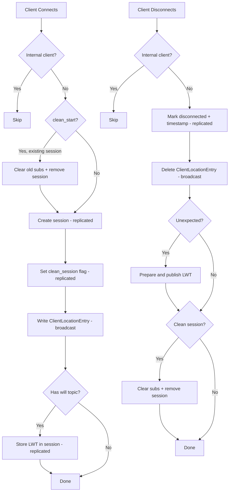
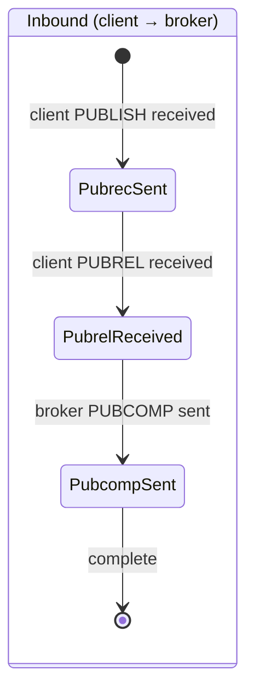
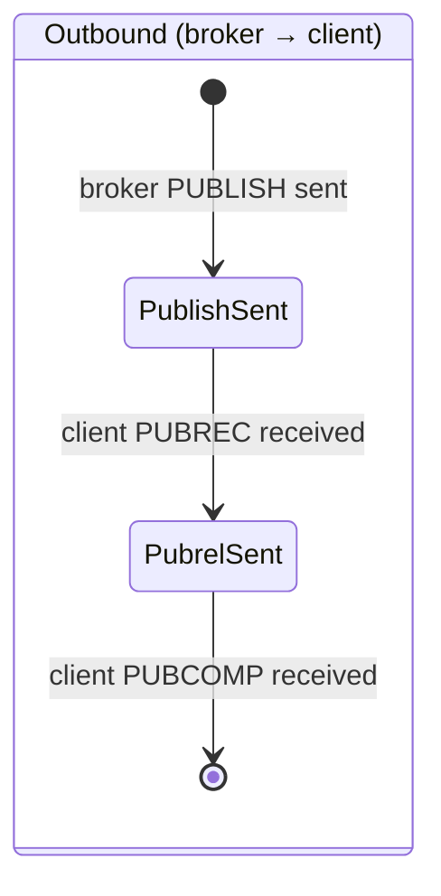

# Chapter 12: Session Management

Rebalancing moves partitions between nodes, but a partition is just a range of keys — it has no awareness of the MQTT clients whose state it contains. When Partition 47 migrates from Node 1 to Node 2, every client whose `client_id` hashes to Partition 47 has its session, subscriptions, in-flight messages, and QoS 2 handshake state relocated. Meanwhile, the clients themselves remain connected to whichever node accepted their TCP connection. The partition that *owns* a client's session and the node the client is *connected to* are two independent facts that can point to different places in the cluster.

This chapter covers the full session lifecycle: what an MQTT session contains, how it is created and destroyed, how QoS delivery guarantees survive broker failures, and how the system cleans up after itself when sessions expire or nodes die.

## 12.1 What Lives in a Session

A `SessionData` struct captures everything the broker needs to remember about a connected (or recently disconnected) MQTT client. It is serialized with `BeBytes` — the same big-endian binary encoding used by every other internal entity — and contains roughly 20 fields organized into four groups.

**Identity and location:** `client_id` (variable-length string), `session_partition` (the CRC32 hash result that determines which partition owns this session), `connected` (boolean flag), and `connected_node` (the node ID where the client's TCP connection lives).

**Session semantics:** `clean_session` (whether the client requested clean start), `session_expiry_interval` (seconds until the session is eligible for removal after disconnect), and `last_seen` (millisecond timestamp of the last connect or disconnect event).

**Subscription tracking:** `mqtt_sub_version` (a monotonically increasing counter that changes whenever the client's subscription set is modified). The actual subscriptions are stored separately in the `_mqtt_subs` entity, not in `SessionData` — the version counter allows the session to detect whether its subscription set has changed without scanning the subscription store.

**Last Will and Testament:** `has_will`, `lwt_published`, `lwt_token_present`, `lwt_token` (16 bytes for the idempotency UUID), `will_qos`, `will_retain`, `will_topic` (variable-length), and `will_payload` (variable-length). Embedding the LWT in the session rather than storing it separately ensures that the will message is always co-located with the session metadata that determines whether it should be published. The three flag bytes (`has_will`, `lwt_token_present`, `lwt_published`) form a state machine described in Section 12.4.

The session itself is one of four internal entities that collectively represent an MQTT client's state:

| Entity | Key format | Contents |
|--------|-----------|----------|
| `_sessions` | `_sessions/p{N}/{client_id}` | Session metadata, LWT, connection state |
| `_mqtt_subs` | `_mqtt_subs/p{N}/clients/{client_id}/topics` | `MqttSubscriptionSnapshot` — all topics + QoS per topic |
| `_mqtt_inflight` | `_mqtt_inflight/p{N}/clients/{client_id}/pending/{packet_id}` | QoS 1 in-flight messages awaiting PUBACK |
| `_mqtt_qos2` | `_mqtt_qos2/p{N}/clients/{client_id}/inflight/{packet_id}` | QoS 2 handshake state |

All four use the same partition function: `CRC32(client_id.as_bytes()) % 256`. A client's entire state — session, subscriptions, in-flight messages, QoS 2 handshakes — lives on the same partition and replicates as a unit. When the MigrationManager transfers a partition (Chapter 11), all four entity stores export their data for that partition in a single snapshot, and all four import it on the receiving node. `clear_partition()` removes all data for a partition from all four stores after export.

The `MqttSubscriptionSnapshot` deserves special mention. Rather than storing each subscription as a separate key-value pair (which would produce one replication write per subscribe/unsubscribe), all of a client's subscriptions are packed into a single `MqttSubscriptionSnapshot` struct. Each entry in the snapshot is an `MqttTopicEntry` containing the topic filter, the QoS level, and a flag indicating whether the topic is a wildcard pattern. The snapshot also carries a `snapshot_version` counter that increments on every add or remove operation. A single subscribe operation produces one replication write for the entire snapshot, not one per topic — a significant reduction in replication traffic for clients with many subscriptions.

A fifth supporting entity bridges the gap between partition ownership and TCP connections: `_client_loc` (the `ClientLocationStore`). This is a broadcast entity — not partitioned, but replicated to every node — that maps `client_id` to `connected_node`. Its key format is simply `_client_loc/{client_id}`. When any node needs to route a publish to a specific client, it consults its local `ClientLocationStore` for an O(1) lookup rather than querying the partition primary that owns the client's session.

## 12.2 The Connect/Disconnect Lifecycle

### Connect

When a client connects, the `on_client_connect` handler in `broker_events.rs` executes a sequence of replicated operations:

1. **Skip internal clients.** Any `client_id` starting with `mqdb-` is an internal bridge or service client. These do not get sessions — they are infrastructure, not application clients.

2. **Clean start handling.** If the client set `clean_start=true` in its CONNECT packet and an existing session is found, the handler clears the old subscription state (unsubscribing from the TopicIndex and WildcardStore, broadcasting the removals to the cluster) and removes the old session. Both operations are replicated.

3. **Create session.** A new `SessionData` is created with `connected=1` and `connected_node` set to this node's ID. The creation is replicated to the partition's replica.

4. **Set clean session flag.** A separate replicated update marks whether the client requested clean start. This is forwarded via `write_or_forward` to the partition primary — the connecting node may not be the primary for this client's session partition.

5. **Broadcast client location.** A `ClientLocationEntry` is created with a millisecond timestamp and broadcast to all nodes. Every node now knows where this client is connected.

6. **Store Last Will and Testament.** If the CONNECT packet included a will topic, the handler extracts the will topic, payload, QoS, and retain flag, then stores them in the session via a replicated update.

The `write_or_forward` pattern appears throughout this sequence. The connecting node may not be the partition primary for this client's `client_id` hash. Every session write is constructed locally but forwarded to the partition primary for replication. The connecting node receives the write back via the normal replication pipeline, ensuring consistency with the authoritative copy.

The connect flow generates between 3 and 5 replicated operations depending on the client's configuration: session creation (always), clean session flag (always), client location broadcast (always), plus old session removal (if clean start with existing session) and will storage (if will topic present). In a busy cluster handling 1,000 connections per second, this translates to 3,000-5,000 replication writes per second from connect events alone. The `write_or_forward` pattern distributes this load across partition primaries — each primary handles only the connects that hash to its partitions.

### Disconnect

The `on_client_disconnect` handler mirrors the connect flow:

1. **Skip internal clients.** Same `mqdb-` prefix check.

2. **Mark session disconnected.** A replicated update sets `connected=0` and records the current timestamp as `last_seen`. This timestamp becomes the anchor for session expiry calculations.

3. **Delete client location.** A `ClientLocationEntry` delete is broadcast to all nodes.

4. **Handle unexpected disconnect.** If the disconnect was not graceful (the `unexpected` flag is set), the handler prepares and publishes the Last Will and Testament. This is the most complex part of the disconnect flow, covered in Section 12.4.

5. **Clean session cleanup.** If the client's session has `clean_session=true`, the handler clears all subscriptions and removes the session entirely.



## 12.3 QoS State Replication

### Why Replicate QoS State

QoS 1 guarantees at-least-once delivery: the broker must not consider a message delivered until the subscriber sends PUBACK. QoS 2 guarantees exactly-once delivery: a four-packet handshake ensures the message is processed exactly once on both sides. If the broker crashes mid-delivery, these guarantees break unless the in-progress state survives on another node. Replicating QoS state to the partition's replica means that a partition takeover can resume delivery without losing track of which messages were acknowledged and which handshakes were in progress.

### QoS 1: The Inflight Store

The `InflightStore` tracks QoS 1 messages that have been sent to a subscriber but not yet acknowledged. Each `InflightMessage` contains: `packet_id`, `client_id`, `topic`, `payload`, `qos`, `attempts` (starting at 1), and `last_attempt` (millisecond timestamp).

The lifecycle of an inflight message:

1. **Send.** The broker sends PUBLISH to the subscriber. `add()` creates an `InflightMessage` keyed by `(client_id, packet_id)`. The creation is replicated as an insert.

2. **Acknowledge.** The subscriber sends PUBACK. `acknowledge()` removes the `InflightMessage`. The removal is replicated as a delete.

3. **Retry.** If no PUBACK arrives within the backoff window, the message is resent. The `should_retry()` method checks whether enough time has elapsed since the last attempt:

   - Backoff formula: `min(1000 * 2^attempts, 300_000)` milliseconds
   - At attempt 1: 2 seconds. At attempt 2: 4 seconds. At attempt 5: 32 seconds. Capped at 300 seconds (5 minutes).
   - `messages_due_for_retry()` scans the store for all messages past their backoff window.

4. **Expire.** After 10 attempts (the default `max_attempts`), the message is considered undeliverable. `expired_messages()` finds these and they are removed from the store.

The inflight store partitions messages the same way as sessions: `session_partition(client_id)`. A client's in-flight messages live on the same partition as its session and travel with it during migration.

### QoS 2: The QoS 2 Store

The exactly-once protocol requires a four-packet handshake. There are two directions, each with distinct phases:





The `Qos2State` struct stores: `direction` (byte: 0=inbound, 1=outbound), `state` (phase byte, starting at 1), `packet_id`, `client_id`, `topic`, `payload`, and `created_at`. The `direction` and `state` bytes together determine the current phase:

| Direction | State byte 1 | State byte 2 | State byte 3 |
|-----------|-------------|-------------|-------------|
| Inbound (0) | PubrecSent | PubrelReceived | PubcompSent |
| Outbound (1) | PublishSent | PubrelSent | — |

Advancing the phase is a single operation: `advance_phase()` increments the state byte by 1. The `phase()` method maps the `(direction, state)` pair to the corresponding enum variant, returning `None` for invalid combinations.

**Inbound flow:** Client publishes with QoS 2. The broker creates `Qos2State(Inbound, state=1)` — phase `PubrecSent`. It sends PUBREC. When the client sends PUBREL, the state advances to `PubrelReceived`. The broker processes the message and sends PUBCOMP. On completion, the state is removed from the store.

**Outbound flow:** The broker needs to deliver a message to a subscriber at QoS 2. It creates `Qos2State(Outbound, state=1)` — phase `PublishSent`. When the subscriber sends PUBREC, the state advances to `PubrelSent` and the broker sends PUBREL. When the subscriber sends PUBCOMP, the state is removed.

Every state creation, phase advance, and completion is replicated to the partition replica. If the partition primary fails mid-handshake, the new primary can read the replicated state and resume from the last committed phase.

### The Message Delivered Handler

The `on_message_delivered` event handler ties the QoS stores to the MQTT protocol events. When the broker's MQTT layer reports that a message has been delivered (meaning the client completed the required acknowledgment exchange), the handler dispatches based on QoS level:

- **QoS 1:** Call `acknowledge_inflight_replicated()` to remove the inflight message and replicate the deletion. This is the normal completion path — the subscriber sent PUBACK, and the message is considered delivered.

- **QoS 2:** Call `complete_qos2_replicated()` to remove the QoS 2 state and replicate the deletion. This fires when the subscriber sends the final PUBCOMP (for outbound messages) or when the broker processes the final stage of the inbound handshake.

- **QoS 0:** No action. QoS 0 messages have no delivery tracking — they are fire-and-forget by definition.

The handler skips internal clients (the `mqdb-` prefix check) to avoid creating QoS tracking state for cluster infrastructure messages. Internal clients use QoS 0 for cluster communication precisely to avoid this overhead.

## 12.4 Last Will and Testament

### The Double-Failure Problem

A client connects to Node 1 and registers a will message. The client disconnects unexpectedly — Node 1 detects the broken TCP connection and should publish the will. But what if Node 1 also fails before publishing? The will is stored in the session, which is replicated to Node 2. When Node 2 takes over the partition, it must publish the will. But how does Node 2 know whether Node 1 already published it before failing?

Without a coordination mechanism, two outcomes are possible: the will is published twice (Node 1 published it, Node 2 doesn't know and publishes again) or not at all (Node 1 failed before publishing, Node 2 assumes Node 1 handled it). Neither is acceptable.

### Token-Based Idempotency

The `LwtPublisher` solves this with a prepare/complete protocol using UUID v7 tokens.

**Prepare phase** (`prepare_lwt`):

1. Read the session. Check `determine_lwt_action()`:
   - Already published → `AlreadyPublished`
   - No will configured → `Skip`
   - Token already present (another prepare is in progress) → `Skip`
   - Will pending, no token → `Publish`

2. Generate a UUID v7 token (16 bytes, time-ordered).

3. Store the token in the session via `set_lwt_token()`. This write is replicated.

4. Return `LwtPrepared` containing the topic, payload, QoS, retain flag, and token.

**Complete phase** (`complete_lwt`):

1. Read the session. Compare the stored token with the provided token.
2. If mismatch → `TokenMismatch` error (another node or attempt prepared a different token).
3. If match → mark `lwt_published = 1`. This write is replicated.

The token prevents double-publish: if Node 1 prepared an LWT (token written to session, replicated to Node 2), then crashed before completing, Node 2 sees `lwt_token_present=1` and `lwt_published=0`. The `recover_pending_lwts()` function finds sessions in this state — `has_will=1`, `lwt_token_present=1`, `lwt_published=0` — and resumes delivery using the original token.

Three LWT states exist in `SessionData`, distinguished by three flag bytes:

| `has_will` | `lwt_token_present` | `lwt_published` | Meaning |
|-----------|-------------------|----------------|---------|
| 0 | 0 | 0 | No will configured |
| 1 | 0 | 0 | Will pending, prepare not started |
| 1 | 1 | 0 | Prepare complete, publish in progress |
| 1 | * | 1 | Published (terminal state) |

### The Lock Drop Pattern

The disconnect handler in `broker_events.rs` demonstrates the lock drop/reacquire pattern that appears throughout MQDB's async code. Publishing the LWT requires forwarding the message to subscribers on remote nodes — an operation that involves network I/O. But the `NodeController` write lock is held during disconnect processing.

The solution unfolds in three phases:

1. **While holding the lock:** Call `prepare_lwt_forwarding()`, which prepares the LWT (storing the token in the session), resolves which subscribers match the will topic, groups them by remote node, and extracts the transport handle. Collect all needed data into an `LwtForwardingData` struct.

2. **Drop the lock.** Forward the publish to remote nodes via `forward_publish_to_remotes()`. This is the network I/O that would deadlock if the lock were held, because remote nodes' responses flow through the same event loop.

3. **Reacquire the lock.** Call `complete_lwt()` with the token to mark the will as published. Then handle clean session cleanup if applicable.

The key insight is that the token survives the lock gap. If the node crashes between steps 2 and 3, the token is already replicated. The recovery path can resume from the token.

## 12.5 Session Expiry and Cleanup

Sessions with a non-zero `session_expiry_interval` expire when the client has been disconnected long enough. The `is_expired()` method checks:

- If the session is still connected → not expired (connected sessions never expire).
- If `session_expiry_interval` is 0 → not expired. In MQDB, zero means "persist indefinitely" — the session survives across disconnects without expiring. This is the persistent session default.
- Otherwise, expired when `now - last_seen > session_expiry_interval * 1000` (the interval is in seconds, timestamps are in milliseconds).

The `handle_session_cleanup` function runs periodically in the cluster agent's event loop. In addition to session expiry, it also handles cleanup for three other time-sensitive subsystems: idempotency records (from deduplication), stale consumer offsets, and expired unique constraint reservations. All four cleanup operations share the same timer tick — a pragmatic choice that avoids maintaining four separate timers for what are all essentially "find expired entries and remove them" operations.

For sessions specifically, the function calls `cleanup_expired_sessions(now)` on the `SessionStore`, which atomically removes all expired sessions and returns them. For each expired session, `clear_expired_session_subscriptions()` performs a cascade of replicated cleanup operations:

1. **Iterate the subscription snapshot.** For each topic the client was subscribed to:
   - If wildcard: unsubscribe from the `WildcardStore` (replicated) and broadcast the removal to the cluster.
   - If exact: unsubscribe from the `TopicIndex` and broadcast the removal.
   - Remove the subscription from the `SubscriptionCache` (replicated via `write_or_forward`).

2. **Clear QoS 2 states.** `clear_qos2_client_replicated()` removes all QoS 2 handshake states for this client. Each removal generates a replicated delete.

3. **Clear inflight messages.** `clear_inflight_client_replicated()` removes all pending QoS 1 messages. Each removal generates a replicated delete.

A client with N subscriptions, M inflight messages, and K QoS 2 states generates N + M + K replicated deletes plus up to N broadcast messages during cleanup. The cleanup function processes all expired sessions within a single write lock acquisition, keeping the operation atomic from the perspective of concurrent event processing.

The ordering of cleanup operations matters: subscriptions are removed first because they affect the TopicIndex and WildcardStore (broadcast entities that influence publish routing on every node). If QoS state were removed first and the node crashed before removing subscriptions, the client would still appear as a subscriber for topics it no longer has sessions for — causing publishes to be routed to a non-existent client. Removing subscriptions first ensures that the client stops receiving new messages before its delivery tracking state is cleaned up.

## 12.6 Node Death and Session Handling

When the heartbeat manager detects a dead node, the `handle_processing_batch` function in the cluster agent's event loop handles the session implications:

1. `drain_dead_nodes_for_session_update()` yields the IDs of nodes that have been declared dead but whose sessions have not yet been processed.

2. For each dead node: `sessions_on_node(dead_node_id)` finds all sessions with `connected_node` equal to the dead node's ID.

3. Each affected session is marked disconnected with the current timestamp. This is a replicated update forwarded to the session's partition primary.

4. Every 8 sessions, the handler yields to the async runtime via `tokio::task::yield_now()`. This prevents a large batch of session updates from starving other tasks on the event loop.

This does NOT trigger LWT delivery directly. The separation is deliberate: marking sessions disconnected is a bookkeeping operation that can be performed by any node that detects the death. LWT delivery, by contrast, requires routing the will message to subscribers across the cluster — a more complex operation that depends on the will message content stored in the session.

LWT recovery happens through `recover_pending_lwts()`, which scans for sessions in the "in-progress" state (`has_will=1, lwt_token_present=1, lwt_published=0`). These are sessions where the dead node prepared an LWT token (storing it in the session, which was replicated) but crashed before calling `complete_lwt()`. The recovery function extracts the token and will message data from each session and returns them as `LwtPrepared` structs that can be published using the existing forwarding path.

If the dead node died before preparing the LWT at all, the session's will remains in the "pending, not started" state (`has_will=1, lwt_token_present=0, lwt_published=0`). The `needs_lwt_publish()` method identifies these sessions. A node that becomes primary for the partition can initiate a fresh prepare/complete cycle for these orphaned wills.

The two-phase recovery depends critically on the fact that the session data — including the LWT token — is replicated before the will is published. If the dead node had published the will but crashed before the `lwt_published=1` update was replicated, the will could be published a second time during recovery. This is a theoretical possibility accepted as a tradeoff: at-least-once will delivery is preferable to at-most-once, because a missed will message is invisible (clients assume silence means health), while a duplicate will message is visible and can be handled by idempotent subscribers.

## 12.7 Subscription Reconciliation

When a node becomes primary for new partitions — either through rebalancing or failover — its local subscription cache may be out of sync with the authoritative TopicIndex and WildcardStore. The SubscriptionCache records which topics each client is subscribed to (per-partition state), while the TopicIndex and WildcardStore are broadcast entities that every node maintains independently. Drift can occur in several ways: a subscription broadcast might arrive before the corresponding SubscriptionCache replication write, a partition migration might transfer cached subscriptions that were already removed from the broadcast stores, or a node might have been down when a broadcast was sent and never received the update.

The `reconcile()` function in `SubscriptionCache` performs a three-way comparison:

1. For each client in the cache, collect the authoritative set of exact topics (from the TopicIndex) and wildcard patterns (from the WildcardStore).

2. **Remove stale entries.** If the cache contains a subscription that is not in either authoritative store, remove it.

3. **Add missing entries.** If an authoritative store contains a subscription that is not in the cache, add it.

The result is a `ReconciliationResult` with counts: `clients_checked`, `subscriptions_added`, `subscriptions_removed`.

Reconciliation runs in two situations:

- **On `became_primary`.** The `handle_tick` function in the event loop detects when this node has become primary for any partition (comparing the new partition map from Raft against the previous one). When `became_primary` is true, reconciliation runs immediately.

- **On timer.** The reconciliation interval is 300,000 milliseconds (5 minutes). The `needs_reconciliation()` method checks whether enough time has elapsed since the last reconciliation.

The forced reconciliation on `became_primary` is the critical path — it ensures that the new primary has a consistent subscription cache before it starts processing publishes for its new partitions. The timer-based reconciliation is a safety net that catches any drift that accumulates during normal operation.

## 12.8 Partition Migration for Sessions

All four session entities support the export/import protocol that the MigrationManager uses during partition transfers (Chapter 11). The binary format is identical across all four stores:

```
[count: u32]
  [id_len: u16] [id: bytes] [data_len: u32] [data: bytes]
  [id_len: u16] [id: bytes] [data_len: u32] [data: bytes]
  ...
```

The `id` field varies by store: for sessions it is the `client_id`, for inflight and QoS 2 stores it is `client_id:packet_id`, and for subscriptions it is the `client_id`.

`export_for_partition(partition)` filters each store's contents to the specified partition (using the same `session_partition()` hash), serializes the matching entries, and returns the byte buffer. `import_sessions()`, `import_inflight()`, `import_states()`, and `import_subscriptions()` parse the byte buffer and insert the entries into the local store.

After a successful export and transfer, `clear_partition(partition)` removes all data for that partition from the local store. The old primary retains no state for the migrated partition, ensuring that the new primary is the sole authority.

The export/import cycle for a partition with 100 clients, each with 5 subscriptions and 3 inflight messages, produces four binary blobs: 100 session entries, 100 subscription snapshots, 300 inflight messages, and however many QoS 2 states are in progress. The total transfer size depends on the session payload sizes (will topics and payloads dominate for sessions with large will messages) and the inflight message payloads. The format is compact — each entry is the raw `BeBytes` serialization with only a length prefix overhead — but the transfer is atomic: all four blobs are included in the same snapshot chunk sequence described in Chapter 10.

One subtlety: the migration transfers the SubscriptionCache data, but it does NOT transfer TopicIndex or WildcardStore entries. Those are broadcast entities — the new primary already has them. The reconciliation step after `became_primary` ensures that the transferred SubscriptionCache and the existing broadcast stores agree.

## What Went Wrong

### The Missing Client Location Store

Early versions of the cluster had no `_client_loc` entity. Publish routing used the session's `connected_node` field, which lived on the partition primary for that client's `client_id` hash. When Client A on Node 1 published to a topic subscribed by Client B on Node 3, Node 1 needed to know that Client B was on Node 3. But Client B's session might live on Node 2 (the partition primary for Client B's hash). Node 1 would have to query Node 2 to find Client B's location — adding a network round trip to every cross-node publish.

The cost compounded with subscriber count. A topic with 10 subscribers across 3 nodes could require up to 10 partition lookups before the publisher knew where to forward. Latency scaled with the number of subscribers rather than the number of nodes.

The fix was `_client_loc` as a broadcast entity. On connect, a `ClientLocationEntry` is written and broadcast to all nodes. On disconnect, it is deleted and broadcast. Every node maintains a complete `HashMap<String, NodeId>` mapping client IDs to their connected nodes. Publish routing becomes a local hash map lookup — O(1) per subscriber, regardless of which partition owns the subscriber's session.

The tradeoff is memory: every node stores every connected client's location, even if no local partition cares about that client. For a cluster with 10,000 connected clients, each node holds 10,000 entries in its `ClientLocationStore`. The entry itself is small (a string key and a `NodeId`), so the overhead is measured in kilobytes. The latency savings — eliminating one network round trip per subscriber per publish — are worth orders of magnitude more than the memory cost.

### The Phantom Disconnect

The `ClientLocationEntry` originally had no timestamp. When a client disconnected from Node 1 and reconnected to Node 3, two broadcast operations were emitted: a delete (from Node 1) and an insert (from Node 3). These could arrive at other nodes in any order. If the delete arrived after the insert, every other node believed the client had disconnected — even though it was connected to Node 3 and actively publishing. The client appeared to vanish from the routing table.

The symptom was intermittent: publishes to that client's subscriptions would succeed sometimes (when the insert arrived last) and fail sometimes (when the delete arrived last). The timing depended on network latency between nodes, making the bug difficult to reproduce.

The fix was adding a `timestamp_ms` field to `ClientLocationEntry` (reflected in its current version 2 format). The timestamp establishes a causal ordering between connect and disconnect events for the same client: the insert from Node 3 carries a later timestamp than the delete from Node 1, because the reconnect necessarily happens after the disconnect. While the current implementation relies on last-write-wins semantics at the broadcast layer rather than explicit timestamp comparison in the store, the timestamp field provides the foundation for ordering guarantees if network reordering becomes a problem in practice. The approach mirrors the timestamp addition to ForwardedPublish dedup described in Chapter 8 — embedding temporal ordering into the data itself rather than relying on delivery order.

## Lessons

**State that follows the client vs. state that follows the partition.** Sessions are partitioned by `client_id`, meaning they follow the partition — wherever Partition 47 lives, that is where Client B's session lives. But publish routing needs to know which *node* Client B is connected to, which follows the TCP connection. The two do not always agree: a client can be connected to Node 1 while its session partition primary is Node 2. The `_client_loc` broadcast entity bridges this gap. It follows the connection (broadcast to all nodes), not the partition. Any system where entities are co-located by hash but accessed by connection needs a separate index that maps identity to location.

**Idempotency tokens are cheaper than distributed locks.** The LWT double-publish problem could have been solved with a distributed lock: "acquire the lock before publishing the will, release it after." But distributed locks require consensus (an additional Raft round trip), have failure modes when the lock holder dies (who releases the lock?), and add latency to every will publish. The UUID v7 token approach requires no coordination. Any node can attempt to prepare the LWT. The token stored in the replicated session state ensures that only one attempt completes. The token is a claim, not a lock. It survives crashes because it is part of the session data that is already replicated for other reasons. The pattern generalizes: any operation that must happen exactly once across a distributed system can use a token written to replicated state instead of a distributed lock, provided the operation is idempotent from the token holder's perspective.

**Clean up what you replicate.** Every replicated write must have a corresponding replicated delete path. Inflight messages that expire, QoS 2 states that complete, sessions that disconnect with clean start — all require replicating the deletion. `clear_expired_session_subscriptions()` generates up to N + M + K replicated writes for a client with N subscriptions, M inflight messages, and K QoS 2 states. Forgetting to replicate a delete creates ghost state on replicas that accumulates indefinitely. The cost is not immediate — ghost state does not cause errors — but it consumes memory and eventually degrades scan performance on every query that touches the affected partition.

**Co-locate related state by partition key.** All four session entities use the same partition function — `CRC32(client_id) % 256` — ensuring that a client's session, subscriptions, inflight messages, and QoS 2 states always live on the same partition. This co-location is not accidental; it means partition migration moves all of a client's state atomically, session cleanup can clear all state in a single lock acquisition, and the replication factor applies uniformly to all components of a session. If inflight messages were partitioned differently from sessions (say, by topic hash instead of client hash), a partition migration would split the client's state across two partitions with potentially different primaries — a consistency nightmare where the session says "connected" but the inflight messages live on a node that disagrees.

## What Comes Next

Sessions generate events — connects, disconnects, publishes, subscribes — but these events arrive over the network as raw MQTT packets. Between the TCP socket and the session handlers described in this chapter sits the message processor pipeline: a chain of transformations that classifies incoming cluster messages, deduplicates forwarded publishes, and dispatches operations to the correct handler. Chapter 13 covers how messages flow from the transport layer through classification and batching before reaching the session management logic described here.
