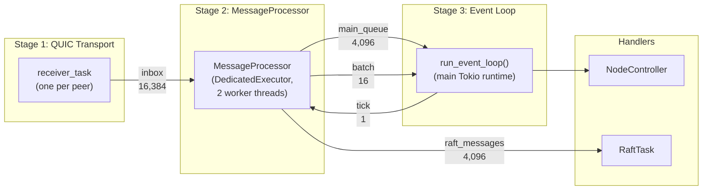
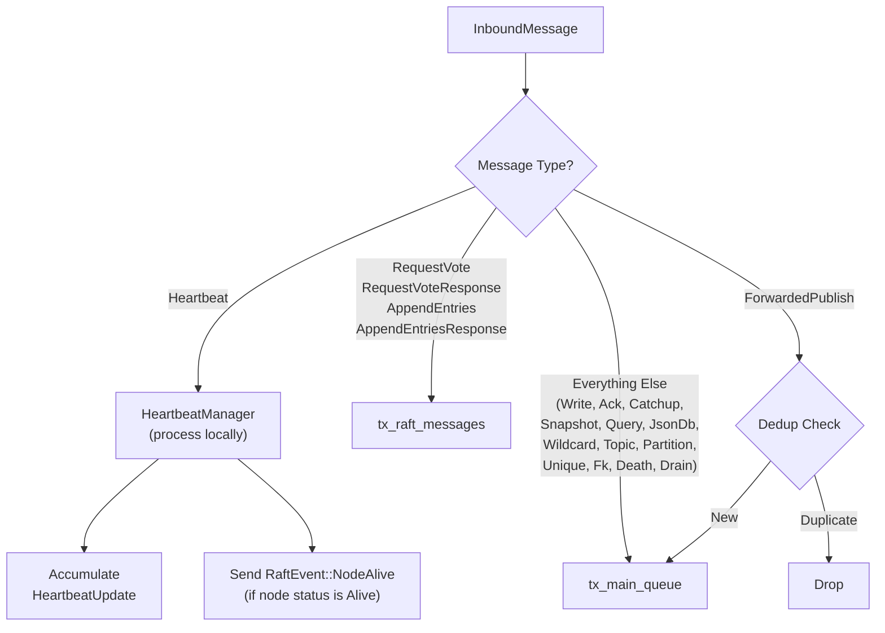

# Chapter 13: The Message Processor Pipeline

The previous chapters described what happens when a cluster message reaches its handler — replication writes update replicas, heartbeats detect failures, Raft proposals coordinate partition ownership, and forwarded publishes deliver messages to remote subscribers. But those handlers do not read directly from the network. A multi-stage pipeline sits between the QUIC transport layer and the `NodeController` that processes each message. This pipeline classifies messages by urgency, deduplicates forwarded publishes before they reach the main queue, separates consensus traffic from data traffic, and batches work to amortize lock acquisition costs. Without it, every message type would compete for the same processing thread, and a flood of snapshot chunks during rebalancing could starve the heartbeat protocol into declaring false node deaths.

This chapter traces a message from the moment it arrives as bytes on a QUIC stream to the point where a handler in the `NodeController` acts on it. The path crosses three runtime boundaries, passes through two deduplication layers, and touches six bounded channels — each sized for a specific reason.

## 13.1 The Pipeline Architecture

The pipeline has three stages, each running on its own task or runtime, connected by bounded channels:



**Stage 1** is the QUIC receiver. One `receiver_task` runs per peer connection — both for outgoing connections (opened via `connect_to_peer()`) and incoming connections (accepted by the `acceptor_task`). Each task reads framed messages from a QUIC bidirectional stream: a 4-byte big-endian length prefix followed by the payload. The maximum message size is 10 MB — large enough for snapshot chunks (which use 64 KB pieces but can carry larger partition data) but bounded to prevent memory exhaustion from malformed peers. If a message exceeds this limit, the receiver task breaks the connection to that peer.

The payload structure is minimal: a 2-byte big-endian sender node ID, a 1-byte message type discriminant, and the type-specific encoded data. The receiver calls `InboundMessage::parse_from_payload()`, which filters self-sends (messages where the sender node ID matches the local node) and decodes the message type discriminant into the appropriate `ClusterMessage` variant via a match over the 35 registered type codes. Valid messages become `InboundMessage` structs — carrying the sender identity, the parsed `ClusterMessage` enum, and a millisecond timestamp — and are sent into the inbox channel via `try_send()`. When the inbox is full (at 16,384 messages), the receiver logs the dropped message's type and continues reading from the stream. This is a deliberate design choice: dropping messages at the inbox boundary is preferable to blocking the QUIC stream, which would apply backpressure to the remote node's send path and delay its heartbeat broadcasts to all peers.

**Stage 2** is the `MessageProcessor`. It consumes from the inbox channel, classifies each message by urgency, and routes it to one of three output paths: Raft messages go to a dedicated Raft channel, heartbeats are processed inline and accumulated into batches, and everything else flows to the main queue channel. The processor runs on a `DedicatedExecutor` — a separate Tokio runtime with its own worker threads — to isolate heartbeat timing from application-level processing delays.

**Stage 3** is the event loop, running `tokio::select!` on the main Tokio runtime. It receives messages from the main queue and processing batches from the batch channel, acquires the `NodeController` write lock, and dispatches each message to the appropriate handler. The event loop also drives periodic maintenance: TTL cleanup, session expiry, wildcard reconciliation, subscription reconciliation, retained message sync, and cascade operation retries.

The three stages exist for isolation. Stage 1 handles I/O — reading bytes from QUIC streams must not be blocked by application logic. Stage 2 handles timing — heartbeat detection must not be delayed by database operations holding the `NodeController` lock. Stage 3 handles serialized writes — the `RwLock` on the `NodeController` ensures that partition state mutations are sequential. Each stage runs at its own pace, with bounded channels providing backpressure when a downstream stage falls behind.

The full channel topology:

| Channel | Capacity | Direction | Purpose |
|---------|----------|-----------|---------|
| inbox | 16,384 | QUIC receivers → MessageProcessor | Raw inbound messages |
| raft_messages | 4,096 | MessageProcessor → RaftTask | Vote requests, append entries |
| raft_events | 4,096 | MessageProcessor → RaftTask | Node alive/dead notifications |
| main_queue | 4,096 | MessageProcessor → Event Loop | All non-Raft, non-heartbeat messages |
| batch | 16 | MessageProcessor → Event Loop | Accumulated heartbeat updates, dead nodes |
| tick | 1 | Event Loop → MessageProcessor | Clock signal for heartbeat timing |

The capacity choices reflect the traffic profiles. The inbox is the widest at 16,384 because QUIC receivers produce messages at wire speed and any message dropped at the inbox boundary is permanently lost — the cluster protocol has no application-level retransmission for discarded messages. The Raft and main queue channels are smaller at 4,096 because their consumers (the Raft task and event loop) process messages in tight loops. The batch channel is 16 because it carries aggregated state, not individual messages — one batch per tick. The tick channel is 1 and uses `try_send`, meaning ticks are dropped rather than queued when the processor is busy. A dropped tick means the heartbeat check runs on the next cycle instead; no state is lost.

## 13.2 Message Classification

The `MessageProcessor`'s `process_message()` function is the routing core of the pipeline. Every inbound message passes through it exactly once, and the function determines which output path the message takes.



The classification logic groups messages into three urgency tiers:

**Immediate: Heartbeats.** Heartbeats are never queued in any channel. The processor calls `HeartbeatManager::receive_heartbeat()` inline, updates the node's liveness state, and if the node is now `Alive`, sends a `RaftEvent::NodeAlive` notification to the Raft task. The heartbeat data is accumulated into a `Vec<HeartbeatUpdate>` and drained into the next `ProcessingBatch` on the next tick. Processing heartbeats inline is essential — queuing them behind data-plane messages would delay timestamp updates and risk false death declarations.

**Time-sensitive: Raft messages.** The four Raft message types — `RequestVote`, `RequestVoteResponse`, `AppendEntries`, and `AppendEntriesResponse` — are forwarded to a dedicated channel consumed by the `RaftTask`. Raft has its own timing constraints (election timeouts, heartbeat intervals) and runs on the main Tokio runtime. Separating Raft from the main queue means that a slow database operation holding the `NodeController` lock does not delay vote responses, which would cause unnecessary leader elections.

**Best-effort: Everything else.** The remaining 30 message types — replication writes and acks, catchup requests and responses, forwarded publishes (after dedup), snapshot transfers, query requests and responses, JSON DB operations, wildcard and topic subscription broadcasts, partition updates, unique and foreign key constraint messages, death notices, and drain notifications — all flow to the main queue. They are processed in arrival order by the event loop, which acquires the `NodeController` write lock for each batch.

The classification is by urgency profile, not by semantic domain. A replication write and a foreign key check response share nothing semantically, but both can wait for the `NodeController` lock without causing timing failures. Heartbeats and Raft messages cannot.

## 13.3 Deduplication

Only one message type in the system undergoes deduplication: `ForwardedPublish`. Every other cluster message is inherently unique — replication writes carry sequence numbers, Raft messages carry terms and indices, constraint operations carry request IDs, and heartbeats are idempotent (a second heartbeat with the same timestamp simply overwrites the first).

Forwarded publishes are different. In a multi-node cluster, a publish on Node 1 may be forwarded to both Node 2 and Node 3. If Node 2 also has subscribers for the same topic, it might forward the message to Node 3 as well, creating a duplicate. The MQTT bridge transport (now deprecated) was especially prone to this because bridge loops could amplify a single publish into multiple copies. Even with the QUIC transport, topology changes during rebalancing can create temporary routing paths that produce duplicates.

The deduplication mechanism uses a fingerprint computed from four fields:

```
fingerprint = hash(origin_node, timestamp_ms, topic, payload) → u64
```

The hash function is `DefaultHasher` (SipHash). The `timestamp_ms` field is critical — it ensures that two legitimate publishes of the same message to the same topic at different times produce different fingerprints. Without the timestamp, a temperature sensor publishing `{"temp": 22.5}` to `sensors/room1` every second would have its second and subsequent publishes suppressed.

The fields deliberately excluded from the fingerprint are `qos`, `retain`, and `targets`. These are delivery metadata, not message identity. The same message forwarded with different QoS levels (because different subscribers requested different QoS) is still the same message and should be deduplicated.

The dedup cache is a `HashSet<u64>` paired with a `VecDeque<u64>`, capped at 1,000 entries. When the cache is full, the oldest fingerprint is popped from the front of the deque and removed from the hash set. This is FIFO eviction, not LRU — there is no access-order tracking. FIFO is sufficient because forwarded publishes arrive in roughly chronological order, and duplicates appear within milliseconds of the original. A message that has not been seen as a duplicate within 1,000 subsequent messages is not going to appear as a duplicate later.

The system has two dedup layers. The first sits in the `MessageProcessor`, before messages reach the main queue. This layer catches duplicates at the earliest possible point, preventing them from consuming main queue capacity. The second sits in the `NodeController`'s `handle_forwarded_publish()` method, using an identical `HashSet` + `VecDeque` structure with the same 1,000-entry capacity. The second layer exists for a historical reason: before the `MessageProcessor` existed, the `NodeController` processed all messages directly, and the dedup cache lived there. When the processor was introduced, the dedup was replicated at the processor level for early filtering, but the `NodeController` cache was retained as a safety net. In processor mode, the `NodeController` calls `handle_forwarded_publish_no_dedup()` instead, skipping the redundant check — the processor has already filtered duplicates before the message reached the main queue.

## 13.4 The Dedicated Executor

The `DedicatedExecutor` is a separate Tokio runtime that runs the `MessageProcessor` in isolation from the main application runtime. It is 81 lines of code that solve one of the subtlest problems in the cluster architecture.

The constructor creates a multi-threaded Tokio runtime with `worker_threads.clamp(2, 8)` — always at least 2 threads, never more than 8. It spawns a dedicated OS thread that blocks on a shutdown signal, keeping the runtime alive until explicitly dropped. The executor exposes a `Handle` for spawning tasks on its runtime and implements `Drop` to send the shutdown signal automatically.

The cluster initializes the executor in `spawn_message_processor()` with exactly 2 worker threads:

```
executor = DedicatedExecutor::new("msg-processor", 2)
```

The processor is spawned on this executor's handle, and the executor itself is stored in the `ClusteredAgent` struct for the lifetime of the cluster node.

Why does heartbeat processing need its own runtime? The `HeartbeatManager` detects node deaths by comparing the current time against the last-received heartbeat timestamp. If the gap exceeds the timeout (15 seconds by default), the node is declared dead. But this comparison only runs during `process_tick()`, which requires the processor to get CPU time. If the processor shares a runtime with the event loop and QUIC transport, heavy application load can starve it — the failure mode described in this chapter's What Went Wrong section. The dedicated executor prevents this by reserving 2 worker threads exclusively for heartbeat processing and message classification, independent of the main runtime's load.

The `MessageProcessor`'s `run()` method is itself a biased `tokio::select!` loop with two branches: the tick channel and the inbox channel. The tick branch has priority (checked first due to `biased`), ensuring that heartbeat timing is evaluated before new messages are processed. The inbox branch drains messages in batches — after receiving one message via `recv_async()`, it loops on `try_recv()` to consume all available messages without yielding. Every 64 messages, it calls `tokio::task::yield_now()` to give the tick branch a chance to fire.

The initialization sequence in `spawn_message_processor()` wires the processor into the channel topology. It creates the `MessageProcessor` with five of the six channel endpoints (the Raft, main queue, inbox, and tick channels), registers each configured peer with the processor (which internally registers with the `HeartbeatManager`, so that it knows which nodes to expect heartbeats from), creates the `DedicatedExecutor` with 2 workers, and spawns the processor's `run()` method on the executor's handle — passing the sixth channel (`tx_batch`) as an argument to `run()` rather than to the constructor. The executor is returned and stored in the `ClusteredAgent`, ensuring its `Drop` implementation fires on shutdown.

## 13.5 Processing Batches

The `ProcessingBatch` struct is the data contract between Stage 2 (the `MessageProcessor`) and Stage 3 (the event loop):

| Field | Type | Content |
|-------|------|---------|
| `heartbeat_updates` | `Vec<HeartbeatUpdate>` | Accumulated heartbeat data from all peers since last batch |
| `dead_nodes` | `Vec<NodeId>` | Nodes that exceeded the heartbeat timeout |
| `heartbeat_to_send` | `Option<ClusterMessage>` | Outgoing heartbeat (if send interval elapsed) |
| `forwarded_publishes` | `Vec<(String, Vec<u8>, u8)>` | (unused in current implementation) |

The batch is produced by `process_tick()`, called whenever a tick arrives on `rx_tick`. The tick is a `u64` millisecond timestamp sent by the event loop every 10 milliseconds. The `process_tick()` method performs three operations in sequence: check whether it is time to send an outgoing heartbeat (based on a 1-second interval), run the timeout check to detect dead nodes (and notify the Raft task of any deaths), and drain the accumulated heartbeat updates that were collected inline during `process_message()` calls since the last tick.

The event loop's `handle_processing_batch()` consumes the batch in three steps. First, if the batch contains an outgoing heartbeat, it acquires a read lock on the `NodeController` and broadcasts the heartbeat via the transport — this only requires a read lock because broadcasting does not mutate partition state. Second, if the batch contains heartbeat updates, it acquires a write lock and calls `apply_heartbeat_updates()` on the `NodeController`, updating each peer's liveness state. Third, if the batch contains dead nodes, it acquires a write lock and calls `apply_dead_nodes()`, which triggers the full death handling cascade: marking the `HeartbeatManager` state, logging the death, sending `RaftEvent::NodeDead`, and queuing the dead node for session cleanup. The session cleanup loop then iterates through all sessions connected to the dead node, marks them disconnected, and generates replicated writes — yielding to the runtime every 8 sessions to prevent starvation of other event loop branches.

The small batch channel capacity also means that if the event loop falls behind, the `MessageProcessor` blocks on the batch send. Heartbeat updates not yet applied to the `NodeController` cannot influence routing decisions, so blocking until the event loop catches up loses nothing.

## 13.6 Event Loop Dispatch

The event loop is a biased `tokio::select!` with 12 branches, each representing a different event source:

| Priority | Branch | Frequency | Purpose |
|----------|--------|-----------|---------|
| 1 | tick_interval | 10ms | Send tick to processor, apply partition map changes |
| 2 | rx_batch | Per tick (~100ms) | Apply heartbeat updates, handle dead nodes |
| 3 | rx_main_queue | Continuous | Process cluster messages |
| 4 | ttl_cleanup | 60s | Remove TTL-expired entities |
| 5 | cleanup_interval | 3600s | Session expiry, idempotency cleanup |
| 6 | wildcard_reconciliation | 60s | Retry pending wildcard broadcasts |
| 7 | subscription_reconciliation | 300s | Verify subscription cache consistency |
| 8 | retained_sync_cleanup | 30s | Clean stale retained sync entries |
| 9 | cascade_retry | 30s | Retry pending cascade operations |
| 10 | admin_rx | On demand | Handle admin MQTT requests |
| 11 | rx_local_publish | On demand | Forward local publish requests |
| 12 | shutdown_rx | Once | Graceful shutdown |

The `biased` keyword in `tokio::select!` means branches are checked in declaration order, not randomly. This gives the tick and batch branches priority over the main queue, ensuring that heartbeat timing and partition map updates are never starved by a flood of data-plane messages. The main queue branch has priority over maintenance timers, which have priority over the admin channel. This ordering is deliberate: a cluster in the middle of a rebalancing operation should prioritize processing partition updates over running hourly session cleanup.

The tick handler (`handle_tick`) does more than send the clock signal to the `MessageProcessor`. It is the event loop's synchronization point between the Raft consensus layer and the `NodeController`'s partition map. The Raft task publishes partition map changes via a `watch` channel. Every 10 milliseconds, the tick handler reads the latest Raft partition map, compares it against the `NodeController`'s current map, and applies any differences. For each changed partition, it calls `become_primary()` or `become_replica()` on the `NodeController`, updates the local partition map, and reconciles subscriptions if the node just became primary for new partitions. This diff-and-apply loop yields every 8 partition changes to prevent starvation, using the same cooperative yielding pattern as the message processing code. The tick handler also sweeps closed pending constraint channels and logs transport queue statistics — diagnostic work that runs at a fixed cadence regardless of message traffic.

The `handle_main_queue_message()` function contains three optimizations that reduce lock acquisition overhead and improve throughput:

**Constraint response fast-path.** Before acquiring the `NodeController` write lock, the function checks whether the message is a constraint response (`UniqueReserveResponse`, `FkCheckResponse`, or `FkReverseLookupResponse`). These responses resolve a pending `oneshot` channel and require no mutable state on the `NodeController` — the pending constraint state is stored in an `Arc<PendingConstraintState>` that can be resolved without a write lock. If the first message is a constraint response, the function drains the main queue with `try_recv()`, resolving constraint responses inline and only acquiring the write lock for other message types. This fast-path prevents constraint responses from waiting behind the write lock when the `NodeController` is busy.

**Batch draining.** After processing one message from the main queue, the function drains all available messages via a `try_recv()` loop. This amortizes the write lock acquisition cost — instead of acquiring and releasing the lock for each message, the function holds the lock across a batch. The batch continues until `try_recv()` returns empty or the function needs to drop the lock for a pending constraint operation.

**Cooperative yielding.** After every 8 messages (`BATCH_SIZE = 8`), the function calls `tokio::task::yield_now()`. This prevents long batches from starving other `select!` branches — particularly the tick and batch branches that need to run at regular intervals. The yield point also appears in the `MessageProcessor`'s inbox draining loop (every 64 messages) and in the dead node session cleanup loop (every 8 sessions).

When `handle_filtered_message()` returns `Some(PendingConstraintWork)` — indicating that a create or update operation triggered unique or foreign key constraint checks that require remote responses — the event loop drops the `NodeController` write lock and spawns a completion task. This task awaits the constraint check responses (which arrive as messages on the main queue and are resolved via the `PendingConstraintState`), then reacquires the write lock and completes the operation. This lock-drop-reacquire pattern, described in earlier chapters for retained queries and unique constraints, is essential here: holding the write lock while awaiting a remote response would deadlock the system, because the response itself needs to be processed by the event loop, which needs the write lock to dispatch it.

The `handle_filtered_message()` dispatch covers all non-Raft, non-heartbeat message types. Its structure mirrors the classification in the `MessageProcessor`, but at a finer granularity:

| Message Type | Handler | Chapter Reference |
|-------------|---------|------------------|
| Write, WriteRequest | `handle_write()`, `handle_write_request()` | Chapter 5 (Replication) |
| Ack | `handle_ack()` | Chapter 5 (Replication) |
| DeathNotice | `handle_node_death()` | Chapter 10 (Failure Detection) |
| DrainNotification | sends `RaftEvent::DrainNotification` | Chapter 11 (Rebalancing) |
| CatchupRequest, CatchupResponse | `handle_catchup_request()`, `handle_catchup_response()` | Chapter 5 (Replication) |
| ForwardedPublish | `handle_forwarded_publish_no_dedup()` | Chapter 8 (Cross-Node Pub/Sub) |
| SnapshotRequest, SnapshotChunk, SnapshotComplete | `handle_snapshot_*()` | Chapter 10 (Failure Detection) |
| QueryRequest, QueryResponse | `handle_query_*()` | Chapter 9 (Query Coordination) |
| BatchReadRequest | `handle_batch_read_and_respond()` | Chapter 9 (Query Coordination) |
| WildcardBroadcast | `handle_wildcard_broadcast()` | Chapter 8 (Cross-Node Pub/Sub) |
| TopicSubscriptionBroadcast | `handle_topic_subscription_broadcast()` | Chapter 8 (Cross-Node Pub/Sub) |
| PartitionUpdate | `handle_partition_update_received()` | Chapter 11 (Rebalancing) |
| JsonDbRequest, JsonDbResponse | `handle_json_db_*()` | Chapter 2 (Storage Foundation) |
| UniqueReserveRequest, UniqueCommitRequest, UniqueReleaseRequest | `handle_unique_*_request()` | Chapter 15 (Constraints) |
| FkCheckRequest, FkReverseLookupRequest | `handle_fk_*_request()` | Chapter 15 (Constraints) |
| UniqueReserveResponse, FkCheckResponse, FkReverseLookupResponse | `pending_constraints.resolve_*()` | Chapter 15 (Constraints) |

The dispatch is a `match` statement on the `ClusterMessage` enum, which has 35 variants. The `handle_filtered_message()` method explicitly ignores Heartbeat and the four Raft message types (they should never arrive on the main queue), handles the common data-plane types directly, and delegates the remaining types to `dispatch_data_plane_message()`. This two-level dispatch keeps the hot path (writes, acks, forwards) in the first match and the less frequent types (snapshots, constraints, queries) in a secondary function.

## What Went Wrong

**The shared runtime problem.** The first implementation had no `DedicatedExecutor`. The `MessageProcessor` ran as a regular `tokio::spawn` on the main runtime alongside the event loop, the QUIC transport, and the MQTT broker. During normal operation with low message volume, this worked. The heartbeat interval (1 second) and timeout (15 seconds) provided generous margins.

The problem appeared during rebalancing. When a third node joined a two-node cluster, the Raft leader assigned approximately 85 partitions to the new node. Each partition required a full snapshot transfer — the `SnapshotSender` chunked the partition data into 64 KB pieces and sent them as `SnapshotChunk` messages. On the receiving end, each chunk entered the inbox channel, was classified by the `MessageProcessor` as a main queue message, and dispatched to the event loop. The event loop acquired the `NodeController` write lock for each chunk, assembled the snapshot, and applied it to the partition store.

With 85 concurrent snapshot transfers, the main queue was flooded. The event loop spent most of its time processing snapshot chunks, holding the write lock for extended periods. The `MessageProcessor` — running on the same runtime — could not get enough CPU time to process heartbeats from the inbox. Heartbeats accumulated in the inbox channel. When the tick finally fired, the `HeartbeatManager` checked timestamps and found them stale. Nodes were declared dead.

But declaring a node dead during rebalancing triggers further rebalancing — the Raft leader reassigns the dead node's partitions. This generated more snapshot transfers, which made the problem worse. The system oscillated: false death → rebalancing → more load → more false deaths.

The diagnosis was difficult because the symptoms were misleading. The logs showed "node death detected" messages, suggesting a network problem. But the network was fine — heartbeat packets were arriving on the QUIC stream and sitting in the inbox channel. The problem was that nobody was consuming them fast enough. Adding trace logging to the `MessageProcessor`'s `run()` loop revealed 3-4 second gaps between `process_message()` calls during peak rebalancing load.

The problem compounded because the delay was bidirectional. When Node 1's processor was starved, it not only failed to receive heartbeats — it also failed to send them. The outgoing heartbeat is created during `process_tick()`, which only runs when the processor gets CPU time. So Node 2 and Node 3 were simultaneously missing heartbeats from Node 1 (because Node 1's processor was not sending them) and having their own heartbeats go unprocessed (because Node 1's processor was not consuming from the inbox). A 3-second delay on one side became an effective 6-second delay in the liveness check, bringing the system much closer to the 15-second timeout threshold. Under sustained load, the delays accumulated past the threshold on all nodes simultaneously, creating a cascade of mutual death declarations.

The fix was architectural: move the `MessageProcessor` to its own Tokio runtime via `DedicatedExecutor`. Two dedicated worker threads process heartbeats and classify messages regardless of what the main runtime is doing. The heartbeat-to-death detection path became independent of the data-plane load.

**The unbounded main queue.** An earlier version of the pipeline used unbounded channels for the main queue. During a rebalancing storm with many snapshot transfers, the queue grew without limit — snapshot chunks were produced faster than the event loop could consume them. The queue consumed hundreds of megabytes of memory, and more critically, it created a latency wall. Replication acks for normal write operations sat behind thousands of queued snapshot chunks. The ack timeout (500ms) expired, causing writes to fail with `QuorumFailed` errors even though the replicas were alive and had processed the writes. The acks just could not get through the queue fast enough.

Switching to bounded channels (4,096 for the main queue) created backpressure. When the queue was full, the `MessageProcessor`'s `send()` call blocked, which caused the inbox channel to fill, which caused the QUIC `receiver_task`'s `try_send()` to fail and drop messages. But the messages dropped were new snapshot chunks — and snapshot transfers are idempotent (the receiver requests missing chunks via catchup). The system self-regulated: backpressure slowed snapshot ingestion, giving the event loop time to process acks and heartbeats interleaved with chunks.

## Lessons

**Separate what you measure from what you run.** Heartbeat-based failure detection is a measurement system. It measures whether remote nodes are alive by comparing timestamps against thresholds. Database operations, snapshot transfers, and Raft coordination are workload systems. When measurement and workload share the same compute resources, the measurement becomes unreliable under the exact conditions where reliability matters most — high load. The `DedicatedExecutor` is a concrete application of this principle: give the measurement system its own resources so that it produces accurate readings regardless of the workload's behavior.

**Classify by urgency, not by type.** Domain-based grouping — all replication together, all queries together — seems natural but produces more channels without improving failure handling. Urgency-based classification produces fewer channels, simpler routing, and correctly prioritizes the failure modes that matter: timing-sensitive work gets dedicated paths, everything else shares a single queue.

**Bounded channels are backpressure, not throttling.** The instinct when a queue overflows is to make it bigger. Bounded channels are not arbitrary limits — they are a feedback mechanism that communicates load information from the slowest consumer back to the fastest producer. Unbounded queues defer the problem by converting it from "dropped messages" to "unbounded memory growth and latency spikes" — which is strictly worse, because dropped messages have well-defined recovery paths while latency walls do not.

**Yield early, yield often.** A cooperative runtime requires tasks to voluntarily yield the thread. The right yield interval depends on per-item cost: cheap work like message classification tolerates longer batches between yields, while expensive work like handler dispatch or replicated writes needs shorter ones. The interval is inversely proportional to the per-item cost. Choosing wrong in either direction has visible consequences: too few yields starves timer-driven branches; too many yields adds scheduling overhead that shows up as throughput loss in benchmarks.

## What Comes Next

The pipeline classifies messages by a single byte — the message type discriminant extracted from the wire format. It routes them to channels, deduplicates fingerprints, and dispatches to handlers. But the encoding and decoding of those messages has been treated as a black box: bytes arrive, a `ClusterMessage` variant appears. Chapter 14 opens that box. It covers the binary wire protocol — the `BeBytes` derive macro that generates serialization code, the message type registry that maps discriminant bytes to struct parsers, and the design decisions behind a protocol that carries 35 message types with zero-copy parsing where possible.
