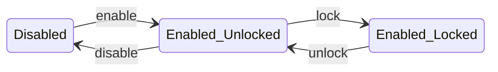

# Chapter 19: Vault Encryption and Data Protection

Chapter 18 covered how MQDB authenticates users and authorizes their actions — who can connect, which topics they can publish to, and which records they own. But authentication and authorization answer the question of *access*: who is allowed to interact with the data. They say nothing about *exposure*: what happens when someone gains access to the storage layer itself — a stolen disk, a backup tape, a database file left on a decommissioned server.

This chapter covers MQDB's two encryption-at-rest systems: the *vault*, which gives users control over their own data's encryption with a passphrase only they know, and *identity encryption*, which protects OAuth credentials with a server-managed key. Both use AES-256-GCM authenticated encryption, but they serve different threat models and operate at different layers of the system.

> **Note**: The vault system covers both agent and cluster modes. This chapter describes the functionality that exists in the codebase as of writing. Sections marked with *(planned)* describe known gaps and future work.

## 19.1 Two Threat Models

Authentication prevents unauthorized *access*. Encryption prevents unauthorized *reading*. These are complementary protections, not alternatives.

Consider a multi-tenant MQDB deployment where users authenticate via OAuth and store data in entities they own. Without encryption at rest, anyone with access to the storage files — a system administrator, a backup operator, an attacker who exfiltrates a disk image — can read every record in plaintext. Authentication is irrelevant; the data is just bytes on disk.

MQDB addresses this with two separate encryption systems, each targeting a different class of data:

| System | Protects | Key Source | User Control | Always On |
|--------|----------|------------|-------------|-----------|
| Vault | User-owned entity records | User passphrase | Enable/disable/lock/unlock | No |
| Identity Crypto | OAuth identity records | Server-generated key | None | Yes |

The vault encrypts entity data that users create through the MQTT API — notes, documents, sensor readings, anything stored in entities with ownership enabled. The user provides a passphrase; the server derives an encryption key; records are encrypted field by field. The user can lock the vault (removing the key from memory, rendering reads opaque) and unlock it later by re-entering the passphrase.

Identity encryption protects the OAuth infrastructure itself — email addresses, provider tokens, identity links. These records are created and managed by the server during the OAuth flow, not by the user directly. The encryption key is generated randomly and stored wrapped alongside the data. The user never sees or manages this key.

The separation matters because the threat models differ. Vault encryption protects user data from server operators (the user controls the passphrase). Identity encryption protects OAuth credentials from storage-level exposure (the server controls the key but does not expose it through any API). Neither system provides end-to-end encryption — the server sees plaintext during processing. Both protect data at rest.

## 19.2 Vault Crypto Primitives

The vault's cryptographic foundation is AES-256-GCM with PBKDF2 key derivation. A user provides a passphrase; MQDB derives a 256-bit key; that key encrypts and decrypts individual field values within JSON records.

The choice of algorithms was driven by WebAssembly compatibility. MQDB's database layer compiles to WASM for browser and edge deployments (Chapter 21), and the vault must work identically in both environments. AES-256-GCM and PBKDF2-HMAC-SHA256 are available in the Web Crypto API — the standard cryptographic interface exposed by all major browsers. Algorithms with better brute-force resistance, like Argon2 or scrypt, are memory-hard and rely on platform-specific memory allocation patterns that do not translate cleanly to WASM's linear memory model. PBKDF2 is purely computational (no memory hardness), which makes it portable at the cost of being more GPU-friendly for attackers. The tradeoff is acceptable: the 600,000 iteration count compensates with raw computational cost, and the algorithm works identically whether the caller is a native Rust binary or a WASM module running in a browser. Argon2 — the preferred memory-hard alternative — exists in a draft W3C community group specification for modern Web Crypto algorithms (February 2026), and is available in Node.js, but has not yet shipped in any browser's native Web Crypto API. When browser support lands, the derivation function can be swapped without changing the encryption layer — the key derivation and field encryption are independent stages connected only by a 32-byte key.

**Key derivation** uses PBKDF2-HMAC-SHA256 with 600,000 iterations and a 32-byte random salt generated per user. The iteration count follows OWASP's 2023 recommendation for PBKDF2-HMAC-SHA256. Each derivation takes roughly 200ms on a modern CPU core, which means an attacker who steals the encrypted database can try approximately 5 passphrases per second per core. A dictionary of 10 million common passphrases would take ~23 days on a single core, or ~33 minutes on a 1,000-core GPU cluster. The iteration count does not make brute force impossible — it makes each guess expensive enough that weak passphrases become the bottleneck. The security of the vault ultimately rests on passphrase entropy, not on the derivation function. At 5 guesses per second per core:

| Passphrase type | Search space | Single core | 1,000-core cluster |
|----------------|-------------|-------------|-------------------|
| 4-digit PIN | 10,000 | 33 minutes | 2 seconds |
| Common English word | ~170,000 | 9 hours | 34 seconds |
| Two random words | ~29 billion | 184 years | 67 days |
| 4 random words (diceware) | ~1.7 × 10^{17} | heat death | 1 billion years |
| 20-character random | ~10^{26} | heat death | heat death |

Operators deploying MQDB with vault encryption should enforce minimum passphrase requirements — a floor of 4 random words (diceware-style) or 16 random characters provides a comfortable margin against GPU-accelerated attacks for the foreseeable future. Any passphrase that a human can memorize after seeing it once is too short. The per-user salt ensures that two users with the same passphrase produce different keys, preventing precomputation attacks (rainbow tables) and forcing the attacker to run the full 600K iterations independently for each user.

**Encryption** operates at the field level, not the record level, and recurses through the full JSON structure. Given a record like `{"id": "rec-1", "name": "Alice", "profile": {"city": "Paris", "age": 30}, "tags": ["personal", "draft"]}`, the vault encrypts every leaf value at any depth — `"Alice"`, `"Paris"`, `"personal"`, `"draft"`, and the number `30` are each encrypted independently, while the object structure and array structure pass through unchanged. String values are encrypted directly. Non-string values (numbers, booleans, null) are serialized with a `\x01` prefix before encryption — the prefix signals to the decryption path that the plaintext should be parsed back to its original JSON type rather than returned as a string. This preserves type fidelity across the encrypt-decrypt round trip: a number stored as `30` decrypts back to the number `30`, not the string `"30"`.

Each encrypted value is formatted as `base64(nonce || ciphertext || tag)`:

| Component | Size | Purpose |
|-----------|------|---------|
| Nonce | 12 bytes | Unique per encryption, prevents replay |
| Ciphertext | Variable | Encrypted field value |
| Tag | 16 bytes | Authentication tag, prevents tampering |

The nonce is generated randomly for each field encryption using the system's cryptographic random number generator. Reusing a nonce with the same key would be catastrophic — it would allow an attacker to recover plaintext by XORing two ciphertexts. Random 12-byte nonces provide a collision probability of approximately 2^-48 after a billion encryptions, which is acceptable for a database with per-user keys.

**Additional authenticated data** (AAD) binds each ciphertext to its record. The AAD string is `"{entity}:{record_id}"` — for example, `"notes:rec-1"`. This means a ciphertext encrypted for record `rec-1` cannot be copied to record `rec-2` and decrypted successfully. The authentication tag verification will fail because the AAD does not match. This prevents a class of attacks where an adversary with write access (but not the encryption key) swaps ciphertext between records to confuse users.

**Skip fields** control which fields are excluded from encryption. Keys starting with `_` (system-managed metadata like `_created_at`, `_version`) are skipped at all depths — a nested `{"meta": {"_internal": "value"}}` leaves `_internal` in plaintext regardless of nesting level. Explicitly listed fields (`id` and the owner field) are skipped only at the top level of the record. A nested object like `{"address": {"id": "123"}}` encrypts the inner `"123"` because the `id` skip applies only at the root. This distinction matters because the database needs top-level `id` and owner fields in plaintext for routing and access control, but nested fields with the same names carry no structural significance.

**Passphrase verification** uses a check token: a known constant (`b"mqdb-vault-check-v1"`) encrypted with the derived key. When a user attempts to unlock the vault, the server derives the key from the provided passphrase and the stored salt, then tries to decrypt the check token. If decryption succeeds and the plaintext matches the expected constant, the passphrase is correct. If it fails, the passphrase is wrong. This avoids storing the passphrase or its hash — only the encrypted check token and salt are persisted.

## 19.3 The Vault Lifecycle

The vault has five operations, each represented as an HTTP endpoint. The lifecycle forms a state machine with two axes: *enabled* (whether encryption is configured) and *unlocked* (whether the key is in memory).



**Enable** (`POST /vault/enable`): The user provides a passphrase. The server generates a random 32-byte salt, derives the AES-256-GCM key using PBKDF2, creates a check token, then encrypts every record the user owns across all entities. The salt, check token, and vault-enabled flag are stored on the user's identity record. The derived key is stored in the in-memory key store. After enable, the vault is both enabled and unlocked.

The batch encryption is the expensive part. For a user who owns 500 records across three entities, enable reads each record, recursively encrypts all leaf values, and writes it back as an update. This is why enable acquires an exclusive fence (described in Section 19.4) — concurrent reads during batch encryption would see a mix of encrypted and plaintext records.

Every batch operation — enable, disable, and change — tracks its progress via a `vault_migration_status` field on the identity record. Before the batch begins, the status is set to `pending` with a `vault_migration_mode` indicating the operation type (`encrypt`, `decrypt`, or `re_encrypt`). When the batch completes, the status is set to `complete` and the mode is cleared. If the server crashes mid-batch, the next unlock detects the pending status and resumes the batch from the beginning. The read path's graceful fallback (skipping fields that fail decryption) ensures that re-running a partially completed batch is idempotent — already-encrypted fields decrypt-then-re-encrypt to the same ciphertext, and already-plaintext fields encrypt normally.

**Lock** (`POST /vault/lock`): Removes the key from the in-memory key store. No data is modified — the records remain encrypted at rest. Subsequent MQTT reads return encrypted ciphertext because no key is available for decryption. Lock is instantaneous.

**Unlock** (`POST /vault/unlock`): The user provides the passphrase. The server decodes the stored salt, derives the key, and verifies it against the check token. If verification succeeds, the server acquires the exclusive write fence *before* storing the key in the key store. This ordering matters: if the key were set before the fence, a concurrent MQTT operation could see the key, attempt decryption, and race against a pending migration resume. With the fence held, the key is set, any pending migration is resumed, and only then are MQTT operations unblocked. Unlock is rate-limited to 5 attempts per user to prevent brute-force passphrase guessing.

**Disable** (`POST /vault/disable`): The reverse of enable. The user provides the passphrase for confirmation. The server verifies the passphrase, then batch-decrypts every owned record, writing plaintext back to storage. The salt, check token, and vault-enabled flag are cleared from the identity record. The key is removed from the in-memory key store.

**Change passphrase** (`POST /vault/change`): Rotates the encryption key without a plaintext window. The user provides both the old and new passphrases. The server derives the old key, verifies it, generates a new salt, derives the new key, then re-encrypts every owned record: decrypt with the old key, encrypt with the new key, write back. The identity record is updated with the new salt and check token.

Change is the most expensive operation — it requires reading, decrypting, re-encrypting, and writing every owned record. For a user with many records, this can take several seconds. The exclusive fence prevents concurrent MQTT operations during the re-encryption.

Re-encryption introduces a crash recovery challenge that enable and disable do not face. If the server crashes mid-enable, the records are in a mixed state (some encrypted, some plaintext), but the key is the same for both passes — re-running the batch with the same key converges to the correct state. During a passphrase change, records are being migrated *between two different keys*. A crash leaves some records encrypted with the old key and some with the new. The server must know both keys to resume.

The solution persists the old salt alongside the new salt on the identity record before beginning re-encryption. The migration mode is set to `re_encrypt`, and a `vault_old_salt` field stores the base64-encoded old salt. On the next unlock, the resume logic detects the `re_encrypt` mode, reads the old salt, derives the old crypto from the user's passphrase and the old salt, and calls the re-encryption batch with both old and new crypto objects. When re-encryption completes, the old salt is cleared.

## 19.4 In-Memory Key Management

The `VaultKeyStore` holds derived encryption keys in memory, indexed by canonical user ID. Three design decisions define its behavior.

**Keys are volatile.** The key store is a `HashMap` in process memory. When the server restarts, all keys are lost. Users must unlock their vaults again after every restart. This is deliberate — a key that survives restart must be persisted somewhere, and any persistence mechanism creates an attack surface. Volatile keys mean that stealing the database files without access to the running process yields only ciphertext.

**Keys are zeroized.** Every key is wrapped in `Zeroizing<Vec<u8>>` from the `zeroize` crate. When the wrapper is dropped (on lock, disable, or process exit), the memory is overwritten with zeros before deallocation. This prevents the key from lingering in freed memory where a memory dump or swap file analysis could recover it.

**Batch operations use write fences.** The key store maintains a second map of `tokio::RwLock` instances, one per user. When a batch operation begins (enable, disable, or change passphrase), it acquires the write lock:

```
acquire_fence("user-abc")  →  OwnedRwLockWriteGuard
```

While the fence is held, any MQTT operation for that user calls `read_fence("user-abc")`, which blocks until the batch completes. This prevents a race where:

1. Batch encryption is processing record 50 of 100
2. An MQTT read for record 75 arrives
3. Record 75 is still plaintext (batch hasn't reached it yet)
4. The MQTT handler looks for a vault key, finds one (batch stored it), and tries to decrypt
5. Decryption fails because the field is plaintext, not ciphertext

The read fence serializes MQTT operations behind the batch, ensuring they see a consistent view: either all records encrypted (after batch) or all plaintext (before batch). If no fence exists for a user (no batch in progress), `read_fence` returns immediately — it is a no-op for the common case.

## 19.5 Transparent Encryption in the MQTT Data Path

The vault's value lies in transparency: MQTT clients send and receive plaintext, unaware that encryption exists. The server intercepts requests and responses in the agent handler, applying encryption and decryption based on the presence of a vault key in the store.

**Eligibility check.** Not all MQTT operations go through vault processing. A record is vault-eligible only if its entity is not internal (does not start with `_`) and has ownership configured. Internal entities like `_sessions` and `_mqtt_subs` are infrastructure — encrypting them would break the broker. Entities without ownership have no way to associate a record with a user's key.

**Create path.** When a client publishes to `$DB/notes/create` with payload `{"name": "Alice", "email": "alice@example.com"}`, the handler:

1. Extracts the sender's user ID from the `x-mqtt-sender` MQTT user property
2. Checks if the entity `notes` is vault-eligible
3. Waits on the read fence (blocks if a batch operation is in progress)
4. Retrieves the user's vault key from the key store
5. Generates a record ID if the payload lacks one
6. Recursively encrypts all leaf values (skipping `id` and the owner field at the top level, and `_`-prefixed keys at all depths)
7. Passes the encrypted payload to the database

The database stores `{"id": "rec-1", "name": "base64(...)", "email": "base64(...)"}`, with any nested objects and arrays recursively encrypted in the same manner. The plaintext never touches storage.

**Read and list paths.** On response, the handler checks for a vault key and recursively decrypts all leaf values. If decryption fails for a given value (it was not encrypted, or was encrypted with a different key), it is left unchanged. This graceful fallback handles mixed state during transitions, records that predate vault enablement, and backward compatibility with records encrypted before recursive encryption was introduced.

For list operations, the handler iterates the response array and decrypts each record independently, extracting the `id` from each record for the AAD.

**The update problem.** Updates are the complex case. MQTT updates are partial — a client might send `{"email": "new@example.com"}` to update only the email field. But vault encryption uses the full record's `id` as part of the AAD, and the existing encrypted fields must remain valid. A naive approach of encrypting only the delta fields and sending them as an update would leave the existing encrypted fields untouched but create an inconsistent state if the delta overlaps with encrypted fields.

The solution reads the full record, decrypts it, applies the delta as a JSON merge, re-encrypts the entire record, and sends the merged result as the update:

1. Read existing record from database (encrypted)
2. Decrypt all fields locally
3. Merge delta into decrypted record
4. Remove system fields (`id`, owner field) to prevent client overwrite
5. Re-encrypt the merged record
6. Send as a full update

This means every vault-encrypted update is a read-modify-write cycle, even if the client only changed one field. The additional read is the cost of field-level encryption with partial updates.

**Delete path.** Deletes require no vault processing — there is no data in the request or response to encrypt or decrypt.

## 19.6 Identity Encryption

Identity encryption is a separate system from the vault. Where the vault protects user-created entity data with a user-provided passphrase, identity encryption protects OAuth infrastructure records with a server-generated key. The user never interacts with identity encryption; it is always on when OAuth is configured.

**What it protects.** Three internal entities store OAuth data:
- `_identities`: canonical user records with email, name, provider information
- `_identity_links`: mappings from provider-specific IDs (e.g., `google:12345`) to canonical IDs, with email and name
- `_oauth_tokens`: refresh tokens and access tokens

These records contain personally identifiable information (email addresses, names) and sensitive credentials (OAuth tokens). Storing them in plaintext means a database breach exposes every user's email and active tokens.

**Key architecture.** Identity encryption uses a three-layer key hierarchy:

1. A 32-byte *identity key* is generated randomly at first startup (256 bits of entropy — far beyond brute-force range)
2. A *wrapping key* is derived from a fixed salt using PBKDF2 (600K iterations), using a constant string hardcoded in the binary (`b"mqdb-identity-encryption-seed-v1"`) as the "passphrase"
3. The identity key is encrypted (wrapped) with the wrapping key and stored in the database alongside the salt

On subsequent startups, the server reads the salt and wrapped key from storage, derives the wrapping key, and unwraps the identity key. The wrapping layer means the identity key never appears in plaintext in storage — only the wrapped form is persisted.

The honest limitation: the wrapping key's "passphrase" is a 32-byte constant compiled into the binary. An attacker who has both the database files and the MQDB binary (or its source code) can derive the wrapping key, unwrap the identity key, and decrypt all identity records. The 600K PBKDF2 iterations add ~200ms of computation — trivial when the input is known. The wrapping protects against casual exposure (a stolen database dump without the binary) but not against a determined attacker with access to both. This is the fundamental difference from vault encryption, where the passphrase lives in the user's head, not in the source code. A future improvement could derive the wrapping key from an operator-provided secret (an environment variable or key file), moving the trust anchor from "the binary is secret" to "the deployment environment is secure."

From the identity key, two purpose-specific keys are derived using HKDF-SHA256:

| Derived Key | HKDF Info | Purpose |
|------------|-----------|---------|
| Encryption key | `aes-encryption` | AES-256-GCM for field encryption |
| HMAC key | `hmac-blind-index` | HMAC-SHA256 for searchable blind indexes |

The encryption key works identically to the vault's field-level encryption — AES-256-GCM with random nonces and entity-scoped AAD. The difference is that the AAD uses only the entity name (not `entity:id`), because identity records need to be searchable by encrypted fields.

**Blind indexing.** The HMAC key enables searching encrypted fields without decrypting them. When the server stores an identity link with email `user@example.com`, it computes:

```
blind_index("_identity_links", "user@example.com")
    = HMAC-SHA256(hmac_key, "_identity_links:user@example.com")
    = "a3f2b7c9..."  (hex-encoded)
```

This deterministic hash is stored alongside the encrypted email. When a user authenticates via OAuth and the server needs to find their identity link by email, it computes the blind index for the email and searches for that hash value instead of the encrypted email.

The blind index reveals nothing about the plaintext (it is a keyed hash, not reversible without the HMAC key) but allows equality lookups. It cannot support range queries, prefix searches, or pattern matching — only exact equality. For the OAuth use case (looking up a user by their exact email from their OAuth provider), this is sufficient.

## 19.7 What Went Wrong

### Re-encryption resume lost the old key

The first version of passphrase change had no crash recovery. The batch re-encryption iterated all records, decrypting with the old key and encrypting with the new. If the server crashed mid-batch, the identity record already had the new salt and check token (written before the batch started), but some records were still encrypted with the old key. On next unlock, the server derived the new key from the new salt. Records still encrypted with the old key could not be decrypted — the old salt was gone, and without it, the old key could not be re-derived.

The fix persists the old salt on the identity record before beginning re-encryption. The `vault_old_salt` field stores the base64-encoded salt from the previous passphrase, alongside a `vault_migration_mode` of `re_encrypt`. On the next unlock, the resume logic reads the old salt, derives the old crypto from the passphrase and old salt, and calls the re-encryption batch with both the old and new crypto objects. When re-encryption completes, the old salt is cleared.

The same migration status mechanism handles enable and disable crashes: the `vault_migration_mode` is set to `encrypt` or `decrypt`, and the resume path re-runs the appropriate batch on the next unlock. But re-encryption is the only case where two keys are needed simultaneously, making the old salt persistence essential.

### The fence-key ordering race

The initial unlock implementation set the vault key in the store, then acquired the exclusive write fence. This created a window where a concurrent MQTT operation could see the newly-set key, attempt to decrypt a record, and race against a pending migration resume. If the migration had not yet re-encrypted that record (still under the old key), the MQTT handler's decryption attempt would fail, and the graceful fallback would return encrypted ciphertext to the client.

The fix reorders the operations: acquire the fence first, then set the key. While the fence is held, no MQTT operation can proceed (they block on `read_fence`). The key is set, any pending migration is resumed to completion, and only when the fence is dropped do MQTT operations see a consistent state. The ordering is: fence → key → resume → release. This guarantees that by the time any MQTT handler sees the key, all records are encrypted under the current key.

### Fire-and-forget constraint initialization

The `_identities` entity needs a unique constraint on the email field (or its blind index) to prevent duplicate identity records from concurrent OAuth callbacks. The initial implementation published the constraint-add request to the MQTT admin topic and returned immediately, without waiting for confirmation. This meant the HTTP server could start accepting OAuth callbacks before the constraint was active — a race between the first login and constraint propagation.

The fix uses the same subscribe-publish-wait pattern as other MQTT request-response operations: subscribe to a response topic, publish the constraint-add request with that response topic attached, and wait up to 5 seconds for confirmation. Both success and error responses are accepted (the constraint may already exist from a previous startup). The server only proceeds to accept HTTP requests after the constraint is confirmed or the timeout expires, with a warning logged on timeout.

### The update TOCTOU window

The vault pre-update path reads a record, decrypts it, merges the delta, re-encrypts, and writes. Between the read and the write, the vault state could change (a concurrent disable removes the key). The write fence protects batch operations, but individual CRUD operations are not fenced — they only call `read_fence`, which is a no-op when no batch is running.

The window is extremely narrow: it requires a vault disable (which acquires the exclusive fence) to interleave exactly between a single MQTT update's read and write phases. In practice, the fence serialization makes this nearly impossible — the batch would block subsequent MQTT operations via the read fence. But the theoretical possibility exists.

*(Planned)* A vault generation counter on entity metadata would allow the write path to detect that the vault state changed between read and write, and retry with the current state.

## Lessons

**Server-side encryption is not end-to-end encryption.** The vault encrypts data at rest, but the server processes plaintext during every request. A compromised server (or a malicious operator with access to the running process) can read all data for users whose vaults are unlocked. The threat model is stolen disks and backup tapes, not compromised servers. Users who need protection from the server operator need client-side encryption, which is a fundamentally different architecture.

**Volatile keys are a feature.** The decision to lose all vault keys on restart initially seems like a limitation. But it creates a strong security property: the window of exposure is bounded by the process lifetime. An attacker who gains disk access to a stopped server finds only ciphertext. An attacker who gains access to a running server can only access data for currently-unlocked vaults. The restart boundary is a natural key rotation event — users re-authenticate and re-unlock, confirming they still possess the passphrase.

**Structural encryption preserves shape at the cost of metadata leakage.** Recursively encrypting leaf values while preserving JSON structure means an observer can see the full shape of a record: key names, nesting depth, and array lengths. A record like `{"profile": {"city": "base64(...)", "age": "base64(...)"}, "tags": ["base64(...)", "base64(...)"]}` reveals that there is a nested object with two fields and an array with two elements — without knowing any plaintext or original types. Record-level encryption (encrypting the entire JSON blob as a single ciphertext) would hide this metadata but would prevent the database from operating on any field without decryption. The tradeoff is acceptable for MQDB's use case: the database needs to read `id` and owner fields for routing and access control.

**Separate keys for separate concerns.** The vault and identity encryption use independent key hierarchies even though both use AES-256-GCM. A vault compromise (user passphrase leaked) does not expose identity records. An identity key compromise (server storage breached) does not expose vault-encrypted data. This independence means each system's failure mode is contained. The cost is implementation complexity — two crypto modules, two key stores, two sets of encrypt/decrypt paths. But the alternative (a single key for all encryption) would mean that any key compromise exposes everything.

## What Comes Next

Cluster-mode vault is implemented: when a client on node 2 reads a record whose partition primary is node 1, the request is forwarded via QUIC, node 1 decrypts using the vault key, and returns plaintext transparently. Vault unlock on any node propagates the derived key to other nodes that hold partitions with the user's data. The E2E test suite (`examples/vault-cluster/run.sh`) covers cross-node create, read, list, passphrase change, and disable operations across a 3-node cluster.

*(Planned: vault generation counters for TOCTOU prevention on the update path.)*

Chapter 20 covers operating MQDB in production — deployment modes, cluster sizing, monitoring, backup, and the CLI tools that tie the system together.
