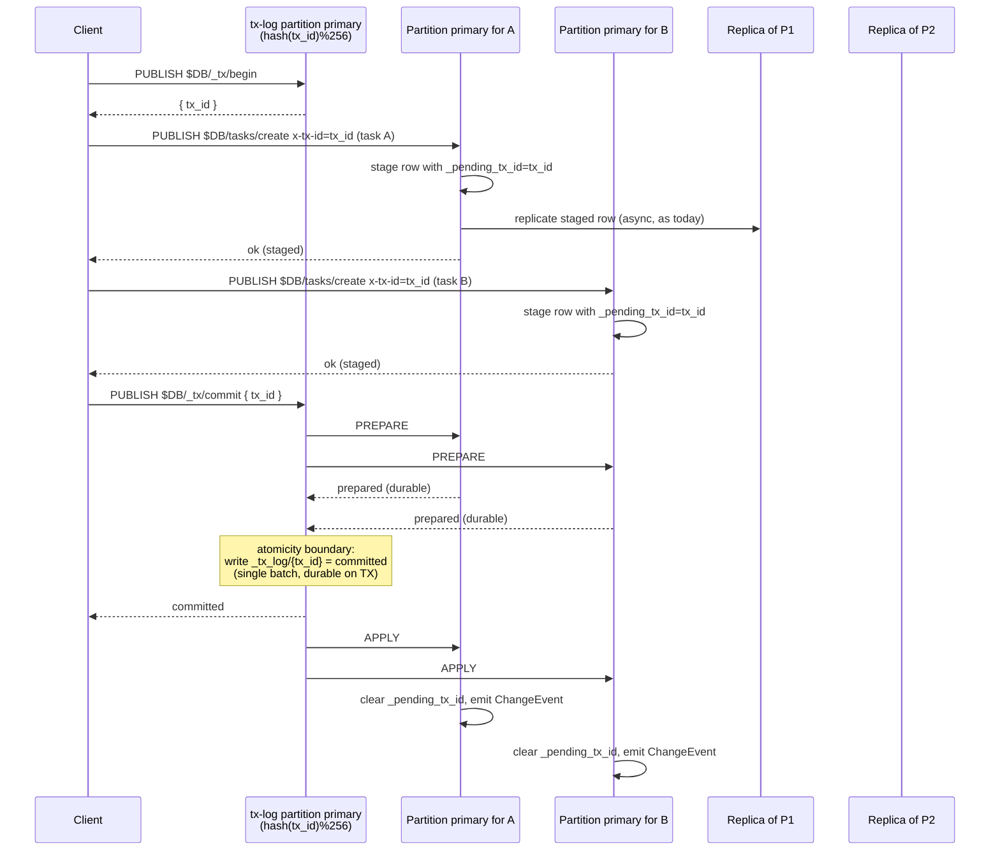
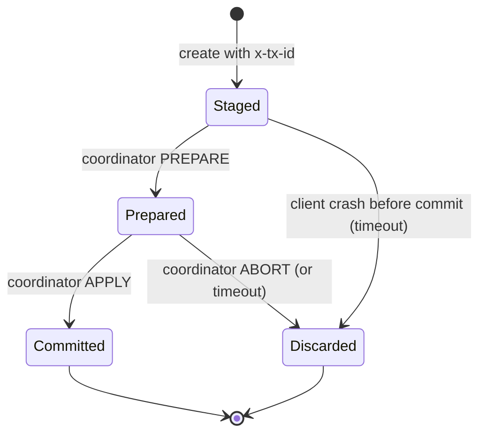

# Cross-partition batch atomicity in MQDB — implementation answer

## The picture

You have three realistic builds. Cost goes up left-to-right; correctness goes from "application-level" to "ACID-shaped."

| Approach | Effort | Throughput ceiling | Visibility of intermediates | When it's right |
|---|---|---|---|---|
| **Sagas via outbox** | 0 in MQDB; some in clients | Same as today (8K w/s) | Visible | "Tasks A and B" workflows where business logic owns rollback |
| **Calvin-over-Raft** | ~1 wk | Hundreds/sec | None | Rare ceremonial multi-key changes (schema migrations, admin bulk ops) |
| **2PC with commit-log-as-entity** (recommended for general use) | ~3–4 wk | ~2–3K tx/s, parallelized across partitions | None (filtered on read) | Real general-purpose multi-key atomic commit |

If the answer to *"how often does a real workflow actually need both-or-neither across partitions?"* is "rarely," ship sagas + Calvin-over-Raft and stop. The rest of this document is the general path.

## The recommended build: 2PC with the commit log as a partitioned entity

The native answer for MQDB. It reuses every existing primitive — `expect_value` CAS, partition routing, the outbox, the unique-2PC inter-partition messaging — and adds no new replication tier, no new clock, no new coordinator role. Mechanically it is Gray & Lamport's *Paxos Commit*, but the "Paxos" part is the partition-primary failover you already have.

### Architecture

### The atomicity point

`_tx_log/<tx_id>` is a row in a normal entity. It hashes to one partition primary. That primary's batch commit (the same `BatchOperations::commit` at `storage/backend.rs:90` that `Database::create` uses today at `crud.rs:108`) is the single point that decides committed vs aborted. Everything before it is staging; everything after it is bookkeeping.

This is the only invariant the protocol needs:

> A transaction is committed if and only if `_tx_log/<tx_id>` has `status=committed` durably in the keyspace.

Every other node can query `_tx_log/<tx_id>` to answer "did this commit?" with full authority. No timestamp oracle. No second consensus group.

### Wire protocol (MQTT topics)

Three new topics; one new user property; one new row field.

| Topic | Direction | Payload | Effect |
|---|---|---|---|
| `$DB/_tx/begin` | client → broker | `{}` (optional `{ "timeout_ms": N }`) | Allocates `tx_id`; coordinator partition derives from hash |
| `$DB/_tx/commit` | client → broker | `{ "tx_id": "..." }` | Drives PREPARE → commit-log write → APPLY |
| `$DB/_tx/abort`  | client → broker | `{ "tx_id": "..." }` | Coordinator writes `_tx_log/<tx_id>=aborted`, broadcasts cleanup |

User property: `x-tx-id` on any `$DB/<entity>/create`, `update`, `delete` enrolls that write into the transaction. Absence = today's behavior (unchanged path).

Row field: `_pending_tx_id` is the visibility filter. Present = invisible to reads, lists, and ChangeEvent subscribers in the default `read_committed` mode.

### State machine per row

`Staged` and `Prepared` are distinguishable by whether the participant has persisted a `_tx_prepared/<tx_id>` marker. `Prepared` is durable; `Staged` is not committed-to and can be discarded freely.

### Files that change

Concrete, not speculative:

- `crates/mqdb-core/src/transport.rs:14-63` — add `Request::TxBegin`, `TxCommit`, `TxAbort` variants. Add `tx_id: Option<String>` to `Create`, `Update`, `Delete`.
- `crates/mqdb-core/src/protocol/mod.rs:21-27` — extend `DbOp` or add a parallel `TxOp` enum; parse `$DB/_tx/...` topics.
- `crates/mqdb-core/src/entity.rs` — `_pending_tx_id` becomes a reserved system field alongside `_version`, `_expires_at`. Reads in the projection path strip it.
- `crates/mqdb-agent/src/database/crud.rs:87-113` — when `x-tx-id` is present:
  - inject `_pending_tx_id` into `data`
  - **do not** call `dispatcher.dispatch(event)` at line 110 (defer event emission to APPLY)
  - **do not** call `outbox.mark_delivered` at line 111 (the outbox entry stays pending until APPLY)
- `crates/mqdb-agent/src/database/` — new `tx.rs` module: `tx_begin`, `tx_prepare`, `tx_commit`, `tx_abort`, `tx_apply`. Each is a sequence of `BatchOperations` against existing stores.
- `crates/mqdb-core/src/query.rs` — list/filter path must hide rows where `_pending_tx_id IS NOT NULL` unless caller is the originating client (read-your-staged-writes) or asks for `read_uncommitted`.
- `crates/mqdb-cluster/src/cluster/db_topic.rs:7-24` — add `TxPrepare { tx_id }`, `TxApply { tx_id }`, `TxAbort { tx_id }` inter-partition operations. Mirror the existing `UniqueReserve/UniqueCommit/UniqueRelease` shape — same lock-drop/reacquire pattern from `unique.rs`.
- `crates/mqdb-cluster/src/cluster/node_controller/` — new `tx.rs` peer to `unique.rs`. The coordinator state machine lives here.
- The outbox processor (`crates/mqdb-agent/src/database/...outbox`) — staged outbox entries carry `tx_id`; dispatcher skips them until APPLY arrives.

You will reuse, not reimplement: partition routing (`partition_map.rs`), inter-partition messaging (`mqtt_transport.rs`), the lock-drop/reacquire pattern (`unique.rs` is the template), the outbox (already there), CAS via `expect_value` (already there).

### Failure modes — verify each one

| Failure | Outcome | Why it's safe |
|---|---|---|
| Client crashes before COMMIT | Participants time out staged rows after `timeout_ms` (default 30 s); coordinator has no `_tx_log` entry → aborted | No commit marker = aborted by definition of the invariant |
| Client crashes after COMMIT returns | Already committed; rows are visible after APPLY arrives at participants | Atomicity boundary already crossed |
| Coordinator crashes after PREPARE, before commit-log write | Replica takes over coordinator partition (standard MQDB failover); finds no commit marker → aborts the transaction; participants discard prepared state on receiving ABORT | Commit marker absence is the abort signal |
| Coordinator crashes after commit-log write, before APPLY broadcast | Replica takes over; commit-log row is replicated; replica reads it on startup, broadcasts APPLY | Standard replication recovery |
| Participant crashes during PREPARE | Coordinator times out the prepare, aborts the whole transaction | Pessimistic: any participant unreachable = abort |
| Participant crashes after PREPARE durable, before APPLY | Replica fails over; `_tx_prepared/<tx_id>` is durable; replica queries `_tx_log` on recovery to learn outcome | Recovery via the commit-log lookup |
| Replica fails over but lags in async replication | Standard MQDB story: if it lags past the commit, it serves stale reads briefly until catchup | No new failure mode |

The presumed-abort variant (default to abort on missing commit marker) is what keeps this from being the blocking 2PC of textbooks. There is no "in-doubt" state from the coordinator's point of view — only "I wrote the commit marker" or "I did not."

### Cost analysis

- **Latency** on the happy path: BEGIN (1 RTT) + N writes (N parallel, each 1 RTT as today) + COMMIT (1 RTT for the coordinator's prepare-fan-out + commit-log batch + reply). ~3 RTTs total over QUIC. 2–5 ms intra-DC.
- **Throughput**: parallelized across the 256 partitions for the tx-log entity, so no single Raft choke. Bottleneck shifts to outbox write rate on the busiest participating partition (~8K w/s today). Practical ceiling ~2–3K tx/s for typical 2-participant transactions. Hot `tx_id` partitions are a concern only if you pick non-random IDs.
- **Storage cost**: `_tx_log` rows can be TTL'd (reuse the existing `ttl_secs` machinery in `crud.rs:48-58`). 24-hour retention is enough for any recovery scenario.
- **What it does not give you**:
  - **Serializable isolation**. This is read-committed at most. Concurrent transactions on overlapping keys race; whichever commits second sees the first's effects but the first cannot see the second's staged rows.
  - **External consistency** (Spanner-style). No global clock, no commit-wait. Two transactions with disjoint key-sets can commit in either order observably.
  - **Cross-cluster transactions**. Single MQDB cluster only.

### What I'd ship in three increments

1. **MVP (single-partition fast path)** — `x-tx-id` user property + `_pending_tx_id` filter. Same-partition transactions only (coordinator and all participants are the same node). One batch commit, no PREPARE phase, no inter-partition messages. Useful immediately for "create parent + children" patterns where you partition by scope. ~1 week.

2. **General 2PC (cross-partition)** — adds the coordinator state machine, PREPARE/APPLY/ABORT inter-partition messages, the commit-log entity. ~2 weeks. This is the real deliverable.

3. **Hardening** — coordinator failover under replica promotion, idempotent APPLY replay, presumed-abort timer tuning, `read_uncommitted` subscription option for debugging, TLA+ model of the commit/abort/recovery state machine the way Ch15's constraint proofs are modeled. ~1 week.

### What to do first, before any code

Verify the failure-mode table against a TLA+ spec the same way `ch15-constraints.md:15.9` describes the unique-2PC + FK proofs. The "What Went Wrong" sections in this codebase are dominated by missed concurrent interleavings. A 200-line spec for the commit-log state machine plus a participant state machine catches the bugs you would otherwise find in production at month two.

That's the answer for real work: build #2 (Calvin) only if your transaction frequency is low; otherwise build the 2PC-with-commit-log-entity protocol above. Three weeks of engineering, no new replication tier, no new consensus group, every primitive already in the codebase.
