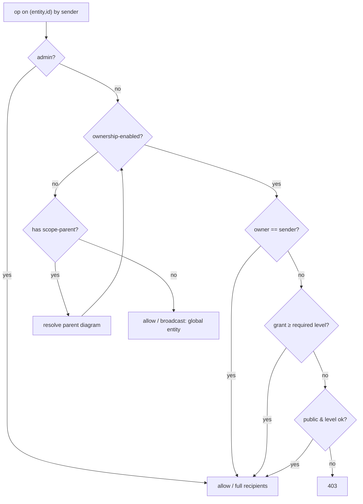
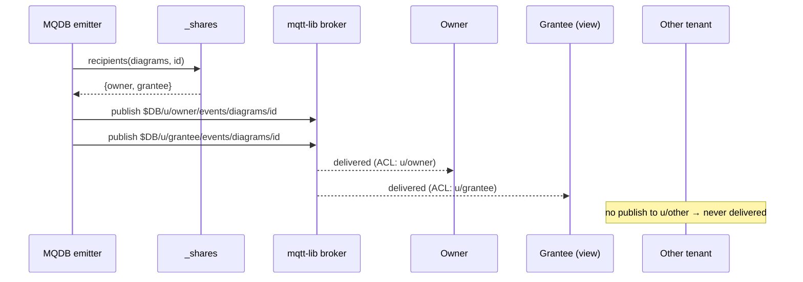

# Diagram Sharing

> **STATUS: Phases 1-3 IMPLEMENTED (agent mode); Phase 4 (public/anon) and cluster parity PENDING.** The `_shares` entity, `AccessLevel`, and share-aware `check_access` live in `crates/mqdb-agent`. No public/anonymous sharing and no cluster-mode implementation exist yet.

Let a diagram owner grant other users **view** or **edit** access to a diagram and
the diagrams it references, share a diagram **publicly** by link, and have all of
this hold consistently across CRUD, child entities (nodes/edges/topics), and the
live event stream — under a threat model where authenticated users are **mutually
untrusting tenants** (Alice must not see Bob's data).

This supersedes the "Sharing (future)" note in `frontend-ownership.md`. It is designed
generically for any ownership-enabled entity, with `diagrams` as the running
example.

## Goals

- Owner shares a diagram with a **named user** at level **view** or **edit**.
- Owner shares a diagram **publicly** (anyone with the link, including not-logged-in
  users) at view (optionally edit).
- Sharing follows references: sharing diagram A shares the diagrams A references
  (transitive closure) at the same level.
- The grant holds **everywhere**: CRUD on the diagram, CRUD on its child entities,
  and the live event stream. View-only genuinely prevents edits and genuinely
  prevents seeing data you weren't granted.
- Owner lists who a diagram is shared with, and revokes. Grantee discovers diagrams
  shared with them.
- Admin users bypass everything, as today.

## Non-goals (this iteration)

- Group/role-based sharing. Grants name a user (or "public").
- Live-derived grants — references added *after* a share are not retroactively
  shared; the owner re-shares (idempotent) to pick them up.

---

## Verified current behavior (what this changes)

All statements below were checked against code, not docs. Where they contradict
`frontend-ownership.md`, the code wins and that doc must be corrected alongside
this work.

| Area | Reality in code | Source |
|------|-----------------|--------|
| Ownership config | per-entity `--ownership diagrams=userId`, single owner field | `mqdb-core/src/types.rs:75` |
| Read | **ownership-enforced** (403 for non-owner) | `transport_execute.rs:72-79` |
| Update | owner-checked; owner field stripped from payload | `transport_execute.rs:90-101` |
| Delete | owner-checked | `transport_execute.rs:122-129` |
| List | injects mandatory `owner_field = sender` (single AND filter; no OR/contains) | `transport_execute.rs:156-166` |
| Owner check | exact string compare `owner_value != sender` | `crud.rs:424` |
| **Child entities** | **zero access control** — unconfigured entity → `evaluate` returns `Allowed` even for `sender=None`; FK validation checks existence only; anyone who knows a node id can edit/delete it | `types.rs:144-155`, `constraint.rs` |
| **Events** | **broadcast to all** authenticated subscribers; final fan-out is done by **mqtt-lib's broker** (off-limits); MQDB publishes each event once to a shared topic | `dispatcher.rs:72-82`, `tasks.rs:215`, `topic_rules.rs:45` (`$DB/+/events/#` = ReadOnly → any subscribe allowed) |
| `%u` topic ACL | **implemented** — ACL patterns like `$DB/u/%u/#` expand per-user at subscribe time | `mqtt-lib …/broker/acl/rules.rs:12-20` |
| Sender identity | password/SCRAM → username; JWT → `sub`; **OAuth → `sub = canonical_id` (UUID from `_identities`), NOT email** | `http/handlers.rs:821`, `auth_config.rs` |
| Email→id lookup | exists server-side: `find_canonical_id_by_email` over `_identities.email_hash` | `http/handlers.rs` |
| Cluster events | **no event task**; the broker emits/replicates events natively — emission point differs from agent | `cluster_agent/broker.rs`, `db_handler/json_ops.rs` |

Two consequences drive the design:

1. **"Ownership" today protects only the diagram record, not its contents.** Nodes
   and edges are wide open. View-only sharing is meaningless until child writes are
   gated. Hence child enforcement is in scope, not deferred.
2. **The event channel contradicts the confidentiality the CRUD layer enforces.**
   Since fan-out is in mqtt-lib, we cannot filter at delivery; we route events to
   per-recipient topics instead and gate them with `%u` ACL.

---

## Core: one access resolver

Every decision below reduces to two predicates and one set, all sharing the same
logic. This is the heart of the feature; everything else is wiring.

```
can_see(sender, entity, id)  -> bool        # read, watch, event delivery
can_edit(sender, entity, id) -> bool        # update, child writes
recipients(entity, id)       -> Set<Recipient>   # who an event is delivered to
```

Resolution rules (admin short-circuits to true / full set before any of this):

```
resolve(entity, id):
    if entity is ownership-enabled:
        owner   = record(entity,id)[owner_field]
        grants  = shares_for(entity, id)            # _shares index read
        public  = grants has a `_public` grant
        return Owned{ owner, grants, public }
    elif entity has a scope-parent (child entity):
        (p_entity, p_id) = parent_of(entity, id)    # via scope mapping
        return resolve(p_entity, p_id)              # derive from parent
    else:
        return Global                               # no ownership anywhere
```

- `can_see` = sender is owner **or** has a grant ≥ view **or** (public and reader)
  **or** Global.
- `can_edit` = sender is owner **or** has a grant ≥ edit **or** (public-edit)
  **or** Global. (Delete is stricter — see below.)
- `recipients` = `{owner} ∪ {grantees ≥ view} ∪ ({PUBLIC} if public)`, or the
  parent's recipients for a child, or `BROADCAST` for Global.



Resolution per request is cached (a request almost always touches one diagram), so
child operations pay one parent lookup, amortized.

---

## Identities and the grantee problem

A grant must name the **exact string that will arrive as the sender** for that
user. That string is auth-mode dependent:

- **Password / SCRAM**: the MQTT username. A grant naming the username matches
  directly.
- **OAuth / JWT**: the `sub` claim, which for OAuth is the **canonical id (UUID)**
  in `_identities` — *not* the email. A grant naming an email would never match.

Humans share by email. So `/share` resolves the grantee input to the canonical
identity, server-side, reusing `find_canonical_id_by_email`:

```
resolve_grantee(input):
    if identities-enabled (OAuth/HTTP) and find_canonical_id_by_email(input) => cid:
        return Resolved(cid)
    if identities-enabled and email unknown:
        return Pending(email=input)        # grant stored, grantee filled on signup
    else (password-only deployment):
        return Resolved(input)             # username used verbatim
```

**Pending grants** let an owner share with someone before they've signed up. A
pending grant stores `grantee_email` with `grantee = null`. When that email first
authenticates, `resolve_or_create_identity` (`http/handlers.rs`) sweeps `_shares`
for pending grants matching the now-verified email and fills in `grantee`. Pending
grants confer no access until resolved.

`_shares` stores both for display and resolution:

```json
{
  "id": "<uuid>",
  "resource_entity": "diagrams",
  "resource_id": "<uuid>",
  "grantee": "<canonical-id | username | null-if-pending>",
  "grantee_email": "bob@gmail.com",
  "permission": "view",
  "granted_by": "<owner-identity>",
  "created_at": "<rfc3339>"
}
```

Indexes: `(grantee)`, `(resource_entity, resource_id)`, `(grantee_email)` for
pending resolution; unique on `(resource_entity, resource_id, grantee_email)`.

### Reserved identities

- `_public` — sentinel grantee marking a public grant (not a real user).
- `_anonymous` — the sender identity carried by anon-ticket JWTs (see Public).

Both are `_`-prefixed and **must be rejected** as usernames / canonical ids at user
creation and identity resolution, so they can never collide with a real principal.

---

## Sharing API

Topic structure for CRUD is unchanged. Sharing adds sub-topics, modeled on the
existing `transfer` feature (`ownership-transfer.md`).

| Topic | Payload | Who | Effect |
|-------|---------|-----|--------|
| `$DB/{entity}/{id}/share` | `{"grantee":"bob@…","permission":"view\|edit","cascade":true}` | owner / admin | resolve grantee; upsert grant(s) |
| `$DB/{entity}/{id}/share` | `{"public":true,"permission":"view","cascade":true}` | owner / admin | upsert `_public` grant(s) |
| `$DB/{entity}/{id}/unshare` | `{"grantee":"bob@…","cascade":true}` or `{"public":true}` | owner / admin | remove grant(s) |
| `$DB/{entity}/{id}/shares` | `{}` | owner / admin | list grants on this resource |
| `$DB/{entity}/shared` | `{}` | any authed user | resources of `{entity}` shared **with caller** (named grants) |

Level semantics, made explicit per review:

- **Direct `/share` = set-to-level.** Re-sharing a diagram at `view` *demotes* an
  existing `edit` grant. This is how an owner downgrades a collaborator without a
  revoke+re-share dance.
- **Cascade = max-of-levels.** A cascade never downgrades a referenced diagram's
  existing grant for that grantee; it raises view→edit but never edit→view.

`/share` and `/unshare` emit ordinary ChangeEvents on the affected diagrams (so
open editors refresh), delivered via the recipient-scoped routing below. The
`_shares` records are server-managed and not exposed through generic CRUD.

### Transitive sharing

Diagram→diagram references are the registered relationships / FKs where
`source_entity == target_entity == "diagrams"` (`mqdb-core/src/relationship.rs`,
`constraint.rs`). The handler walks them with a bounded, cycle-safe BFS:

```
const MAX_CASCADE_DIAGRAMS = 256;
visited = {}; queue = [root]
while queue and |visited| < MAX_CASCADE_DIAGRAMS:
    id = pop(queue); if id in visited: continue; visited.add(id)
    for f in self_reference_fields(entity):
        r = record(entity,id)[f]; if r and r not in visited: push(queue, r)
upsert a grant for every id in visited (cascade = max-of-levels)
```

`MAX_CASCADE_DIAGRAMS` bounds work; `visited` is the cycle guard. `unshare
--cascade` removes grants across the same closure.

---

## Public / link sharing

A public grant is a `_shares` row with `grantee = "_public"` and a level (default
`view`). `can_see`/`can_edit` treat a `_public` grant as matching *any* reader
(including `_anonymous`). Cascade applies, so a public diagram's referenced
diagrams become public too. Revoke = remove the `_public` grant.

The diagram UUID *is* the link (UUIDs are unguessable); "public" simply lifts the
auth requirement for that resource. Public **edit** is supported as an explicit
level but should be surfaced in the UI as dangerous.

### Anonymous access

Not-logged-in viewers still need an MQTT session to read and to receive events.
An HTTP endpoint issues a constrained ticket:

- `POST /anon-ticket` — IP-rate-limited; returns a short-lived JWT with
  `sub = _anonymous` and a claim marking it anon-scoped.
- The frontend uses it as the MQTT password.
- `can_see` for `_anonymous` returns true **only** for resources with a `_public`
  view grant (or whose parent is public); all writes and all non-public reads are
  denied.
- Anonymous event delivery uses the public event topic (below), not a per-user one.

---

## Event confidentiality (recipient-scoped topics)

Because mqtt-lib owns the fan-out and is off-limits, MQDB cannot decide
per-subscriber what to deliver at the broker. Instead, **MQDB decides recipients at
emission time** and publishes each event only into namespaces the broker's `%u`
ACL already isolates.

**Topic scheme**

| Topic | Subscribers (enforced by ACL) |
|-------|------------------------------|
| `$DB/u/{recipient}/events/{entity}/{id}` | only that user — ACL rule `$DB/u/%u/events/# = read` |
| `$DB/public/events/{entity}/{id}` | anyone, incl. `_anonymous` — ACL rule `$DB/public/events/# = read` |
| `$DB/{entity}/events/{id}` (legacy shared) | **admin only** for non-Global entities — tier change in `topic_protection` |

**Emission** — replace the single publish with a recipient fan-out:

```
for r in recipients(entity, id):           # owner ∪ grantees(≥view) ∪ {PUBLIC?}
    topic = r == PUBLIC ? "$DB/public/events/{entity}/{id}"
                        : "$DB/u/{r}/events/{entity}/{id}"
    publish(topic, event)
# Global entities (no ownership, no scope) keep the legacy shared topic — unchanged.
```

Child-entity events resolve recipients through the parent diagram, so a node change
is delivered to exactly the diagram's owner + grantees (+ public).



**Frontend subscription change (breaking):** clients subscribe to
`$DB/u/{me}/events/#` instead of `$DB/diagrams/events/#`; public-by-link viewers
subscribe to `$DB/public/events/{entity}/{id}`. The companion frontend plan must
gate this behind the same feature flag as the server change.

**ACL provisioning:** add default/role rules granting every authenticated user
`read` on `$DB/u/%u/events/#`, and everyone (incl. anon) `read` on
`$DB/public/events/#`; change `$DB/+/events/#` from ReadOnly to admin-only for
subscribe on ownership/child entities. The internal event-service account keeps
publish rights (existing `is_internal_service` bypass).

**Cost / bounds:** N publishes per event, N = recipients; capped by
`MAX_GRANTEES` per resource. `recipients` does one `_shares` index read per event
on ownership/child entities; Global entities are untouched and keep single-publish.

**`mqdb watch` / internal dispatcher:** the CLI watch path uses the internal
dispatcher (`dispatcher.rs`), not the broker fan-out. It must apply the same
`can_see` filter so internal subscribers don't bypass confidentiality.

**Cluster:** there is no agent-style event task; events are emitted/replicated by
the broker natively (`cluster_agent/broker.rs`, `db_handler/json_ops.rs`). The
recipient-scoped emission must be applied at the cluster emission point too — the
exact point to confirm during implementation (agent/cluster parity).

---

## Child-entity enforcement

Child entities derive their permission from the parent diagram. The parent mapping
is a per-child-entity `(fk_field, parent_entity)` config — the same shape as the
existing `ScopeConfig` (`types.rs:12-72`), which today is used **only** for event
topics and is **not** wired into auth. This feature wires it into `resolve` for
both auth and recipient computation.

- Child **read** → `can_see(sender, parent)`.
- Child **update / create** → `can_edit(sender, parent)`. (Create also validates
  the FK as today.)
- Child **delete** → `can_edit(sender, parent)` (an editor may delete nodes).
- Child **events** → delivered to `recipients(parent)`.

This also closes the pre-existing hole where any authenticated user could edit any
node by id. Configuration: a derivation map, e.g.
`--ownership-derive "nodes=diagramId>diagrams,edges=diagramId>diagrams"`; absent a
mapping a child entity stays Global (current behavior), so the change is opt-in
per deployment.

---

## Admin, revocation, transfer, cleanup

- **Admin** bypasses `resolve` entirely (full access, full recipient set) and may
  share/unshare/list on any resource.
- **Delete is owner-only**, not edit — an edit-grantee must not destroy the owner's
  diagram (matches Docs/Figma). Only the diagram *record* delete is owner-gated;
  child deletes follow `can_edit(parent)`.
- **Revocation** = `/unshare`; grants are read per-request (no caching beyond a
  request), so access stops on the next op.
- **Ownership transfer** (`ownership-transfer.md`): grants reference `resource_id`,
  which is stable, so **grants persist across transfer**; the new owner may revoke.
- **Orphan cleanup:** deleting a diagram removes its `_shares` rows (FK `on_delete:
  Cascade` keyed by `(resource_entity, resource_id)`, or an explicit sweep in the
  delete path).

---

## Implementation phases (all part of v1; ordered so frontend can flag 1:1)

1. **Grants + access core.** `_shares` system entity; `AccessLevel`; the `resolve`
   / `can_see` / `can_edit` core; grantee resolution + pending grants; share /
   unshare / shares / shared API; CRUD read/update share-aware; delete owner-only;
   transitive cascade. Files: `mqdb-core/src/types.rs`, `protocol/mod.rs`,
   `transport.rs`; `mqdb-agent/src/database/crud.rs`,
   `transport_execute.rs`, `agent/handlers.rs`, `http/handlers.rs`
   (resolution + pending sweep).
2. **Child enforcement.** Derivation config; wire `resolve` parent-derivation into
   child read/update/delete/create.
3. **Event confidentiality.** Recipient-scoped emission (agent event task
   `tasks.rs` + cluster emission point); ACL provisioning (`topic_protection.rs`,
   `topic_rules.rs`); internal-dispatcher `can_see` filter; legacy events topic →
   admin-only.
4. **Public / link sharing.** `_public` grant handling; reserved-identity rejection;
   `/anon-ticket` HTTP endpoint + rate limit; `_anonymous` access path; public
   event topic + ACL.
5. **Cluster parity** for every server change above
   (`cluster_agent/admin.rs`, `node_controller/db_ops.rs`, `db_handler/`).
6. **WASM** surface: `share`, `unshare`, `listShares`, `listSharedWithMe`,
   `setPublic`; subscribe to `$DB/u/{me}/events/#`.
7. **Docs**: correct `frontend-ownership.md` (read enforced; events no longer
   broadcast for isolated entities); add a Sharing section pointing here.

Each phase lands behind a feature flag; the frontend companion plan tracks these
roughly 1:1 (stitch wrappers → ShareModal w/ public tab + cascade preview →
SharedStateBadge → "Shared with me" tab → read-only canvas for view grants →
co-edit UX). Note phase 3 is the breaking subscription-topic change.

---

## Tests

Unit (`mqdb-agent/tests/`):

- view grant → grantee reads, cannot update (403); edit grant → reads + updates,
  cannot delete (owner-only)
- direct re-share view demotes an edit grant; cascade never downgrades
- cascade over A→B→A terminates, shares {A,B} once; respects `MAX_CASCADE_DIAGRAMS`
- grantee resolution: email→canonical_id; unknown email → pending; pending filled
  on first sign-in; password deployment uses username verbatim
- child write by view-grantee → 403; by edit-grantee → ok; by stranger → 403 (closes
  the pre-existing hole)
- public grant → anonymous reads; anonymous write → 403; non-public read by anon → 403
- non-owner cannot share / list shares; admin can do anything
- `/shared` returns exactly the caller's named grants, bounded by `MAX_LIST_RESULTS`
- delete diagram removes its `_shares` rows
- **event routing**: a change to a diagram shared with B is delivered to owner and B
  only; a third tenant subscribed to `$DB/u/{self}/events/#` receives nothing; ACL
  denies subscribing to another user's `$DB/u/{other}/events/#`; public change
  reaches `$DB/public/events/…`

E2E (`mqdb dev test --sharing`): run the matrix on both agent and 3-node cluster,
including the cross-node event-routing case.

---

## Decisions (resolved)

| # | Decision | Resolution |
|---|----------|-----------|
| 1 | Delete authorization | **Owner-only** (not edit-grant) |
| 2 | List integration | **Separate `/shared`** endpoint; frontend merges |
| 3 | Child enforcement | **In v1** (phase 2) — view-only is otherwise a lie |
| 4 | Transfer interaction | **Keep grants** on transfer |
| 5 | Generic vs diagram-only | **Generic** over any ownership-enabled entity |
| 6 | Public sharing | **In v1** (phase 4) — `_public` grant + anon ticket |
| 7 | Event confidentiality | **Fixed here** (phase 3) — untrusting-tenant model; recipient-scoped topics + `%u` ACL |
| 8 | Direct vs cascade level | direct = set-to-level; cascade = max-of-levels |

## Formal verification (TLA+)

The authorization core was model-checked with the `specs/` TLA+ toolchain. Three
specs, all exhaustively checked (no `limit_reached`):

| Spec | What it checks | Result |
|------|----------------|--------|
| `specs/DiagramSharing.tla` | Proposed design: view/edit/public/pending grants, child derivation, recipient-scoped event routing, ownership transfer | **13/13 invariants hold**, 26,244 states exhausted |
| `specs/DiagramSharingCurrent.tla` | Today's behavior (owner-only diagrams, ungated children, broadcast events). Checked with two cfgs: `DiagramSharingCurrent.cfg` and `DiagramSharingCurrentChild.cfg` | `InvEventConfidentiality` (first cfg) and `InvChildNeedsParentEdit` (second cfg) **violated** (counterexamples in initial state) |
| `specs/CascadeClosure.tla` | Transitive cascade vs. an independent fixpoint reachability, over all reference graphs on 3 diagrams | **3/3 invariants hold**, cycle-safe & terminating, 1,792 states |
| `specs/GrantLifecycle.tla` | Level-merge and revocation rules for a grant cell (direct = set, cascade = max, unshare = remove) | **6/6 invariants hold**; a replay confirms direct demotes, cascade never downgrades, revoke clears access |

Invariants proven on the proposed design:

- **Event confidentiality** — `Delivers(u,x) => CanSee(u,x)`: the recipient-scoped
  routing never delivers an event to someone who could not read the record. This is
  the property that makes the per-user-topic + `%u`-ACL scheme equivalent to CRUD
  ownership.
- **Event completeness** — every authorized non-admin reader *does* receive the
  event (grantees never miss live updates), and a public resource's events reach
  anonymous viewers.
- **Edit ⇒ see**, **delete is owner/admin only** (never via edit or public grant),
  **view-grantee cannot edit a child** (the "view is a lie" property defeated),
  **child ⇒ parent** for both see and edit, **anonymous confined to public**,
  **pending grants inert**, **reserved sentinels never own**.
- **Ownership transfer** preserves grants (the action leaves the grant set
  unchanged) and every safety invariant continues to hold in post-transfer states.
- **Cascade = exact reference closure** (no over- or under-sharing) and terminates
  on cyclic graphs.
- **Level-merge**: direct `/share` sets exactly the requested level (demotion
  allowed); cascade is exactly `max(previous, requested)` and never downgrades.
- **Revocation removes access**: after `/unshare`, the cell confers neither see nor
  edit, from any prior level.

The `Current` spec is the teeth check: the same invariants that pass on the design
*fail* on today's behavior, confirming the invariants are non-vacuous and that the
design closes the event-leak and unprotected-children holes.

**Scope of the proof.** TLA+ verifies the design's internal logical consistency
under one stated assumption: that mqtt-lib's `%u` ACL correctly isolates per-user
event topics (so a reader receives only events published to their own or the public
namespace). It does **not** verify the Rust implementation, the ACL engine itself,
or implementation-level concurrency/TOCTOU.

## Open risks to confirm during implementation

- **Cluster event emission point** — agent has an event task; cluster emits via the
  broker. The exact place to apply recipient-scoped emission must be pinned down so
  agent and cluster behave identically.
- **Per-event `_shares` lookup cost** on hot ownership entities — acceptable for
  document-style entities (diagrams) but measure if applied to high-churn ones.
- **Reserved-identity enforcement** — ensure `_public` / `_anonymous` cannot be
  registered as usernames or minted as canonical ids anywhere.
- **`mqdb watch` confidentiality** — confirm the internal dispatcher path applies
  `can_see`, or restrict watch to admins in untrusting deployments.
