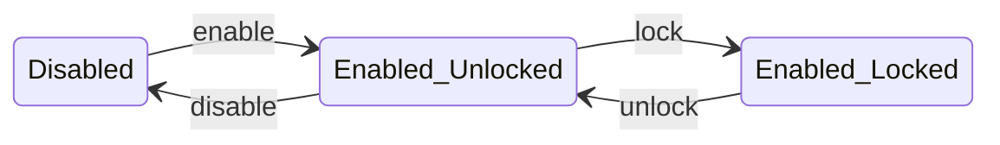

# Vault Encryption

MQDB's vault gives each user control over their own data's encryption. You provide a passphrase; MQDB derives a cryptographic key; every string value in your records is encrypted at rest. Lock the vault, and reads return opaque ciphertext. Unlock it, and plaintext flows transparently. The server never stores your passphrase.

The vault uses **recursive structural encryption**: it walks the full JSON structure of each record and encrypts every string leaf value, no matter how deeply nested. Object keys, array lengths, numbers, booleans, and nulls remain in cleartext. This preserves the record's shape and keeps non-string values queryable while making all textual content unreadable without the key.

## Threat model

### What vault protects against

- **Stolen storage media.** An attacker who takes a disk, a backup tape, or a database file finds only ciphertext. Without the passphrase, the data is unreadable.
- **Exposed backups.** Database dumps contain encrypted fields. A backup that leaks does not expose user data.
- **Unauthorized storage access.** A system administrator or database operator who reads files directly sees ciphertext for vault-enabled records.
- **Other users on the same server.** Users without the vault key see base64 ciphertext when reading records they have access to. The data is provably encrypted at rest.

### What vault does not protect against

- **Compromised running server.** The server processes plaintext during every request while the vault is unlocked. An attacker with access to the running process can read decrypted data in memory.
- **Malicious server operator.** An operator who modifies the server binary or inspects process memory can intercept plaintext. Vault is not end-to-end encryption.
- **Network eavesdropping.** Vault encrypts data at rest, not in transit. Use TLS (for HTTP/MQTT) or QUIC (for cluster communication) to protect data on the wire.
- **Weak passphrases.** The vault's security rests on passphrase entropy. A 4-digit PIN can be brute-forced in seconds; a 4-word diceware passphrase resists GPU clusters for over a billion years. See [Passphrase strength](#passphrase-strength) below.

### Volatile keys

Vault keys exist only in process memory. When the server restarts, all keys are lost. Users must unlock their vaults again after every restart. This is deliberate: it bounds the exposure window to the process lifetime. An attacker who gains disk access to a stopped server finds only ciphertext, regardless of how many users had their vaults unlocked before shutdown.

## What gets encrypted

Vault encryption recurses through the entire JSON structure of each record:

**Encrypted** — every leaf value at any depth:
```
Before:  {"name": "Alice", "profile": {"city": "Paris", "age": 30}, "tags": ["personal", "draft"]}
After:   {"name": "base64(...)", "profile": {"city": "base64(...)", "age": "base64(...)"}, "tags": ["base64(...)", "base64(...)"]}
```

Non-string values (numbers, booleans, null) are serialized with a `\x01` prefix before encryption. On decryption, the prefix signals type restoration — a number decrypts back to a number, not a string.

**Not encrypted** — structural metadata:
- Object structure (keys, nesting) and array lengths remain visible

**Skipped fields:**

| Rule | Scope | Example |
|------|-------|---------|
| Keys starting with `_` | All depths | `_version`, `_created_at`, `{"meta": {"_internal": "..."}}` |
| `id` field | Top level only | Root `"id"` stays cleartext; `{"nested": {"id": "..."}}` gets encrypted |
| Owner field | Top level only | The field specified in `--ownership` (e.g., `userId`) stays cleartext at root |

The `id` and owner field must remain in cleartext at the top level for the database to route queries and enforce access control. Nested fields with the same names carry no structural significance and are encrypted normally.

### Metadata leakage

Vault encryption preserves the record's shape. An observer can see key names, nesting depth, array lengths, and the types of non-string values. They can tell that a record has a nested object with two string fields and one number — they cannot read the string values. This is a deliberate tradeoff: the database needs structural visibility to operate on `id`, owner, and non-string fields without decryption. Record-level encryption (encrypting the entire JSON blob) would hide this metadata but prevent all server-side operations.

## Prerequisites

Vault requires three things:

1. **Ownership** on at least one entity: `--ownership notes=userId`
2. **HTTP server** running: `--http-bind 127.0.0.1:3000`
3. **Authentication** configured (password file, SCRAM, or OAuth)

Without ownership, no entities are vault-eligible and the vault endpoints have no effect.

## Vault lifecycle

The vault has two axes: *enabled* (encryption is configured) and *unlocked* (the key is in memory).



**Enable.** You provide a passphrase. The server generates a random salt, derives an AES-256-GCM key, and batch-encrypts every record you own across all vault-eligible entities. The vault is now enabled and unlocked. This is the most expensive operation — it reads, encrypts, and writes back every owned record.

**Lock.** Removes the key from memory. No data is modified. Subsequent reads return base64 ciphertext. Instantaneous.

**Unlock.** You provide the passphrase. The server re-derives the key, verifies it against a stored check token, and resumes any pending migration from a previous crash. The vault is now unlocked. Rate-limited to prevent brute-force guessing.

**Change passphrase.** You provide both old and new passphrases. The server verifies the old passphrase, generates a new salt and key, then re-encrypts every owned record: decrypt with the old key, encrypt with the new key, write back. The old salt is persisted during the operation so a crash can be recovered (see [Crash recovery](#crash-recovery)).

**Disable.** You provide the passphrase for confirmation. The server batch-decrypts every owned record back to plaintext and removes the vault configuration. All records are stored unencrypted.

**Status.** Returns the current vault state without modifying anything.

## HTTP API

All vault operations are HTTP endpoints. There are no MQTT-level vault commands.

| Method | Endpoint | Body | Description |
|--------|----------|------|-------------|
| POST | `/vault/enable` | `{"passphrase": "..."}` | Derive key, encrypt all owned records |
| POST | `/vault/lock` | — | Remove key from memory |
| POST | `/vault/unlock` | `{"passphrase": "..."}` | Re-derive key, resume transparent decryption |
| POST | `/vault/change` | `{"old_passphrase": "...", "new_passphrase": "..."}` | Re-encrypt all records with new key |
| POST | `/vault/disable` | `{"passphrase": "..."}` | Decrypt all records, remove vault |
| GET | `/vault/status` | — | Returns `{"vault_enabled": bool, "unlocked": bool}` |

All endpoints require an authenticated HTTP session (cookie-based via OAuth or dev-login). Enable, unlock, change, and disable return HTTP 401 on wrong passphrase. Unlock returns HTTP 429 when rate-limited.

## MQTT behavior with vault

MQTT clients do not interact with the vault directly. The vault operates transparently on the MQTT data path:

**Create.** When you publish to `$DB/notes/create`, the server checks if you have a vault key. If so, it recursively encrypts all string leaf values before writing to storage. The response returns plaintext (the server decrypts before responding).

**Read.** The server reads the encrypted record from storage, decrypts it with your vault key, and returns plaintext. If the vault is locked (no key in memory), you receive the raw ciphertext.

**Update.** Updates are partial in MQTT — you might send only `{"email": "new@example.com"}`. The server reads the full encrypted record, decrypts it, merges your delta, re-encrypts the entire record, and writes it back. Every vault-encrypted update is a read-modify-write cycle.

**List.** The server retrieves all matching records (encrypted), decrypts them locally, then applies your filters on the plaintext. Filters cannot operate on ciphertext, so filtering happens after decryption. This means list queries with vault return all records first, then filter — no server-side predicate pushdown on encrypted fields.

**Delete.** No vault processing needed — there is no data to encrypt or decrypt.

## Cryptographic details

### Key derivation

| Parameter | Value |
|-----------|-------|
| Algorithm | PBKDF2-HMAC-SHA256 |
| Iterations | 600,000 (OWASP 2023 recommendation) |
| Salt | 32 bytes, randomly generated per user |
| Output | 32-byte (256-bit) AES key |

Each derivation takes roughly 200ms on a modern CPU core.

### Field encryption

| Parameter | Value |
|-----------|-------|
| Algorithm | AES-256-GCM |
| Nonce | 12 bytes (96 bits), randomly generated per encryption |
| Authentication tag | 16 bytes (128 bits) |
| Ciphertext format | `base64(nonce \|\| ciphertext \|\| tag)` |

Each string value is encrypted independently. The nonce is generated randomly using the system's cryptographic RNG.

### Authenticated data (AAD)

Every ciphertext is bound to its record via additional authenticated data: `"{entity}:{record_id}"` (e.g., `"notes:rec-1"`). This prevents an attacker with write access from copying ciphertext between records — decryption fails because the AAD does not match.

### Check token

A known constant (`mqdb-vault-check-v1`) is encrypted with the derived key and stored on the user's identity record. On unlock, the server derives the key and attempts to decrypt this token. If the plaintext matches, the passphrase is correct. The passphrase itself is never stored or hashed.

### Passphrase strength

The vault's security rests entirely on passphrase entropy. At 600,000 PBKDF2 iterations, each guess costs ~200ms on a single CPU core (~5 guesses/second):

| Passphrase type | Search space | Single core | 1,000-core GPU cluster |
|----------------|-------------|-------------|------------------------|
| 4-digit PIN | 10,000 | 33 minutes | 2 seconds |
| Common English word | ~170,000 | 9 hours | 34 seconds |
| Two random words | ~29 billion | 184 years | 67 days |
| 4 random words (diceware) | ~1.7 x 10^17 | heat death | 1 billion years |
| 20-character random | ~10^26 | heat death | heat death |

A minimum of 4 random words (diceware-style) or 16 random characters provides a comfortable margin for the foreseeable future. Any passphrase a human can memorize after seeing it once is too short.

## Cluster mode

In a distributed MQDB cluster, vault keys stay on the node where the user authenticated. They never transit the network.

| Operation | Originating node (has the key) | Partition primary (has the data) |
|-----------|-------------------------------|----------------------------------|
| **Create** | Encrypts fields, forwards encrypted payload | Stores encrypted data |
| **Read** | Decrypts response | Returns encrypted data from storage |
| **Update** | Reads encrypted record, decrypts, merges delta, re-encrypts, forwards | Stores updated encrypted data |
| **List** | Decrypts all responses, applies filters locally | Returns all records (no server-side filtering) |

For list operations, the originating node sends the query to all partition primaries. Each returns encrypted records. The originating node decrypts everything locally and applies filters on the plaintext. This scatter-gather approach is a correctness requirement: filters cannot operate on ciphertext.

Forwarded requests that need vault decryption are tracked with a 30-second timeout. If the partition primary does not respond within 30 seconds, the tracking entry is cleaned up.

## Crash recovery

Vault batch operations (enable, disable, change) modify every owned record. If the server crashes mid-batch, the next unlock detects the incomplete state and resumes.

Three migration modes are tracked on the user's identity record:

| Mode | Trigger | Resume behavior |
|------|---------|-----------------|
| `encrypt` | Enable | Re-run batch encryption (idempotent) |
| `decrypt` | Disable | Re-run batch decryption (idempotent) |
| `re_encrypt` | Change passphrase | Read old salt from identity, derive both old and new keys, re-encrypt all records |

**Idempotency.** The decrypt path skips values that fail decryption (not ciphertext or wrong key). This means re-running a partially completed batch converges to the correct state: already-processed records pass through unchanged, unprocessed records are handled normally.

**Change passphrase recovery.** Before re-encryption begins, the old salt is persisted on the identity record alongside the new salt. If the server crashes, the next unlock reads both salts, derives both keys, and resumes re-encryption with the old key for decryption and the new key for encryption. When re-encryption completes, the old salt is cleared.

## Security considerations

**Rate limiting.** Unlock attempts are rate-limited to 5 per user per minute (configurable). This prevents online brute-force attacks through the API but does not protect against offline attacks on stolen database files.

**Volatile keys.** Keys exist only in process memory and are zeroized (overwritten with zeros) when removed — on lock, disable, or process exit. This prevents keys from lingering in freed memory.

**No key escrow.** If a user forgets their passphrase, their data is irrecoverable. The server has no backdoor, no recovery key, and no way to derive the encryption key without the passphrase. Operators should communicate this clearly to users.

**Server-side encryption.** The vault encrypts at rest, not end-to-end. The server sees plaintext during processing. Users who need protection from the server operator need client-side encryption, which is a fundamentally different architecture.

## Quick start

```bash
# 1. Create a password file
mqdb passwd vault-user -b vault-pass -f /tmp/vault.txt

# 2. Generate a JWT key (for HTTP session tokens)
openssl rand -base64 32 > /tmp/jwt.key

# 3. Start the agent with ownership and HTTP
mqdb agent start --db /tmp/vault-db --bind 127.0.0.1:1883 \
    --http-bind 127.0.0.1:3000 \
    --passwd /tmp/vault.txt --jwt-algorithm hs256 --jwt-key /tmp/jwt.key \
    --ownership notes=userId

# 4. Log in (dev mode)
SESSION=$(curl -s -c - -X POST http://127.0.0.1:3000/dev-login \
    -H 'Content-Type: application/json' \
    -d '{"username":"vault-user","email":"test@example.com","name":"Tester"}' \
    | grep session | awk '{print $NF}')

# 5. Enable vault
curl -s -b "session=$SESSION" -X POST http://127.0.0.1:3000/vault/enable \
    -H 'Content-Type: application/json' \
    -d '{"passphrase":"correct-horse-battery-staple"}'

# 6. Create a record via MQTT (encrypted transparently)
mqdb create notes -d '{"userId":"vault-user","title":"Secret Note","body":"Confidential content"}' \
    --user vault-user --pass vault-pass

# 7. Read it back (plaintext, vault is unlocked)
mqdb read notes <record-id> --user vault-user --pass vault-pass

# 8. Lock the vault
curl -s -b "session=$SESSION" -X POST http://127.0.0.1:3000/vault/lock

# 9. Read again (ciphertext — base64-encoded encrypted values)
mqdb read notes <record-id> --user vault-user --pass vault-pass

# 10. Unlock the vault
curl -s -b "session=$SESSION" -X POST http://127.0.0.1:3000/vault/unlock \
    -H 'Content-Type: application/json' \
    -d '{"passphrase":"correct-horse-battery-staple"}'

# 11. Read again (plaintext is back)
mqdb read notes <record-id> --user vault-user --pass vault-pass

# 12. Check vault status
curl -s -b "session=$SESSION" http://127.0.0.1:3000/vault/status
```
